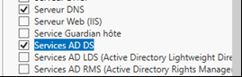

= Services d'annuaire Active Directory
Bauer Baptiste <cours.bauer@gmail.com>
:description: Windows 2016 Server.
:icons: font
:keywords: windows 2012 Server, Active Directory
:sectanchors:
:url-repo: https://github.com/BTS-SIO2
:chapter-number: number
:sectnums:
:toc:
:experimental:
:correction:

====
* *Objectif :*
Configuration des services d'annuaire de Windows 2016 Server.

* *Condition :* Le Tp est réalisé par l'étudiant sur Windows 2016 Server (multiboot).

* *Préparation* : Créer une nouvelle entrée multiboot nommée : *NomEtudiant-AD*
====

== Présentation rapide du service d'annuaire Active Directory

Le rôle de la base d'annuaire *Active Directory* est de fournir des services, d'informer et de localiser des *objets*.

Les *objets* peuvent être les *comptes utilisateurs*, les *groupes*, les *ordinateurs*, les différentes *ressources* (_imprimantes_, _dossiers_, _applications_, …).

Les *domaines*, les *sites*, les *unités d'organisations* et les *stratégies de sécurité* sont aussi considérés comme des *objets* Active Directory.

*Active Directory* va permettre une administration centralisée et simplifiée, offrant une forte tolérance de pannes puisque nous sommes en présence d'une *base d'annuaire distribuée*. Toute modification dans l'annuaire est automatiquement copiée vers tous les *contrôleurs de domaine* d'un domaine.

Un mécanisme de recherche et d'index, basé sur le protocole *LDAP (Lightweight Directory Access Protocol)* permet aux utilisateurs de localiser facilement des ressources publiées.

Le principal protocole d'authentification utilisé est *Kerberos v5*.

*Active Directory* utilise le système de noms de domaine DNS afin d'échanger des informations avec n'importe quel annuaire qui utilise les protocoles LDAP. Il faut donc un serveur DNS sur le réseau.

Pour qu'un serveur Windows 2016 server soit *contrôleur de domaine*, il faut installer *Active Directory*.

== Installation d'Active Directory

=== Installer le rôle

* Utiliser le bouton Gestionnaire de serveur :

image::img/tp01/tp01-01.png[ align="center"]

* Menu menu:Gérer[Ajouter des rôles et fonctionnalités] :
_(Attendre éventuellement la fin de la collecte des données)

* Bouton Suivant pour passer la page ‘Avant de commencer’

* Conserver le type d’installation « Installation basée sur un rôle ou une fonctionnalité », bouton Suivant,

* Conserver votre serveur sélectionné par défaut, bouton Suivant,

* Cocher le Rôle : ‘Services AD DS’, bouton Ajouter les fonctionnalités requises,

* Cocher le Rôle : ‘Serveur DNS’, bouton Ajouter les fonctionnalités requises,

* Bouton Suivant plusieurs fois jusqu’à la confirmation, bouton Installer, Attendre !!!

=== Création du domaine Active Directory

* Menu Notifications :

* Utiliser le lien : Promouvoir ce serveur en contrôleur de domaine

* Cocher : Ajouter une nouvelle forêt

* Entrer le nom du domaine (Dxx.BTSSIO, ou xx représente le numéro de votre poste), bouton Suivant,

* Conserver le niveau fonctionnel de la forêt : Windows Server 2016,

* Conserver les fonctionnalités de contrôleur de domaine déjà cochées,

* Saisir le mot de passe du mode de restauration : *Toto01*

* Bouton Suivant,

* Attendre que le nom de domaine NetBIOS s’affiche automatiquement, bouton Suivant,

* Conserver les chemins des dossiers par défaut, bouton Suivant,

* Vérifier les options de configuration dans le résumé,

* Bouton Suivant,

* Attendre la fin de la vérification de la configuration, bouton Installer,

image::img/tp01/tp01-10.png[align="center"]

* À la fin de l'installation, le serveur redémarrer automatiquement, 

[WARNING]
====
Juste après le redémarrage, sélectionnez la bonne entrée multiboot :

*NomEtudiant-AD*
====

* Attendre l’application des paramètres de l’ordinateur, c'est aussi un peu long

* A la demande, saisir le mot de passe pour l’administrateur : *Toto01*