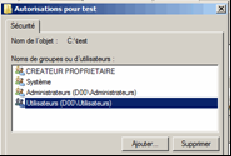
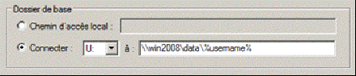

= Gestion des comptes et des utilisateurs dans un domaine
Bauer Baptiste <cours.bauer@gmail.com>
:description: Windows 2016 Server.
:icons: font
:keywords: windows 2012 Server, Active Directory
:sectanchors:
:url-repo: https://github.com/BTS-SIO2
:chapter-number: number
:sectnums:
:toc:
:experimental:
:correction:

====
* *Objectif :*
Création des comptes utilisateurs et des groupes dans un domaine Windows 2016 Server.

* *Condition :* Le Tp est réalisé par l'étudiant sur Windows 2016 Server (multiboot).

====

== Présentation de l'outil d'administration `Utilisateurs et ordinateurs Active Directory`

La console `Utilisateurs et ordinateurs Active Directory` gère les objets de comptes de domaine, elle contient les dossiers (conteneurs) suivants :

* Le dossier `Builtin` contient les groupes par défaut avec une étendue de domaine local.
* Le dossier `Computers` contient les comptes d'ordinateurs des stations clientes appartenant au domaine.
* Le dossier `Domain Controllers` contient les nouveaux contrôleurs de domaine du domaine.
* Le dossier `ForeignSecurityPrincipals` permet de stocker des identificateurs de sécurité (SID) associés à des objets externes de domaines approuvés.
* Le dossier `Users` est le conteneur par défaut des utilisateurs du domaine.

[.question]
**
Question {counter:question} :
Que contiennent les dossiers Computers et Domain Controllers, expliquer :
**

ifdef::correction[]
[.reponse]
****
*Réponse {counter:reponse}* :

 * *Computers* : Rien, il n'y a pas encore de postes clients dans le domaine.
 * *Domain Controllers* : le nom du serveur, seul contrôleur du domaine Active Directory.
****
endif::[]

== Gestion des comptes d'utilisateurs de domaine

=== Création des comptes

Dans la console `Utilisateurs et ordinateurs Active Directory`, Clic droit sur le conteneur `Users`,
Cliquer sur _Nouveau > Utilisateur_.

Pour chaque utilisateur ci-dessous (_à partir des trois premières colonnes seulement_), remplissez les champs *Prénom*, *Nom*, *Nom d'ouverture de session* et bouton suivant, *Mot de passe (Toto0101)* et *confirmer le mot de passe (Toto0101)*, cocher les *options* appropriées pour le mot de passe, bouton terminer.

[NOTE]
====
On ne peut pas avoir *deux noms d'utilisateurs identiques*, et *deux noms d'ouverture de session identiques* (_faire un choix pour Linda Mitchell): Inclure par exemple les initiales pour AssistantClient1._)
====

[cols="1,1,1,1,1,1"]
|===
| Nom détaillé
| Nom d'ouverture de session
| Impératifs du mot de passe
| Description
| Horaires
| Restriction d'accès

|Linda Mitchell
|VicePresident
|Doit changer à la prochaine ouverture de session
|Vice-présidente
|24h/24, 7j/7
|Non

|À définir
|Directeur
|Doit changer à la prochaine ouverture de session
|Directeur des RH
|24h/24, 7j/7
|Non

|À définir
|ChefVentes
|Doit changer à la prochaine ouverture de session
|Chef des ventes
|24h/24, 7j/7
|Non

|À définir
|Representant
|Doit changer à la prochaine ouverture de session
|Représentant
|7h/20h, 7j/7
|Non

|Linda Mitchell
|AssistantClient1
|Doit changer à la prochaine ouverture de session
|Assistance clientèle (nuit)
|18h-6h, 5j/7
|Non
|À définir
|AssistantClient2
|Le compte est désactivé	Assistance clientèle (jour)
|6h-18h, 5j/7
|Non

|À définir
|ChefComptable
|Doit changer à la prochaine ouverture de session
|Chef de la comptabilité
|24h/24, 6j/7
|Non

|À définir
|Comptable
|Doit changer à la prochaine ouverture de session
|Comptable
|24h/24, 6j/7
|Non

|Jean Petit
|Comptable
|Ne peut pas changer de mot de passe
|Comptable intérimaire
|8h-18h, 6j/7
|Oui

|===

=== Rechercher un compte d'utilisateur

Dans la console, _menu > Action_, cliquer sur _Rechercher_.
Avec l'_Onglet Avancé_, il est possible d'effectuer des recherches sur des critères plus spécifiques avec le bouton _Champ_.

[.question]
**
Question {counter:question} :
Quelles sont les adresses d'un utilisateur qui peuvent servir pour la recherche ?
**
ifdef::correction[]
[.reponse]
****
Réponse {counter:reponse} :

    * Adresse de messagerie,
    * Adresse de page Web,
    * Adresse domicile,
    * Adresse du bureau,
    * Adresse postale
****
endif::[]

=== Création d'une unité logique d'organisation pour regrouper les utilisateurs

Dans la console, Clic droit sur le nom du domaine (Dxx.btssio),
cliquer sur _Nouveau > Unité d'organisation._

Créer dans votre domaine une nouvelle unité d'organisation nommée *Labo*.

=== Déplacer les utilisateurs dans un nouveau conteneur (dossier)

Sélectionner tous les comptes créés à la *question 1*,
Avec la souris, déplacer tous ces comptes dans l'unité d'organisation *Labo*.

=== Propriétés d'un compte

*Méthode :*

Clic droit sur le compte et sélectionner _Propriétés_ ou double clic sur le *compte*.

Pour les comptes de l'unité Labo :

* Ajouter la description spécifiée dans le tableau (_onglet Général_).
* Spécifier la ville de votre choix (_Onglet Adresse_).
* Définir les restrictions horaires définies dans le tableau (_Onglet Compte_, bouton _horaires d'accès_…).
* Définir des restrictions de connexion pour que le comptable intérimaire (Jean Petit) ne puisse travailler que sur un seul poste appelé C000 (_Onglet Compte_, _bouton Se connecter à_…).
* Activer le compte *AssistantClient2*, Onglet _Compte_, case à cocher dans les o__ptions de compte__.

[.question]
**
Question {counter:question} :
Quel est le rôle de la case à cocher Déverrouiller le compte :
**
ifdef::correction[]
[.reponse]
****
Réponse {counter:reponse} :
Elle permet de déverrouiller un compte qui a été verrouillé après l'échec de tentatives d'ouverture de session trop nombreuses. Ne pas confondre Activer et Verrouiller.
****
endif::[]

Définir le numéro de téléphone du domicile de la Vice-présidente (_Onglet Téléphones_).

=== Tests sur les restrictions

[IMPORTANT]
====
Par défaut, *il est impossible* à un simple utilisateur d’ouvrir une session sur un serveur, c’est réservé aux *Administrateurs*. Afin de réaliser les tests du Tp, nous allons déroger à cette restriction de sécurité.
====

**Préparation :** Autoriser l'ouverture d'une session localement sur le contrôleur de domaine.

* Bouton kbd:[Démarrer] et menu:Outils d’administration[Gestion des stratégies de groupe].
Ou Bouton kbd:[Démarrer] et dans la zone de recherche saisissez : `GPMC.msc`.

Ouvrir ensuite les dossiers :

*Forêt* : `<dxx>.btssio\Domaines\dxx.btssio\Domain Controllers`.

kbd:[Clic droit] sur `Default Domain Controllers Policy`,

menu:Clic droit[Default Domain Controllers Policy > Modifier]

[WARNING]
====
Il s'agit de *Default Domain Controllers Policy* Et non : Default Domain Policy
====

*Ouvrir les dossiers* :

menu:Configuration ordinateur[Stratégies Paramètres > Windows > Paramètres de sécurité > Stratégies locales > Attribution des droits utilisateurs ]

Dans la fenêtre de droite, kbd:[double clic] sur kbd:[Permettre l’ouverture d’une session locale],

Bouton : kbd:[Ajouter un utilisateur ou un groupe]

À l'aide du bouton kbd:[Parcourir…], bouton kbd:[Avancé…], bouton kbd:[Rechercher] :

Sélectionner le groupe : `Utilisateurs du domaine` et bouton kbd:[OK] 3 fois

Boutons  kbd:[Appliquer] et kbd:[OK] :

Pour forcer la mise à jour des stratégies, taper la commande suivante dans l’`Invite de commandes` : `gpupdate /force`

==== Tests

[IMPORTANT]
====
A chaque première ouverture de session, l’utilisateur doit changer son mot de passe, mettre pour le nouveau mot de passe : *Toto0202*
====

Pour ouvrir une nouvelle session, utiliser : menu:Démarrer[Changer d'utilisateur]

* Vérifier que vous pouvez ouvrir une session avec le compte `AssistantClient2` (activé dans la partie 2.5).

* Vérifier que vous *NE POUVEZ PAS* ouvrir une session avec le compte `AssistantClient1`.

[.question]
**
Question {counter:question} :
Pourquoi ?
**

ifdef::correction[]
[.reponse]
****
Réponse {counter:reponse} :
Impossible d'ouvrir une session, car il y a une limitation des comptes, c'est normal : l'heure de connexion en en dehors des heures autorisées : 18h-6h
****
endif::[]

* Vérifier que vous *NE POUVEZ PAS* ouvrir une session avec le compte `Icomptable`.

[.question]
**
Question {counter:question} :
Pourquoi ? 
**

ifdef::correction[]
[.reponse]
****
Réponse {counter:reponse} :
Impossible d'ouvrir une session, car il y a une limitation des comptes, C'est normal, il y a une restriction d'accès pour ce compte, il ne peut ouvrir une session qu'à partir du poste `C000`, voir §2.5
****
endif::[]

=== Date d'expiration des comptes

* Revenir à la session `Administrateur`, ouvrir la console `Utilisateurs et ordinateurs Active Directory` ( menu:Démarrer[Outils d’administration] ).

* Fixer une date d'expiration pour le compte `Representant` égale à la *date du jour +1* (onglet kbd:[Compte] )

==== Test

* Vérifier que vous pouvez ouvrir une session avec le compte `Representant`.
Fermer la session du compte `Representant`.

* Revenir à la session `Administrateur`, ouvrir la console `Utilisateurs et ordinateurs Active Directory`.

* Fixer une date d'expiration pour le compte `Representant` égale à la *date du jour -1* (onglet kbd:[Compte])

* Vérifier que vous *NE POUVEZ PAS* ouvrir une session avec le compte `Representant`.

[.question]
**
Question {counter:question} :
Message affiché?
**

ifdef::correction[]
[.reponse]
****
Réponse {counter:reponse} :
Le compte de l’utilisateur a expiré.
****
endif::[]

*Ouvrir une session avec le compte Administrateur*

=== Répertoire de base de chaque utilisateur

==== Préparation :

* Créer un dossier nommé `Data` sur `C:` (`C:\Data`),
* kbd:[Clic droit] sur ce dossier `C:\Data`, menu:Propriétés[Partage > Partage avancé],
* Cochez `Partager ce dossier`, bouton kbd:[Autorisations],
* Cochez `contrôle total` pour le groupe `Tout le monde`,
Bouton kbd:[Ok] (2 fois) et bouton kbd:[Fermer].

image::img/tp02/tp02-07.png[align="center"]

* Supprimer les droits du groupe `Utilisateurs` (droits hérités),
* kbd:[Clic droit] sur ce dossier `C:\Data`,  menu:Propriétés[onglet Sécurité >  bouton Avancé]
* Bouton kbd:[Désactiver l’héritage]
* Sélectionner `Convertir les autorisations héritées`.
* Bouton kbd:[Ok]

On peut maintenant supprimer le groupe `Utilisateurs`.

* Bouton kbd:[Modifier..]., sélectionner le groupe `Utilisateurs`,
* Bouton kbd:[Supprimer] et bouton kbd:[Ok] (2 fois).

* Définir les répertoires de base de chaque utilisateur de l'unité `Labo` :
    ** Ouvrir la console `Utilisateurs et ordinateurs Active Directory` :
        *** Sur tous les comptes, menu:Propriétés du compte[onglet Profil] et dans `Dossier de base`, cocher `Connecter`, affecter la lettre `U:`,
Dans la zone "à :", taper `\\<NomOrdinateur>\data\%username%` (`<NomOrdinateur>` est le nom de votre poste) :

*Penser à faire un copier/coller du chemin avant d’utiliser le bouton OK.*
Vérifier la création des répertoires de chaque utilisateur et les permissions attribuées par Windows 2008.

*Permissions :* _Contrôle total pour le compte concerné par le répertoire et pour le groupe Administrateurs du domaine_.

=== Actions courantes sur un compte
kbd:[Clic Droit] sur un compte.

[.question]
**
Question {counter:question} :
Enumérez les menus qui correspondent à des actions courantes sur un compte (Avant le menu toutes les tâches)
**

ifdef::correction[]
[.reponse]
****
Réponse {counter:reponse} :

* Copier
* Ajouter à un groupe
* Désactiver le compte
* Réinitialiser le mot de passe
* Déplacer
* Ouvrir la page de Démarrage
* Envoyer un message.
****
endif::[]

=== Copie d'un compte

[TIP]
====
Lorsque l'on définit de *nombreux comptes disposant des mêmes caractéristiques*, il est pratique de créer un compte modèle pour en faire ensuite une copie.
====

* *Ajouter deux nouveaux comptes*, un représentant (`Representant2`) et un comptable intérimaire (`Icomptable2`) à partir des comptes déjà créés.
* Vérifier l'existence des répertoires de base de ces utilisateurs.
* Regarder les caractéristiques du compte `Icomptable2` que vous venez de créer.
* Comparer les avec celles définies dans le modèle `Icomptable`.A remplir :

|===
| Si l’option est conservée, mettre O	 | O/N

| Nom détaillé
|
ifdef::correction[]
N
endif::[]

| L’utilisateur doit changer de mot de passe à la prochaine ouverture de session
|
ifdef::correction[]
O
endif::[]

| Le mot de passe n’expire jamais
|
ifdef::correction[]
O
endif::[]

| Les options de l'onglet Profil
|
ifdef::correction[]
O
endif::[]

| Les options du bouton «Horaires  d'accès»
|
ifdef::correction[]
O
endif::[]

| Description
|
ifdef::correction[]
N
endif::[]

| Mot de passe et sa confirmation
|
ifdef::correction[]
N
endif::[]

| L’utilisateur ne peut pas changer de mot de passe
|
ifdef::correction[]
O
endif::[]

| Compte désactivé
|
ifdef::correction[]
O
endif::[]

| Les options de l'onglet Membre de
|
ifdef::correction[]
O
endif::[]
|===

=== Modification d'un compte

[.question]
**
Question {counter:question} :
Comment modifier le mot de passe du compte `Directeur` et désactiver le compte du comptable intérimaire `Icomptable`.
**

ifdef::correction[]
[.reponse]
****
Réponse {counter:reponse} :
kbd:[Clic droit] sur le compte, `désactiver le compte`, `Réinitialiser le mot de passe`
****
endif::[]

=== Modification du nom du compte d'un utilisateur

Le fait de renommer un compte permet de modifier le nom du compte tout en gardant les droits, autorisations, appartenance à des groupes, répertoires de base.

* kbd:[Clic droit] sur le nom de compte puis sélectionner `Renommer`, saisissez le nouveau nom détaillé du compte.
* Changer le nom du compte du chef des ventes `ChefVentes`.

== Gestion des groupes dans un domaine

=======
Les groupes possèdent une étendue qui spécifie les comptes qui peuvent en faire partie, ainsi que l'endroit où ils peuvent être utilisés. Ces étendues de groupes sont au nombre de trois :

* Domaine local : utile pour appliquer des permissions à une ressource locale,
* Globale : organise les comptes d'utilisateurs, d'ordinateurs ou de groupes,
* Universelle : regroupe les comptes ou groupes de n'importe quel domaine.
=======
Les groupes possèdent une étendue qui spécifie les comptes qui peuvent en faire partie, ainsi que l'endroit où ils peuvent être utilisés.

Ces étendues de groupes sont au nombre de trois :

* *Domaine local* : utile pour appliquer des permissions à une ressource locale,
* *Globale* : organise les comptes d'utilisateurs, d'ordinateurs ou de groupes,
* *Universelle* : regroupe les comptes ou groupes de n'importe quel domaine.

[NOTE]
====
On peut insérer un *groupe global* dans un *groupe local*.
====

=== Création des groupes

kbd:[Clic droit] sur le conteneur, cliquez sur menu:Nouveau[Groupe], spécifier le *nom du groupe* et son *étendue*.

* Créer les groupes suivants dans le conteneur `Labo`

*Description des groupes :*

Planification des comptes de groupe

|===
|Compte de groupe	|Étendue	|Membres

|Direction	|Globale	|VicePresident, Directeur
|ChefService	|Globale	|ChefVentes, ChefComptable
|SceClient	|Globale	|AssistantClient1, AssistantClient2
|Ventes	|Globale	|ChefVentes, Representant, Representant2
|Ressources humaines	|Locale	|Direction, ChefService
|===

=== Ajouter des membres à un groupe

*Méthode :*

kbd:[doucle clic]  sur le groupe puis Onglet kbd:[Membres] puis cliquer sur le bouton kbd:[Ajouter] et soit :

* Saisir le nom d’ouverture de session dans `Entrez les noms …` et bouton kbd:[Vérifier les noms],
* Utiliser le bouton kbd:[Avancée…] puis le bouton kbd:[Rechercher], sélectionner le nom dans la liste et cliquer kbd:[OK] finalement cliquer sur le Bouton kbd:[OK] pour fermer l’onglet kbd:[Membres].

À l’aide du tableau, affecter les utilisateurs aux groupes à l’aide du bouton kbd:[Ajouter] de l’onglet kbd:[Membres].

À partir des comptes utilisateurs, vérifier leur appartenance aux groupes.

*Méthode :*

kbd:[Propriétés] du compte d'utilisateur, onglet kbd:[Membre de..]

[.question]
**
Question {counter:question} :
Quelle remarque peut-on faire pour le groupe `Utilisateurs du domaine` défini dans `Users` :
**

ifdef::correction[]
[.reponse]
****
Réponse {counter:reponse} :
Il *existe déjà*, c'est un groupe global prédéfini dans le domaine, Utilisateurs  du domaine, il ne faut pas le *créer*.
****
endif::[]

[.question]
**
Question {counter:question} :
Quel est le rôle de l'onglet kbd:[Géré par] dans les propriétés d'un groupe.
**
ifdef::correction[]
[.reponse]
****
Réponse {counter:reponse} :
Permet de définir la personne chargée de gérer le groupe et d'afficher ses coordonnées.
****
endif::[]

=== Renommer un groupe

Lorsque le groupe est renommé, il conserve toutes ses propriétés.

kbd:[Clic droit] sur le nom du groupe, kbd:[Renommer].

Changer le nom du groupe `SceClient` par `ServiceClients` et vérifier que le groupe a conservé ses membres.

=== Permissions attribuées à un groupe

*Préparation :*

* Créer un dossier nommé `RH` dans (`C :`) : Ce dossier recevra tous les documents utilisés pour les ressources humaines.

==== Permissions de sécurité

*Méthode :*

kbd:[Clic droit] sur le dossier, kbd:[Propriétés], onglet kbd:[Sécurité], bouton kbd:[Modifier…], bouton kbd:[Ajouter] pour sélectionner un `utilisateur` ou un `groupe`, utiliser les cases à cocher pour définir les autorisations.

Modifier les permissions de sécurité du dossier `RH` :

* Attribuer le contrôle total au groupe `Ressources humaines`,
* Supprimer le groupe `Utilisateurs`.

**Test : **

Ouvrir une session avec le compte `VicePresident`, essayer d'ajouter et de supprimer des documents dans le répertoire `RH`.

[.question]
**
Question {counter:question} :
Avez-vous réussi ? Pourquoi ?
**

ifdef::correction[]
[.reponse]
****
Réponse {counter:reponse} :
Le compte `VicePresident` appartient au groupe global `Direction`, qui lui-même appartient au groupe local `Ressources humaines`. Ce dernier possède les droits `contrôle total` sur le répertoire `RH`.
****
endif::[]

== Planifier une stratégie de compte

====
*Mode opératoire :*

Bouton kbd:[Démarrer] > kbd:[Outils d'administration] > kbd:[Gestion des stratégies de groupe]

ou

Bouton kbd:[Démarrer] > kbd:[Rechercher] et taper la commande `GPMC.msc`.
====

Ouvrir les dossiers `Forêt` : `dxx.btssio\Domaines\dxx.btssio`.

kbd:[Clic droit]  sur `Default Domain Policy`, menu kbd:[Modifier].

[WARNING]
====
Ne pas utiliser `Default Domain Controllers Policy`  du 2.6
====

Ouvrir le dossier `Stratégies\Paramètres Windows\Paramètres de sécurité\Stratégies de comptes` :

Utiliser les trois dossiers :

* Stratégies de mot de passe.
* Stratégies de verrouillage du compte.
* Kerberos pour définir les stratégies des comptes du domaine.

=== Paramètres de sécurité des comptes

Définir les paramètres de sécurité des comptes pour votre domaine en tenant compte des éléments suivants :

Les utilisateurs doivent changer de mot de passe une fois tous les trois mois.

[.question]
**
Question {counter:question} :
Quel est le nom de la stratégie ?
**

ifdef::correction[]
[.reponse]
****
Réponse {counter:reponse} :
Stratégies de mot de passe, Durée de vie maximale du mot de passe.
****
endif::[]

[.question]
**
Question {counter:question} :
Quelle est la valeur par défaut ?
**
ifdef::correction[]
[.reponse]
****
Réponse {counter:reponse} :
42 jours.
****
endif::[]

[.question]
**
Question {counter:question} :
Quelle valeur définir ?
**

ifdef::correction[]
[.reponse]
****
Réponse {counter:reponse} :
90 Jours.
****
endif::[]

Les utilisateurs ne peuvent pas réutiliser un mot de passe pendant un an.

[.question]
**
Question {counter:question} :
Quel est le nom de la stratégie ?
**
ifdef::correction[]
[.reponse]
****
Réponse {counter:reponse} :
Stratégies de mot de passe, Conserver l’historique des mots de passe.
****
endif::[]

[.question]
**
Question {counter:question} :
Quelle est la valeur par défaut ?
**
ifdef::correction[]
[.reponse]
****
Réponse {counter:reponse} :
24 mots.
****
endif::[]

[.question]
**
Question {counter:question} :
Quelle valeur définir ?
**
ifdef::correction[]
[.reponse]
****
Réponse {counter:reponse} :
4 mots.
****
endif::[]

[.question]
**
Question {counter:question} :
Utiliser l’onglet Expliquer pour déterminer le rôle de la stratégie : Les mots de passe doivent respecter des exigences de complexité :
**
ifdef::correction[]
[.reponse]
****
Réponse {counter:reponse} :
Interdit l'utilisation de mot de passe trop simple, et oblige l’utilisation de différents caractères (majuscules et chiffres).
****
endif::[]

[.question]
**
Question {counter:question} :
Comment désactiver ce paramètre de stratégie de sécurité ?
**
ifdef::correction[]
[.reponse]
****
Réponse {counter:reponse} :
case à cocher : Désactivé
****
endif::[]

[.question]
**
Question {counter:question} :
Quelle est la longueur minimale du mot de passe définie par défaut dans les stratégies de sécurité ?
**

ifdef::correction[]
[.reponse]
****
Réponse {counter:reponse} :
7 caractères.
****
endif::[]

Un compte doit-être verrouillé après trois tentatives infructueuses de connexion.

[.question]
**
Question {counter:question} :
Quel est le nom de la stratégie ?
**
ifdef::correction[]
[.reponse]
****
Réponse {counter:reponse} :
Stratégies de verrouillage du compte, Seuil de verrouillage du compte.
****
endif::[]

[.question]
**
Question {counter:question} :
Quelle est la valeur par défaut ?
**
ifdef::correction[]
[.reponse]
****
Réponse {counter:reponse} :
0
****
endif::[]

[.question]
**
Question {counter:question} :
Que signifie cette valeur ?
**
ifdef::correction[]
[.reponse]
****
Réponse {counter:reponse} :
Pas de verrouillage de compte.
****
endif::[]

Définir cette stratégie à 3 et accepter les paramètres suggérés pour les deux autres stratégies.

La durée du verrouillage du compte doit être permanente.

[.question]
**
Question {counter:question} :
Quel est le nom de la stratégie ?
**
ifdef::correction[]
[.reponse]
****
Réponse {counter:reponse} :
Stratégies de verrouillage du compte, Durée de verrouillage des comptes
****
endif::[]

[.question]
**
Question {counter:question} :
Quelle est la valeur par défaut ?
**
ifdef::correction[]
[.reponse]
****
Réponse {counter:reponse} :
30 minutes.
****
endif::[]

[.question]
**
Question {counter:question} :
Quelle valeur définir ?
**
ifdef::correction[]
[.reponse]
****
Réponse {counter:reponse} :
0 pour permanent
****
endif::[]

[.question]
**
Question {counter:question} :
Utiliser l’onglet Expliquer pour déterminer le rôle de la stratégie : Réinitialiser le compteur de verrouillages du compte après ?
**
ifdef::correction[]
[.reponse]
****
Réponse {counter:reponse} :
Défini le délai après lequel le compteur du nombre d'essais d'ouverture de session infructueux est remis à 0
****
endif::[]

=== Appliquer les paramètres de sécurités de ces stratégies.

Appliquer immédiatement les paramètres de sécurités de ces stratégies.

Fermer la console `Gestion des stratégies de groupe`,

Pour forcer la mise à jour des stratégies, taper la commande suivante dans l’`Invite de commandes` :

`gpupdate /force`

=== Tester les restrictions de la stratégie sur le mot de passe

Modifier le mot de passe du compte `VicePresident` : kbd:[clic droit], `Réinitialiser le mot de passe`,
Ne pas saisir de mot de passe et bouton kbd:[OK].
[.question]
**
Question {counter:question} :
Que se passe-t-il ?
**
ifdef::correction[]
[.reponse]
****
Réponse {counter:reponse} :
Message : le mot de passe entré n’est pas valide, vérifier la longueur du mot de passe minimale etc...
****
endif::[]

Refaire la modification, taper un mot de passe non complexe, comme `_titititi_` et confirmer le.

Vérifier que la case `L’utilisateur doit changer de mot de passe à la prochaine ouverture de session` soit cochée.

Ouvrir une session avec le compte `VicePresident`, à la demande du système, saisir un nouveau mot de passe, le même que celui défini par l’administrateur `_titititi_`.

[.question]
**
Question {counter:question} :
Pourquoi le système refuse ce mot de passe ?
**
ifdef::correction[]
[.reponse]
****
Réponse {counter:reponse} :
A cause de l’historique des mots de passe
****
endif::[]

Entrer un nouveau mot de passe `_totototo_` et confirmer le.

Tester le verrouillage de compte :
Fermer la session,
Ouvrir une nouvelle session avec le même compte `VicePresident` mais sans taper le mot de passe,
Refaites 2 autres tentatives en indiquant le même compte, mais sans mot de passe.
Maintenant, ouvrir une session avec le même compte et le bon mot de passe `_totototo_`.

[.question]
**
Question {counter:question} :
Que se passe-t-il ?
**

ifdef::correction[]
[.reponse]
****
Réponse {counter:reponse} :
Un message indique que le compte est actuellement verrouillé (suite au trois tentatives).
****
endif::[]

Ouvrir une session avec le compte `administrateur`

[.question]
**
Question {counter:question} :
comment résoudre le problème ?
**

ifdef::correction[]
[.reponse]
****
Réponse {counter:reponse} :
Propriétés du compte, `onglet Compte`, utiliser la case à cocher : `Déverrouiller le compte`
****
endif::[]

== Mise en place de quota sur les disques

Les quotas de disque assurent le suivi et le contrôle de l'utilisation de l'espace disque pour des volumes ou des partitions (pas pour des dossiers spécifiques).

En activant les quotas disques, il est possible de définir deux valeurs :

1. *La limite de quota disque* : définit l'espace disque qu'un utilisateur est autorisé à utiliser.
2. *Le niveau d'avertissement* : définit le moment à partir duquel l'utilisateur est sur le point d'atteindre sa limite.

Les quotas disques ne s'appliquent que sur des volumes formatés en *NTFS*.

[TIP]
====
Il est possible d’ajouter l’icon Ordinateur "*Ce PC* » sur le bureau :

- Clic droit sur le bureau, menu *Personnaliser*, *Thèmes*, *Paramètres des icônes du Bureau*.

- Sélectionner *Ordinateur*.
====

=== Activation des quotas disques.

*Méthode :*

====
Ouvrir `Ordinateur`, kbd:[clic droit] sur le volume concerné, kbd:[Propriétés], Onglet kbd:[ Quota],

Cocher la case `Activer la gestion de quota` et spécifier les valeurs de limite de quota et d'avertissement.

Sélectionner les cases `Enregistrer l'événement pour les excès de limite` et d' `avertissement`.

Activer les quotas sur le `volume (C:)`, avec une limite de quota de `80Mo` et un niveau d'avertissement de `40Mo`.

====

=== Quota disque spécifique par utilisateur

**Méthode **

====
Ouvrir kbd:[Ordinateur], kbd:[clic droit] sur le volume concerné, kbd:[Propriétés], Onglet kbd:[Quota], bouton kbd:[Entrées] de quota.

Pour modifier : kbd:[Double clic] sur la ligne concernée,
Pour ajouter un nouveau quota : Menu kbd:[Quota], kbd:[Nouvelle entrée de quota].

Modifier la limite de quota pour la rendre illimitée pour tous les utilisateurs dont l’état est en Limite supérieure (Divers comptes prédéfinis par le système).

====

**Test : **

* Ouvrir une session avec le compte `VicePresident` (mot de passe `*totototo*`),
Copier le dossier `C:\Programmes\Internet Explorer` dans le dossier `C:\Data\VicePresident`

* Changer d’utilisateur (ne pas fermer la session).

* Revenir à la session `Administrateur`, dans la gestion des quotas, bouton kbd:[Entrées de quota].

*Quels sont les états des comptes et la quantité utilisée pour :*

[.question]
**
Question {counter:question} :
Le `VicePresident`
**
ifdef::correction[]
[.reponse]
****
Réponse {counter:reponse} :
Avertissement (80Mo<x<40Mo), c'est la place occupée par le profil local,
****
endif::[]

[.question]
**
Question {counter:question} :
Le `AssistantClient2`
**
ifdef::correction[]
[.reponse]
****
Réponse {counter:reponse} :
Avertissement (80Mo<x<40Mo), c'est la place occupée par le profil local,
****
endif::[]

[.question]
**
Question {counter:question} :
Le `Representant2`
**
ifdef::correction[]
[.reponse]
****
Réponse {counter:reponse} :
OK (<40 Mo), pas d’ouverture de session, donc pas de profil.
****
endif::[]

Modifier la limite de quota pour le `VicePresident` avec une valeur juste inférieure à la quantité utilisée par ce compte.
[.question]
**
Question {counter:question} :
Dans quel état passe ce compte ?
**
ifdef::correction[]
[.reponse]
****
Réponse {counter:reponse} :
Alerte
****
endif::[]

=== Refuser de dépasser le quota disque

**Méthode **
====
Ouvrir kbd:[Ordinateur], kbd:[clic droit] sur le volume concerné, kbd:[Propriétés], Onglet kbd:[Quota],

Cocher la case kbd:[Refuser de l'espace disque aux utilisateurs qui dépassent leur limite de quota].
====

*Test*

Revenir à la session ouverte avec le compte `VicePresident`,
Essayer de créer un simple fichier texte dans le dossier `C:\Data\VicePresident`

[.question]
**
Question {counter:question} :
Que se passe-t-il ? Pourquoi ?
**
ifdef::correction[]
[.reponse]
****
Réponse {counter:reponse} :
*Message : Espace insuffisant* sur disque local. C’est la mise en œuvre de l'option  refusé le dépassement de la limite du quota disque.
****
endif::[]

Revenir à la session `Administrateur`,

[CAUTION]
====
Désactiver la gestion des quotas, sinon vous serez bloqué pour les prochains travaux pratiques.
====

