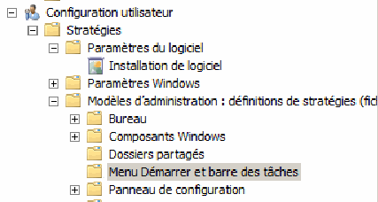

= Gestion de l'environnement de travail des utilisateurs d'un domaine
Bauer Baptiste <cours.bauer@gmail.com>
:description: Windows 2016 Server.
:icons: font
:keywords: windows 2012 Server, Active Directory
:sectanchors:
:url-repo: https://github.com/BTS-SIO2
:chapter-number: number
:sectnums:
:toc:
:experimental:
:correction:

====
* *Objectif :*
Définition de l'environnement de travail des utilisateurs d'un domaine Windows 2016.

* *Condition :* Le Tp est réalisé soit par groupe de deux étudiants, soit seul. Le groupe utilise un poste sous *Windows 2016 comme contrôleur de domaine (boot sur W2016 avec Active Directory et les comptes utilisateurs* du Tp sur la gestion des comptes) et *un poste sous Windows 10 Labo*.
====

== Présentation

L'environnement de travail d'un utilisateur est caractérisé par les différents éléments qui apparaissent à l'écran ou dans les menus (couleurs du fonds d'écran, icônes sur le bureau, personnalisation du menu Démarrer, raccourcis, lecteurs réseaux...). C’est ce qu’on appelle le *profil de l’utilisateur.*

Cet environnement de travail peut être personnalisé à l'aide de *scripts*, ces fichiers sont généralement des fichiers de *commandes du système d'exploitation* (`.bat`, `.cmd`), des scripts (`.vbs`, `.js`…) mais aussi dans certains cas, des *exécutables*.

L'environnement peut-être aussi défini et figé par des *stratégies de sécurité du domaine* sous Windows.

=== Préparation

==== Vérifier la validité des adresses Ip des deux postes

* Définir sur le client *Windows 10* une adresse IP compatible avec celle de votre serveur.

* Tester la connexion avec la commande `ping` (éventuellement, *désactiver* les pare-feu).

==== Vérifier que le service DNS soit démarré sur votre serveur

* menu:Démarrer[Outils d’administration > DNS] (C'est la console d’administration du DNS),
* kbd:[clic droit] sur le nom de votre serveur, kbd:[Toutes les tâches], vérifier que kbd:[Démarrer] est grisé,
* Ouvrir le dossier `Zones de recherche directe` et ouvrir le dossier `Dxx.btssio`,
Retrouver le nom de votre serveur et son adresse IP :

==== Ajouter le client Windows 10 dans le domaine Active Directory

[IMPORTANT]
====
*Définir sur le poste client Windows 10*, l'adresse du serveur *DNS* (_c'est votre serveur, contrôleur de domaine avec Active Directory_)
====

* Dans les kbd:[propriétés] de la carte réseau (_Protocole Internet TCP\IP_),
* Saisir l’adresse de votre serveur dans la zone Serveur DNS préféré, fermer les fenêtres de propriétés,
* Tester avec la commande : `ping win2016-xx.dxx.btssio`.

Ajouter le poste client *Windows 10* dans le domaine du serveur.

* kbd:[Démarrer], kbd:[clic droit] sur Ordinateur, kbd:[Propriétés], kbd:[lien] Modifier les paramètres,
* Onglet kbd:[Nom de l’ordinateur], bouton kbd:[Modifier…], dans la zone kbd:[Membre d’un], sélectionner kbd:[Domaine]
* Saisir le nom du domaine du serveur configuré avec Active Directory : `Dxx.btssio`.

[.question]
**
Question {counter:question} :
Quelles sont les informations demandées pour inclure ce poste dans le domaine :
**

ifdef::correction[]
[.reponse]
****
Réponse {counter:reponse} :
Un compte administrateur du domaine et son mot de passe.
****
endif::[]

[.question]
**
Question {counter:question} :
Faut-il redémarrer le poste client ?
**
ifdef::correction[]
[.reponse]
****
Réponse {counter:reponse} :
Oui
****
endif::[]

À l’ouverture d’une session sur le poste *Windows 10*, saisir le compte `administrateur` sans ouvrir la session.

[.question]
**
Question {counter:question} :
Quel domaine est proposé par le système pour ouvrir la session avec administrateur ?
**
ifdef::correction[]
[.reponse]
****
Réponse {counter:reponse} :
domaine local Win7.
****
endif::[]

Ouvrir une session sur le domaine *Dxx*, avec le compte administrateur du domaine :  `Dxx\administrateur`

==== Sur le serveur Windows 2016

Dans la console *Utilisateurs et ordinateurs Active Directory*, vérifier que le poste est bien ajouté.

[.question]
**
Question {counter:question} :
Dans quel conteneur (dossier) apparaît le poste ?
**

ifdef::correction[]
[.reponse]
****
Réponse {counter:reponse} :
Dans Computers, on trouve le nom Cxx avec le type : ordinateur
****
endif::[]

Vérifier maintenant la présence du *client Windows 10* (avec son adresse IP) dans la console DNS du serveur.

Créer dans votre domaine `Dxx.btssio`, une unité d'organisation qui se nomme `OrdinateurLabo` et déplacer le poste client Windows 10 dans cette unité.

**Mode opératoire : **

* kbd:[Clic droit]  sur `dxx.btssio`, menu:Nouveau[Unité d'organisation > saisir le nom OrdinateurLabo].

* kbd:[Clic droit] sur le nom du poste, menu:Déplacer…[sélectionner > l'unité `OrdinateurLabo`].

[IMPORTANT]
====
Vérifier les *options d'affichage* des fichiers de votre serveur :
Dans l'explorateur de fichiers, menu *Affichage*, cocher la case : `Extensions de noms de fichiers`.

image::img/tp03/tp03-01.png[]
====

== Les profils

Le profil de l’utilisateur est un ensemble de fichiers stocké dans un dossier portant le nom d'ouverture de session de l'utilisateur (dans `Utilisateurs` sous *Windows 10*).

Le profil est dit local lorsqu'il est enregistré sur le poste *client*. Pour que l'utilisateur retrouve son environnement de travail quel que soit le poste d'ouverture de session, le profil doit être enregistré sur le serveur, on parle alors de *profil itinérant (errant)*.

=== Création d'un profil itinérant (ou errant)

* Préparation sur le serveur :

** Créer dans la partition (`C:`) un dossier nommé `c:\Profils` qui contiendra tous les profils des *utilisateurs*,

** Modifier les droits d’accès à ce dossier en ajoutant le groupe `Tout le monde` en `Contrôle total` :
*** kbd:[Clic droit] sur le dossier, menu kbd:[Propriétés], onglet kbd:[Sécurité], bouton kbd:[Modifier].

* Partager ce dossier et définir les autorisations d’accès au groupe `Tout le monde` en `Contrôle total` :
** kbd:[Clic droit] sur ce dossier, menu kbd:[Propriétés], onglet kbd:[Partage], bouton kbd:[Partage avancé…], cocher kbd:[Partager ce dossier], bouton kbd:[Autorisations], Cocher kbd:[contrôle total] pour le groupe `Tout le monde`,

* Créer un profil errant pour tous les utilisateurs :

Dans la console `Utilisateurs et ordinateurs Active Directory`, kbd:[double clic] sur l'utilisateur concerné, Onglet kbd:[Profils], saisir le chemin menant au profil de l'utilisateur : `\\Win2016-xx\Profils\%username%`

* Ouvrir une session sur le poste client** Windows 10** avec le compte `Vicepresident`, créer un fichier texte sur le bureau qui se nomme `Vicepresident.txt`.

* Ouvrir une session sur le poste client *Windows 10* avec le compte `Representant`, créer un fichier texte sur le bureau qui se nomme `Representant.txt`.

* Ouvrir une session sur le poste client *Windows 10* avec le compte : `Dxx\administrateur`.

Vérifier le type de profil sur le poste client :
kbd:[Menu Démarrer], kbd:[clic droit] sur Ordinateur, kbd:[Propriétés], kbd:[Paramètres système avancés], dans la zone kbd:[Profil des utilisateurs], bouton kbd:[Paramètres]...

[.question]
**
Question {counter:question} :
Quels sont les profils présents et leur type ?
**
ifdef::correction[]
[.reponse]
****
Réponse {counter:reponse} :
`Dxx\Vicepresident et Dxx\Representant de type Itinérant et Dxx\Administrateur et Cxx\Administrateur de type Local`
****
endif::[]

[.question]
**
Question {counter:question} :
Sur le serveur, quels sont les dossiers créés dans le dossier `c:\Profils` ?
**
ifdef::correction[]
[.reponse]
****
Réponse {counter:reponse} :
`Vicepresident` et `Representant`
****
endif::[]

=== Répertoires partagés

Sur le serveur, créer dans la partition (`C:`) quatre dossiers (`Direction`, `Compta`, `Ventes` et `clients`) qui sont des répertoires mis en commun pour plusieurs utilisateurs de l'entreprise.

Partager ces répertoires en conservant le nom de partage par défaut (droits de partage : `lecture/Écriture` pour `tout le monde`).

=== Lecteurs réseaux

Pour certains utilisateurs de notre entreprise, nous allons définir des *lecteurs réseaux* qui se connectent à un dossier partagé en assignant une lettre.

Exemple de commande qui permet de définir un lecteur réseau `G` au dossier partagé nommé `data` :

`net use G: \\win2016-xx\data`       (avec un espace entre `G:` et `\\win2016-xx`)

[.question]
**
Question {counter:question} :
Quelles sont les commandes qui permettent de définir le lecteur réseau `I` vers le répertoire `Direction` et le lecteur réseau `J` vers le répertoire `Compta` ?
**

ifdef::correction[]
[.reponse]
****
Réponse {counter:reponse} :

* `net use I: \\Win2016-xx\Direction`

* `net use J: \\Win2016-xx\Compta`
****
endif::[]

Lancer ces deux commandes dans l' `Invite de commandes` du client *Windows 10* et vérifier la présence de ces lecteurs réseaux dans la fenêtre `Poste de travail`.

== Les scripts

=== Script d'ouverture de session (script de connexion)

Le script d'ouverture de session est un programme qui s'exécute automatiquement chaque fois qu'un utilisateur ouvre une session. Ce script peut notamment définir les lecteurs réseaux de l'utilisateur.

Le script est un fichier texte contenant les instructions à exécuter, il est placé sur le serveur, dans le répertoire : `C:\Windows\SYSVOL\sysvol\dxx.btssio\scripts`

Vérifier le nom de partage de ce dossier :

kbd:[Clic droit] sur le dossier, kbd:[Propriétés], Onglet kbd:[Partage], Chemin réseau : `\\Win2016-xx\netlogon`
Le nom du partage est donc : `netlogon`.

Définir les quatre fichiers de commande suivants.

* `Direction.cmd` 	: affecte la lettre `I` au répertoire `Direction`, `J` au répertoire `Compta`, `V` au répertoire `Ventes`
et `T` au répertoire `Clients`.
* `Compta.cmd` 	: affecte la lettre `I` au répertoire `Compta`, la lettre `V` au répertoire `Ventes`.
* `Rep.cmd` 	: affecte la lettre `I` au répertoire `Ventes` et la lettre `J` au répertoire `Clients`.
* `Assistant.cmd` 	: affecte la lettre `I` au répertoire `Clients`.

Pour vérifier le résultat de l’exécution du script, mettre le mot  *_pause_*  à la fin de chaque script.

*Tests* : Lancer directement ces scripts et vérifier la création des lecteurs réseaux.
Si c’est bon, enlever le mot *_pause_* de chaque script.

Placer ces scripts dans le répertoire correspondant du serveur : `C:\Windows\SYSVOL\sysvol\dxx.btssio\scripts`.

Les scripts seront affectés de la manière suivante :

* Le vice-président doit avoir : `Direction.cmd`,
* Les comptables et le chef des ventes : `Compta.cmd`,
* Le représentant : `Rep.cmd`
* Les assistants clientèle : `Assistant.cmd`

Affecter les scripts aux utilisateurs correspondants :

kbd:[Double clic] sur l'utilisateur, Onglet kbd:[Profil],
Mettre le nom du script dans la zone Script d'ouverture de session (seulement le nom sans le chemin).

**Tests :**
Vérifier l'affectation des lecteurs en ouvrant des sessions avec les différents utilisateurs.

=== Synchroniser l'heure du poste avec celle du serveur

*Préparation* : Autoriser la modification de l'heure sur les postes clients
Sur le poste client, à partir du compte `administrateur`, *Panneau de configuration*,  icône *Outils d'administration*,

Ouvrir la stratégie de sécurité locale, ouvrir le dossier `Stratégie locale`, dans le dossier `Attribution des droits utilisateur`, kbd:[double clic] sur *Modifier l'heure système*.

Bouton kbd:[Ajouter…], sélectionner le groupe *Utilisateur du domaine de votre domaine*, bouton kbd:[Ajouter]
(Choisir le domaine dans la liste déroulante).

La commande qui permet de synchroniser l'heure d'un poste avec celle d'un autre poste est :
`net time \\NomDuPoste`

[.question]
**
Question {counter:question} :
En utilisant l'aide de Windows, quel est le rôle des paramètres `/set` et `/yes` avec la commande net time ?
**
ifdef::correction[]
[.reponse]
****
Réponse {counter:reponse} :

* `Net time \\NomduPoste` : affiche l'heure du poste distant.
* `/set` : modifie l'heure du poste où est lancée la commande.
* `/yes` : évite de demander une confirmation.
****
endif::[]

La commande lancée sur le poste client qui permet de synchroniser l'heure avec celle du serveur est donc :
`Net time \\Win2016-xx  /set /yes`.

Modifier vos scripts d'ouverture de session pour ajouter cette commande.

*Tests :* modifier l'heure du poste client et ouvrir une session avec un compte d'utilisateur.
L'heure du client est-elle la même que celle du serveur : *Oui*.

== Les GPO (Group Policies Object)

Les *GPO* (ou *stratégies de groupe*) vont permettre de définir des restrictions sur l’environnement Windows des postes clients.

=== Création d’une nouvelle GPO sur une unité d’organisation

Bouton kbd:[Démarrer] , menu:Outils d’administration[Gestion des stratégies de groupe] : déployer l’arborescence `Gestion de stratégie de groupe` jusqu’au nom du domaine.

kbd:[Clic droit] sur l’unité d’organisation concernée (*LABO*), menu kbd:[créer] un objet GPO dans ce domaine, et le lier ici...

Nommé cet objet : *LABO*

=== Définition des restrictions sur le menu Démarrer et barre des tâches

Les restrictions à appliquer :

*	Interdire l’accès aux menus contextuels pour la barre des tâches
*	Interdire l’icône Images du menu Démarrer
*	Interdire l’icône Documents du menu Démarrer

Déployer  l’*unité d’organisation LABO*, kbd:[clic droit] sur l’objet *GPO*, menu kbd:[Modifier]...

Configuration `utilisateur` > `Stratégies` > `Modèles d’administration`,
Sélectionner `Menu Démarrer` et `barre des tâches`

Dans la fenêtre de droite, activer les paramètres nécessaires pour nos restrictions :

*Test sur le client :*

Ouvrir une session avec le compte `Vicepresident` et vérifier l’application de ces trois restrictions.

Éventuellement, pour forcer l’application des stratégies, taper la commande suivante dans l’ `Invite de commandes` du client *Windows 10* : `gpupdate /force`.

Trouver la solution pour bloquer l’accès au `panneau de configuration` et tester sur le client *Windows 10*.

*Résumer de la GPO* : sélectionner l’objet *GPO*, fenêtre de droite, onglet `Paramètres`, lien `afficher`.

=== Remettre le poste client Windows 10 Labo en workgroup

Ouvrir une session avec le compte administrateur : `Dxx\Administrateur`.

`Démarrer > clic droit sur Ordinateur > Propriétés > lien Modifier les paramètres > Onglet Nom de l’ordinateur > bouton Modifier…`, dans la zone `Membre d’un`, sélectionner `Groupe de travail`,

Saisir le nom du groupe : *WORKGROUP*
