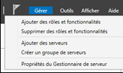
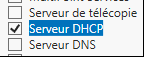
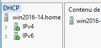
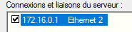
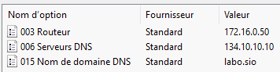

= Windows Serveur 2016 : Serveur DHCP
Bauer Baptiste <cours.bauer@gmail.com>
:description: Windows 2016 Server.
:icons: font
:keywords: windows 2012 Server, Active Directory, DHCP
:sectanchors:
:url-repo: https://github.com/BTS-SIO2
:chapter-number: number
:sectnums:
:toc:
:experimental:
:correction:

====
* *Objectif :*
Configuration dynamique des paramètres `TCP/IP` des stations clientes.

* *Condition :* Le Tp est réalisé par groupe de deux étudiants.
Le groupe utilise deux postes directement connectés, un sous *Windows 2016* et un sous *Windows 10 Labo*.
====

== Préparation

*a) Sous Windows 10 Production SIO*

* Pour le premier poste, créer une nouvelle entrée multiboot pour** Windows2016** : *_W2016-DHCP_*
* Sur l’autre poste, créer une nouvelle entrée multiboot pour *Windows10* : *_W10LaboDHCP_*
* Redémarrer sur ces nouvelles entrées.

*Connecter les deux postes avec les cartes réseaux Broadcom, désactiver les cartes réseaux Intel.*

*b) Définir les paramètres IP des postes*

Pour le *serveur Windows 2016*, saisir : `172.16.0.1/16`

Pour le client Windows 10 labo, saisir : `172.16.0.100/16`

Vérifier la connexion (PING) entre les deux ordinateurs (éventuellement, *désactiver* les pare-feux).

== Introduction à DHCP (Dynamic Host Configuration Protocol)

La mise en œuvre de TCP/IP sur un réseau de taille respectable peut être très difficile à suivre et à administrer correctement. La configuration de chaque poste doit être parfaite, chaque adresse IP doit être unique, le risque de conflits d'adresse est toujours présent. Lorsque le réseau grossit, gérer ces adresses peut prendre beaucoup de temps. De même, les machines portables doivent être réadressées à chaque changement de réseau.

Le protocole DHCP (Protocole de configuration dynamique de l'hôte) offre un moyen de centraliser la configuration des postes du réseau, en mettant à disposition du réseau local un serveur capable de fournir aux stations clientes tous les paramètres TCP/IP, notamment :

* l'adresse IP,
* le masque de sous-réseau,
* la passerelle par défaut,
* l'adresse des serveurs de noms (DNS),
* le nom de domaine internet, ….

La configuration d'une station sous IP se résume alors à cocher une unique case, tous les paramètres IP étant fournis par le serveur.

== Installation et configuration du serveur DHCP

*1.* **Installer le rôle Serveur DHCP (Windows2016) **:

Menu menu:Gérer[ Ajouter des rôles et fonctionnalités]  :

(Attendre éventuellement la fin de la collecte des données)

Bouton *Suivant* pour passer la page ‘Avant de commencer’,
Conserver le type d’installation _*Installation basée sur un rôle ou une fonctionnalité*_, bouton *Suivant*,
Conserver votre serveur sélectionné par défaut, bouton *Suivant*,

Cocher le Rôle : ‘*Serveur DHCP*’ :

Bouton *Ajouter des fonctionnalités* (pour les fonctionnalités requises).

Bouton *Suivant* trois fois, bouton *Installer*,_** Attendre !!**_

bouton *Fermer*. Menu Notifications
Terminer la configuration DHCP, bouton Valider, bouton Fermer.

Ouvrir la console *DHCP* : Menu menu:Outils[DHCP]

Redémarrer le service DHCP : kbd:[Clic droit]  sur le _nom du serveur_ > _Toutes les tâches_ > _Redémarrer_

Vérifier la carte utilisée par le service *DHCP* :

kbd:[Clic droit] sur le nom du serveur/Ajouter-Supprimer des liaisons…

Vérifier que la carte *Broadcom* avec la bonne IP soit bien sélectionnée.

*2.* *Création d'une étendue d'adresses*.

kbd:[Clic droit] sur IPv4 > Nouvelle étendue > bouton kbd:[Suivant] pour continuer.

Définir un nom et une description pour l’étendue (Test, Tp DHCP)

Définir la plage d’adresses IP de l’étendue : `172.16.0.1` à `172.16.0.10`, conserver le masque, bouton Suivant,

Exclure l’adresse du serveur DHCP, bouton Ajouter, bouton kbd:[Suivant],

Conserver la durée de bail par défaut, bouton kbd:[Suivant],

Cocher ‘_Non, je configurerai ces options ultérieurement_’, bouton kbd:[Suivant], bouton kbd:[Terminer].

*Activer l’étendue :*

IPv4, kbd:[clic droit] sur Etendue [`172.16.0.0`] test, menu kbd:[Activer].

Ouvrir le dossier de l’étendue,

[.question]
**
Question {counter:question} :
Quelles sont les informations affichées dans le dossier Pool d'adresses de l'étendue du serveur ?
**
ifdef::correction[]
[.reponse]
****
*Réponse {counter:reponse} :*
Les plages d'adresses et les exclusions
****
endif::[]

*3.* *Configuration d'une station cliente pour l'utilisation de DHCP*

*Sur le client Windows 10 Labo :*
Editer les propriétés TCP/IP de la carte réseau:
Cocher l'option Obtenir une adresse IP automatiquement, bouton OK, bouton Fermer.

*Tests :*
Tester le résultat avec `Ipconfig` dans l’`invite de commandes` :

* Adresse IP du client *W10* :
** `169.254.x.x` (adresse APIPA : Automatic Private Internet Protocol Addressing ) ou `0.0.0.0`

Si l’adresse IP n’est pas compatible avec la plage de l’étendue, lancer la commande `Ipconfig /renew`,

Vérifier que le client a bien une adresse IP compatible avec la plage de l’étendue, IP : `172.16.0.2`

Vérifier avec `ipconfig /all` l’adresse IP du serveur *DHCP* affichée sur le client : `172.16.0.1`

Lancer la commande `ipconfig /release` et vérifier le résultat avec la commande `Ipconfig`.

[.question]
**
Question {counter:question} :
 Que fait la commande ipconfig /release ?
**

ifdef::correction[]
[.reponse]
****
*Réponse {counter:reponse} :*
Elle libère l'adresse IP, cette adresse peut maintenant être affectée à un autre poste
****
endif::[]

Lancer la commande `ipconfig /renew`,

[.question]
**
Question {counter:question} :
Quelle adresse IP reçoit le client ?
**
ifdef::correction[]
[.reponse]
****
*Réponse {counter:reponse} :*
La même adresse IP 172.16.0.2
****
endif::[]

[.question]
**
Question {counter:question} :
A votre avis, quel type de trame (unicast – broadcast) le client utilise pour contacter le serveur DHCP (Ne chercher pas trop longtemps) ?
**

ifdef::correction[]
[.reponse]
****
*Réponse {counter:reponse} :*
Il lance une trame de type broadcast.
****
endif::[]

*4. Durée du bail d'une adresse IP*

Dans le *Gestionnaire de serveur*, Serveur *DHCP*, kbd:[Clic droit] droit sur le dossier *Étendue*, *Propriétés*,

Dans la zone ‘*Durée de l'allocation pour les clients DHCP*’, définir une durée du bail de 1 heure, bouton OK,

*Test :*

Lancer dans l’invite de commandes du client W10 Labo, l’instruction `ipconfig /renew`,
Vérifier l'expiration du bail avec l’instruction `ipconfig /all`.

Dans le dossier ‘*Baux d’adresses*’ de l’Étendue, vérifier le nom, l’expiration du bail et l’adresse Mac du client.

*5. Réservation d'une adresse spécifique à un client*

Il est possible d'attribuer toujours la même adresse particulière à un client (serveur web, imprimante).

Dossier *Etendue*, kbd:[clic droit] sur le dossier *Réservations* > *Nouvelle réservation*,

Saisir un nom (*reserW10*), une nouvelle adresse IP : `172.16.0.8`, l'adresse MAC de votre client W10, kbd:[Ajouter].

*Test :* Lancer dans l’invite de commandes du client W10, l’instruction `ipconfig /renew`,

[.question]
**
Question {counter:question} :
Quelle est maintenant l’adresse IP du client ?
**
ifdef::correction[]
[.reponse]
****
*Réponse {counter:reponse} :*
Nouvelle adresse IP `172.16.0.8`
****
endif::[]

kbd:[Clic droit] sur le dossier ‘*Baux d’adresses*’ > menu Actualiser.

[.question]
**
Question {counter:question} :
quel est l’état de la réservation dans la colonne ‘Expiration du bail’ ?
**
ifdef::correction[]
[.reponse]
****
*Réponse {counter:reponse} :*
(active)
****
endif::[]

**Supprimer la réservation **: Dossier *Réservations* > kbd:[clic droit] sur la réservation > menu Supprimer.

*6. Création d'options propres à une étendue*

Des paramètres IP supplémentaires peuvent être attribués par le serveur DHCP aux clients (comme l'adresse de la passerelle par défaut, l’adresse IP d’un serveur DNS, etc.).

*Méthode :*
kbd:[clic droit] sur le dossier *Options d'étendue*, Configurer les options, cocher les cases des options à ajouter puis indiquer leur valeur (ne pas oublier le bouton kbd:[Ajouter] pour chaque valeur à ajouter).

*_Exemples des principales options DHCP :_*
|===
| 003 Routeur |	Adresse de la passerelle par défaut
| 006 Serveur DNS |	Adresse d’un serveur de noms
| 015 Nom de domaine DNS |	Nom de domaine
|===

[NOTE]
====
*Ne pas tenir compte de l’alerte sur l’adresse du serveur DNS !*
====

Une fois configurée, vérifié la présence de ces trois paramètres dans la colonne *Valeur* des options :

*Test :*

Lancer dans l’*invite de commandes* du client W10, l’instruction `ipconfig /renew`,

Vérifier la configuration de ces trois options IP avec l’instruction `ipconfig /all` :
|===
|Suffixe DNS propre : | labo.sio
| Passerelle par défaut : | 172.16.0.50,
|Serveurs DNS : | 134.10.10.10
|===
