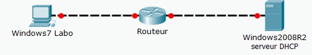
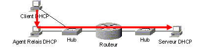
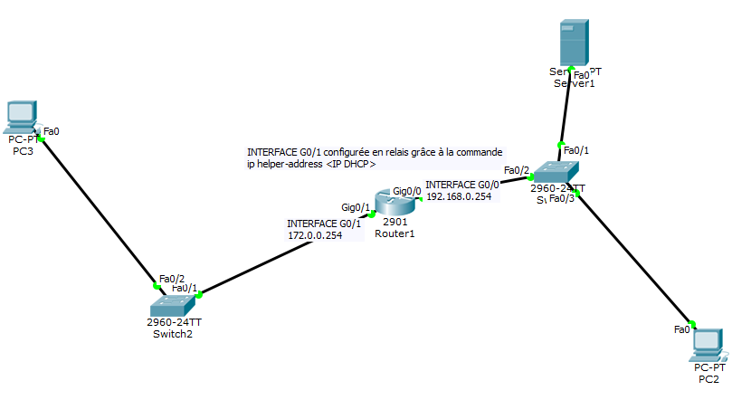
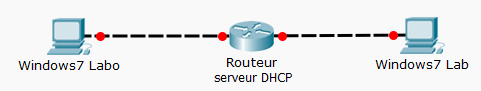

= Windows Serveur 2016 : Serveur DHCP et Agent relais DHCP
Bauer Baptiste <cours.bauer@gmail.com>
:description: Windows 2016 Server.
:icons: font
:keywords: windows 2012 Server, Active Directory, DHCP
:sectanchors:
:url-repo: https://github.com/BTS-SIO2
:chapter-number: number
:sectnums:
:toc:
:experimental:
:correction:

====
* *Objectif :*
Configuration dynamique des paramètres TCP/IP des stations clientes.

* *Condition :* Le Tp est réalisé par groupe de deux étudiants.
Le groupe utilise les deux postes du Tp sur *DHCP* et le routeur Cisco *2901* du premier Tp sur le matériel Cisco.
====

== Préparation

*a) Connexion*

Connecter la carte réseau *Broadcom* du serveur Windows 2016 sur l’interface `G0/0` du routeur *2901*.

Connecter la carte réseau *Broadcom* du client Windows 10 sur l’interface `G0/1` du routeur *2901*.

*b) Définir les paramètres IP*

Sans changer la configuration IP du routeur, faite le nécessaire sur les configurations IP pour assurer une connexion entre les deux postes sans utiliser la configuration DHCP sur le client Windows 10.
Vérifier la connexion (PING) entre les deux ordinateurs (éventuellement, *désactiver* les pare-feux).

*Noter les configurations retenues :*

|===
|*Serveur, IP* 	: |`172.16.0.1`				|*Client W10, IP*	: |`172.17.0.1`
|*Masque* 	: |`255.255.0.0`				|*Masque* 	: |`255.255.0.0`
| *Passerelle* 	: |``172.16.0.254	``			|*Passerelle* 	: |`172.17.0.254`
|===

== Agent Relais DHCP
*Présentation*

Les clients DHCP obtiennent un bail IP en accédant à un serveur *DHCP* avec des trames de "*broadcast* " (diffusion). Etant donné que les "*broadcast*" sont stoppés par les routeurs, il est donc nécessaire de disposer d'un serveur DHCP par segment. On peut s'affranchir de cette contrainte en configurant un agent relais *DHCP* sur un  routeur (ou un serveur).

L'agent relais *DHCP* est configuré avec une *adresse IP statique* et a connaissance de l'*adresse IP du serveur DHCP*. Il intercepte les "broadcast" *DHCP* envoyés par les clients, afin de les router vers le serveur DHCP. De son côté, le serveur *DHCP* sait dans quelle étendue il faut prendre une adresse IP pour la retourner à l'agent.

**Exemple:**

*1. Étape 1* : *Compléter la configuration du serveur DHCP*

Ajouter une nouvelle étendue pour le second réseau IP, ne pas oublier l’option 003 Routeur.
Modifier l’option 003 Routeur de l’étendue déjà configurée.

[.question]
**
Question {counter:question} :
Nouvelle étendue 2 ?
**
ifdef::correction[]
[.reponse]
****
*Réponse {counter:reponse} :*
`172.17.0.1 à 172.17.0.10`
****
endif::[]

[.question]
**
Question {counter:question} :
Option ?
**
ifdef::correction[]
[.reponse]
****
*Réponse {counter:reponse} :*
003 Routeur 172.17.0.254 (Routeur)
****
endif::[]

[.question]
**
Question {counter:question} :
Étendue 1 : 	option ?
**
ifdef::correction[]
[.reponse]
****
*Réponse {counter:reponse} :*
003 Routeur 172.16.0.254
****
endif::[]

*Tests : Configurer le client Windows 10 labo en client DHCP*,

Vérifier que le client n'obtient pas d'adresse du serveur DHCP (`ipconfig /renew`).

[WARNING]
====
Attention, il peut obtenir une adresse d'auto configuration en 169.254.x.x
====

*2. Étape 2 : Configuration d'un agent relais DHCP sur le routeur Cisco 2091.*

Connecter vous à votre routeur via le câble console.

Configurer l’agent relais DHCP sur l’interface G0/1 du routeur :

* `conf  t` 	pour accéder au mode configuration : (config)#
* `int g0/1` 	pour accéder à la configuration de l’interface réseau `g0/1` : `(config-if)#`
* `ip helper-address AdresseIPServeurDHCP` 	(agent relais) pour spécifier l'adresse IP du serveur *DHCPv4*
* `end` 	pour revenir en mode privilège : #

* Afficher les informations de l’interface :``show ip interface g0/1``

[.question]
**
Question {counter:question} :
Pourquoi n’est-il pas nécessaire de configurer l’agent relais sur l’interface G0/0 ?
**
ifdef::correction[]
[.reponse]
****
*Réponse {counter:reponse} :*
Le serveur DHCP est présent sur cette connexion, il n’y a donc pas de routeur entre le serveur DHCP et les éventuels clients DHCP de ce réseau.
****
endif::[]

Tests sur le client Windows 10 Labo:

* Vérifier que le client *DHCP* obtient bien une adresse IP,
* Vérifier la connexion avec le serveur *DHCP* (PING),
* Vérifier que le renouvellement de l’adresse s’effectue correctement (`ipconfig /renew`),
* Afficher les informations de la configuration IP (`ipconfig /all`) et retrouver les adresses IP du serveur DHCP et de l’agent relais DHCP.

*3. Configuration du routeur en serveur DHCP*

*Préparation :*

Redémarrer le poste *Windows2016* sur une nouvelle entrée Windows 10 labo.

Supprimer la configuration de l’agent relais sur l’`interface G0/1` du routeur
( `no ip helper-address AdresseIPServeurDHCP` )

En utilisant le mode opératoire _04CiscoModeOperatoireRouteur.pdf_ ,  configurer le routeur en serveur *DHCP* pour attribuer des adresses IP aux deux postes.
[.question]
**
Question {counter:question} :
Combien d’étendue DHCP (pool DHCP) faut-il définir sur le routeur ?
**
ifdef::correction[]
[.reponse]
****
*Réponse {counter:reponse} :*
2
****
endif::[]

Configurer le second poste *Windows 10 labo* en client *DHCP*.

Tests à faire sur les deux postes :

* Vérifier que le client *DHCP* obtient bien une adresse IP,
* Vérifier la connexion avec l’autre poste (*PING*),
* Vérifier que le renouvellement de l’adresse s’effectue correctement (`ipconfig /renew`),
* Afficher les informations de la configuration IP (`ipconfig /all`) et retrouver l’adresse *IP* du serveur *DHCP*.

Tests à faire sur le routeur (voir m**__ode opératoire__**):

* Afficher les informations sur le service *DHCP* du routeur (_binding_ et _statistics_).

[.question]
**
Question {counter:question} :
Pourquoi ne faut-il pas définir d’agent relais dans cette configuration?
**
ifdef::correction[]
[.reponse]
****
*Réponse {counter:reponse} :*
Le routeur fait également office de serveur DHCP, il n’y a donc pas de routeur positionné entre les clients DHCP et le serveur DHCP.
****
endif::[]

*4. Désactiver le service DHCP sur le routeur (IMPORTANT).*