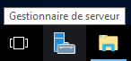
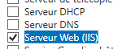
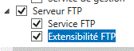
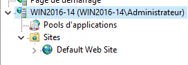

= Windows Serveur 2016 : Serveur FTP
Bauer Baptiste <cours.bauer@gmail.com>
:description: Windows 2016 Server.
:icons: font
:keywords: windows 2012 Server, Active Directory, DHCP
:sectanchors:
:url-repo: https://github.com/BTS-SIO2
:chapter-number: number
:sectnums:
:toc:
:experimental:

====
* *Objectif :*
Configuration d'un serveur FTP avec Windows 2016 server.

* *Condition :* Le Tp est réalisé par l'étudiant sur Windows 2016
====

== Configuration d'un site FTP (File Transfert Protocol)

FTP est un protocole de transfert de fichiers. Il permet de mettre à disposition des utilisateurs des documents qu'ils pourront télécharger.

Vous pouvez créer un site FTP avec Windows 2016 à l'aide du Gestionnaire de services Internet (IIS).

=== Préparation

* Sous **Windows 10 SIO**, créer une nouvelle entrée multiboot pour Windows2016 : `NomEtudiant-WebFtp`.

* *Redémarrer sur cette nouvelle entrée.*

* Définir les paramètres IP de la carte *Intel*, saisir : `172.16.0.xx/16` (`xx` = numéro du poste)

* Vérifier la connexion (PING) avec le poste d’un autre étudiant (éventuellement, *désactiver les pare-feux*).
* *Désactiver la sécurité d’Internet Explorer* : menu:Gestionnaire de serveur[Serveur local >Configuration de sécurité renforcée d’Internet Explorer > Inactif (désactivé) ]

[IMPORTANT]
====
Vérifier les options d'affichage des fichiers de votre serveur :

menu:Explorateur de fichiers[Affichage > Extensions de noms de fichiers (à cocher)]
====

* Créer les quatre répertoires suivants :
** `C:\monFTP`
** `C:\monFTP\anonymous`
** `C:\monFTP\administrateur`
** `C:\monFTP\commun`

Placer un fichier texte dans `C:\monFTP\anonymous, nommé anonymous.txt`.

Placer un fichier texte dans `C:\monFTP\administrateur, nommé administrateur.txt`.

===  Serveur Web (IIS)

Installer le rôle Serveur Web (IIS)

Utiliser le bouton Gestionnaire de serveur :

menu:Gérer[Ajouter des rôles et fonctionnalités > Avant de commencer]

Attendre éventuellement la fin de la collecte des données.

Conserver le type d’installation « *Installation basée sur un rôle ou une fonctionnalité* »,  kbd:[Suivant] ,
Conserver votre serveur sélectionné par défaut, kbd:[Suivant],

Cocher le Rôle : ‘*Serveur Web (IIS)*’

Cliquer sur kbd:[Ajouter des fonctionnalités]   (_pour les fonctionnalités requises_) et cliquer sur kbd:[Suivant] trois fois.

Dans les services de rôle, cocher ‘*Serveur FTP*’ :

Boutons kbd:[Suivant] et kbd:[Installer], Attendre !!! Et bouton kbd:[Fermer].

Ouvrir la console IIS :

menu:Outils[Gestionnaire des services Internet (IIS)]

=== Création d'un nouveau site FTP

* kbd:[Clic droit] sur le dossier `Sites`, menu `Ajouter un site FTP`.
** Pour le nom du site, mettre *TpFTP*, pour le Chemin d'accès physique, rechercher le dossier `C:\monFTP`,

* Bouton kbd:[Suivant], Conserver coché `Démarrer automatiquement le site FTP`,

* Pour *SSL*, sélectionner  *Pas de SSL*, kbd:[Suivant]

* Dans *Authentification*, cocher *Anonyme*,

* Dans la liste déroulante *Autoriser l’accès à*, sélectionner *Utilisateurs anonymes*,

* Dans *Autorisations*, cocher *Lecture*

* Bouton kbd:[Terminer].

=== Messages de bienvenue et de sortie

Dans la console *Gestionnaire des services Internet (IIS)*, sélectionner le site *TpFTP*,
En bas, bouton *Affichage des fonctionnalités*,
kbd:[Double clic] sur *Messages FTP*, dans les zones Texte du message, définir un message de bienvenue et de sortie, et un pour la bannière de votre site FTP.
Dans la zone *Actions* de droite, kbd:[Appliquer].

=== Répertoire de l'utilisateur

* Dans la console *Gestionnaire des services Internet*, sélectionner le site *TpFTP*,
* Bouton `Affichage des fonctionnalités`,
kbd:[Double clic] sur `Isolation d’utilisateur FTP`, cocher *Répertoire des noms d’utilisateurs*,
* Dans la zone Actions de droite, bouton Appliquer.

=== Tester

* Tester vers votre site FTP et vers le site FTP d’un autre étudiant.

Réaliser les testes à partir de l'*Invite de commandes* et le mode FTP (taper ftp dans l'_Invite de commandes_).

Pour la connexion, utiliser le compte *anonymous* avec le mot de passe de votre choix.

Les principales commandes nécessaires :

|===
|*Se connecter à un serveur FTP* | `OPEN <IpDuServeur>` (ou <NomDuServeur> si DNS OK)
|*Voir les fichiers* | `DIR` ou `LS`

|*Copier des fichiers vers le serveur* | `PUT fichiers-local [fichiers-distant]`, ex : PUT c:\fichier.txt fichier.txt

|*Prendre des fichiers du serveur* | `GET fichiers-distant [fichiers-local]`, ex : GET fichier.txt c:\fichier.txt
|*Se déconnecter* |`CLOSE`
|*Quitter le mode FTP*|`QUIT`, `BY`
|===

Voir les commandes *FTP* dans l'aide de Windows ou en tapant `help` dans le mode `ftp>` de l'*Invite de commandes*.

=== Connexion Anonyme

[.question]
**
Question {counter:question} :
En se connectant avec le compte anonymous, dans quel répertoire du site FTP arrive-t-on ?
**

ifdef::correction[]
[.reponse]
****
*Réponse {counter:reponse} :*
`/monFTP/anonymous`
****
endif::[]

Avec la commande FTP, télécharger un fichier pour le placer dans un répertoire local `C:\`.

[.question]
**
Question {counter:question} :
Quelle est la commande ?
**

ifdef::correction[]
[.reponse]
****
*Réponse {counter:reponse} :*
`get anonymous.txt c:\anonymous.txt`
****
endif::[]

Avec la commande *FTP*, ESSAYER de transférer un fichier vers le site FTP d’un autre étudiant, 

[.question]
**
Question {counter:question} :
Quelle est la commande ?
**
ifdef::correction[]
[.reponse]
****
*Réponse {counter:reponse} :*
`put f:\temp\divers.txt`

*Résultat* : Accès refusé (_normal_, _lecture seulement_)
****
endif::[]

[.question]
**
Question {counter:question} :
Expliquer pourquoi la dernière commande ne marche pas (accès refusé) ?
**
ifdef::correction[]
[.reponse]
****
*Réponse {counter:reponse} :*
Pas les droits en écriture.
****
endif::[]

=== Ajouter un répertoire virtuel

kbd:[Clic droit] sur le nom du site *TpFTP*, menu *Ajouter un répertoire virtuel*.

* Pour l’*Alias*, saisir *commun*,
* Pour le chemin d'accès, sélectionner `C:\monFTP\commun` à l’aide du bouton kbd:[Parcourir..], bouton kbd:[Ok],
* Sélectionner le répertoire virtuel commun dans le site *TpFTP*, afficher les fonctionnalités,
* kbd:[Doucle CLic] sur *Règles d’autorisation FTP*, sélectionner la règle (_Autoriser, Utilisateurs anonymes, Lecture_),
* Dans la zone** Actions** de droite, bouton kbd:[Modifier] dans *Autorisations*, cocher *Écriture*, kbd:[OK].

=== Tester

Vers votre site FTP et vers le site FTP d’un autre étudiant.

* Ouvrir une session FTP anonymous sur le serveur FTP (dans l’invite de commandes)
* Déplacer vous dans le répertoire virtuel : commun avec la commande : `cd /commun`

Avec la commande FTP, transférer un fichier du poste vers le site FTP.

[.question]
**
Question {counter:question} :
Quelle est la commande? résultat ?
**
ifdef::correction[]
[.reponse]
****
*Réponse {counter:reponse} :*
`put c:\temp\divers.txt`

*Résultat :* Transfer complete (normal, lecture et écriture)

****
endif::[]

Essayer de vous connecter avec le compte administrateur, mot de passe _Toto01_.

[.question]
**
Question {counter:question} :
Résultat ?
**
ifdef::correction[]
[.reponse]
****
*Réponse {counter:reponse} :*
User administrateur cannot log in.
****
endif::[]

Dans Internet Explorer, tester l'URL suivante : *ftp://172.16.0.xx*

[.question]
**
Question {counter:question} :
Dans quel répertoire du site FTP arrive-t-on ?
**
ifdef::correction[]
[.reponse]
****
*Réponse {counter:reponse} :*
/monFTP\anonymous (avec 2008R2 ??)
****
endif::[]

=== Autoriser les connexions non anonymes

* Dans la console *Gestionnaire des services Internet*, sélectionner le site *TpFTP*, afficher les *fonctionnalités*,
* kbd:[Double clic] sur Authentification FTP, sélectionner la ligne *Authentification de base (état Désactivé)*,
* Dans la zone Actions de droite, kbd:[Activer].

* Dans la console *Gestionnaire des services Internet*, sélectionner le site *TpFTP*, afficher les fonctionnalités,
* kbd:[Double clic] *Règles d’autorisation FTP*, sélectionner la ligne Autoriser (Utilisateurs anonymes),
* Dans la zone *Actions de droite*, bouton kbd:[Modifier...], cocher Tous les utilisateurs, bouton kbd:[ok].

Tester la connexion avec le compte administrateur, mot de passe *Toto01*,

[.question]
**
Question {counter:question} :
Dans quel répertoire du site arrive-t-on ?
**
ifdef::correction[]
[.reponse]
****
*Réponse {counter:reponse} :*
\MonFTP\administrateur
****
endif::[]

=== Interdire les connexions anonymes

Dans la console *Gestionnaire des services Internet (IIS)*, sélectionner le site *TpFTP*,

* Bouton kbd:[Affichage des fonctionnalités],
* kbd:[Double clic] sur Authentification FTP, sélectionner la ligne *Authentification anonyme (état Activé)*,
* Dans la zone Actions de droite, bouton kbd:[Désactiver].

Vérifier qu’il faut maintenant s’identifier pour se connecter :
Dans Internet Explorer, tester l'URL suivante : ftp://172.16.0.xx, (bouton actualiser ou vider le cache Internet)

=== Configuration du site FTP

Sélectionner le site *TpFTP*,

Bouton kbd:[Affichage des fonctionnalités], trouver la fonction pour désactiver une session active :

kbd:[Double clic] sur Sessions Actives FTP, dans la zone Actions, bouton kbd:[Déconnecter la session].

Clic droit sur le site TpFTP, menu Modifier les liaisons…, numéro de port par défaut d'un site FTP : 21

Sélectionner la ligne et bouton kbd:[Modifier…], Changer le numéro de port (mettre 1500), bouton kbd:[OK].

Tester la connexion, 

[.question]
**
Question {counter:question} :
quelle est la commande à taper dans l’invite de commandes pour la connexion avec le port 1500 :
**

ifdef::correction[]
[.reponse]
****
*Réponse {counter:reponse} :*
OPEN 172.16.0.1 1500
****
endif::[]

[IMPORTANT]
====
Remettre le numéro de port à 21.
====

=== Analyse des trames FTP

Capturer les trames de la connexion au serveur FTP avec le compte administrateur et fermer la connexion FTP.
Rechercher les informations suivantes dans la capture des trames

* Les trois premières trames du mode connecté du protocole TCP : (`SYN`, `SYN-ACK`, `ACK`)
* Les trames de fermeture de la connexion TCP.

Dans les trames *FTP*, zone *FTP*

* Message contenant le nom de l'utilisateur
* *Message contenant le mot de passe (IMPORTANT)*
* Message contenant la réponse du serveur FTP après la saisie du mot de passe.

=== Outil graphique de connexion à un site FTP

Installer le** client FTP graphique FileZilla**  et tester la connexion à votre site FTP et ensuite sur le site d’un autre étudiant.

Tester la copie de fichiers.
