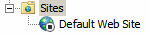
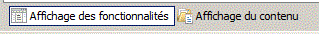
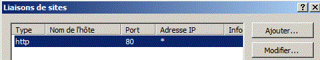

= Windows Serveur 2016 : Serveur DHCP et Agent relais DHCP
Bauer Baptiste <cours.bauer@gmail.com>
:description: Windows 2016 Server.
:icons: font
:keywords: windows 2012 Server, IIS
:sectanchors:
:url-repo: https://github.com/BTS-SIO2
:chapter-number: number
:sectnums:
:toc:
:experimental:

====
* *Objectif :*
Configuration d'un serveur WEB avec Windows 2016 server.

* *Condition :* Le Tp est réalisé par l'étudiant sur Windows 2016
====

== Introduction au serveur Web (WWW, World Wide Web)

Un serveur Web est un ordinateur exécutant le protocole TCP/IP qui renvoie des pages Web à des clients qui en font la demande. Le protocole utilisé pour ce transfert d'information est *HTTP* (HyperText Transfer Protocol), qui est encapsulé dans *TCP/IP*. Le serveur Web peut héberger des sites afin qu'ils soient consultables du monde entier par le réseau Internet. Il est également concevable de mettre à disposition des informations au sein d'une entreprise, de la même manière que celles exposées sur Internet. On appelle cette conception un Intranet. Il s'agit des mêmes méthodologies que celles utilisées sur le réseau mondial, mais limitées à un réseau d'une entreprise, sans qu'il y ait de point d'entrée par Internet.

Les clients (utilisateurs) se servent d'un navigateur afin de consulter l'information. Un navigateur est une application  (Internet Explorer, Netscape) qui sert à consulter des pages Web (HTML).

Le serveur Web de Windows 2016 se nomme *IIS (Internet Information Services)*

== Configuration d'un site Web sous IIS

[IMPORTANT]
====
Démarrer sur l’entrée créée pour le **Tp Serveur FTP**: `<NomEtudiant>-WebFtp`
====

=== Préparation des pages WEB.

[IMPORTANT]
====
Vérifier les options d'affichage des fichiers de votre serveur.

Dans l'explorateur de fichiers :

menu:Affichage[Extensions de noms de fichiers(à cocher)]

====

* Créer les répertoires suivants :
** `C:\Siteperso`,
** `C:\Siteperso\image`,
** `C:\Siteperso\doc\div`,
** `C:\page`.

* Créer dans le répertoire `C:\Siteperso`, un fichier texte `accueil.html` contenant les balises HTML et affichant le texte de votre choix.

* Créer un fichier `divers1.html`, avec un message différent et placer le dans `C:\Siteperso\doc\div`.

* Créer un fichier `page1.html`, avec un message différent et placer le dans `C:\page`.

=== Installation du rôle Serveur Web.

( voir *TP FTP* : *1.2. Serveur Web (IIS)* )

=== Création d'un nouveau site Web

Il faut commencer par arrêter le site Web par défaut :

*   sur *Default Web Site*, menu _Gérer le site Web > Arrêter_.
* Vérifier bien que le site Web par défaut est arrêté, avec le bouton kbd:[Actualiser] :

* Modifier le port d’écoute du site Web par défaut pour éviter les alertes :
* kbd:[Clic droit] sur *Default Web Site*, menu _Modifier les liaisons_, Sélectionner la ligne et bouton kbd:[Modifier]  :

image::img/tp05/tp05-05.png[]

Saisir *8080* pour la valeur du port, bouton kbd:[OK] et bouton kbd:[Fermer].

* Création d’un nouveau site :
** kbd:[Clic droit] sur le dossier *Sites*, menu kbd:[Ajouter un site WEB],
** Pour le nom du site, mettre `TpWeb`, pour le Chemin d'accès physique, rechercher le dossier `C:\Siteperso`,
Conserver D**émarrage immédiat du site Web**, Bouton kbd:[OK].

kbd:[Clic droit] sur le site, menu _Actualiser_ pour vérifier que le site est bien démarré.

Sélectionner le site *TpWeb*, en bas de la zone centrale, utiliser les boutons ‘*Affichage des fonctionnalités*’ et ‘*Affichage du contenu*’ pour passer d’un mode à l’autre :

=== Configurer le navigateur Internet Explorer (sur les deux postes)

Définir la page de démarrage dans Internet Explorer :

Lancer Internet Explorer puis :

menu:Outils[Options Internet > bouton Page vierge > Bouton OK]

=== Tester votre site avec Internet Explorer

* Taper les adresses suivantes :
http://localhost/accueil.html 	et 	http://172.16.0.xx/accueil.html

* Taper l’adresse suivante avec l’IP d’un autre étudiant : http://172.16.0.xx/accueil.html

* Vérifier que l’accès au site est interdit avec les adresses : http://localhost et  http://172.16.0.xx
(Sans spécifier la page `accueil.html`)

=== Exploration du répertoire du site

Dans la console *Gestionnaire des services Internet*, sélectionner le site `Tpweb`, afficher *les fonctionnalités*,
kbd:[Double clic]  sur *Exploration de répertoire*, dans la zone A**ction de droite**, bouton kbd:[Activer] .

Maintenant, utiliser les adresses suivantes dans Internet Explorer :

* Sur Windows 2016 :
** http://localhost
** http://127.0.0.1
** http://172.16.0.xx

[.question]
**
Question {counter:question} :
Expliquer le rôle de la fonctionnalité `Exploration de répertoire`:
**

ifdef::correction[]
[.reponse]
****
*Réponse {counter:reponse} :*
Elle permet de lister l'ensemble des fichiers et des sous-répertoires contenus dans le répertoire consulté en définissant des liens vers ces fichiers et sous-répertoires.
****
endif::[]

[.question]
**
Question {counter:question} :
Pourquoi les trois adresses fonctionnent :
**

ifdef::correction[]
[.reponse]
****
*Réponse {counter:reponse} :*
On consulte le site qui est associé à la carte réseau par l'intermédiaire de son adresse IP, l'adresse de loopback se comporte comme l'adresse IP de la carte.

Pour http://localhost, il y a résolution du nom localhost en IP 127.0.0.1, voir fichier hosts

****
endif::[]

=== Accès au site avec un nom de domaine

Modifier le fichier `hosts` pour consulter votre site avec une URL de la forme :

`www.labo.sio` et le site d’un autre étudiant avec l’URL : `www.autre.sio`

[NOTE]
====
*En cas de problème pour enregistrer le fichier*, déplacer le fichier sur le *Bureau*, modifier le contenu et enregistrer, recopier le fichier à son emplacement d’origine, confirmer `Déplacer et remplacer`,  à la demande : bouton kbd:[Continuer]
====

* Tester dans Internet Explorer, les adresses :
** http://www.labo.sio/accueil.html
** http://www.autre.sio/accueil.html

=== Page par défaut du site

Dans la console *Gestionnaire des services Internet* :

* Sélectionner le site `Tpweb`,
* Afficher les fonctionnalités,
* kbd:[Double clic]  sur *Document par défaut*, dans la zone *Actions* de droite, bouton kbd:[Ajouter]
* Saisir `accueil.html` et bouton kbd:[Ok].

Tester l'adresse :

* http://www.labo.sio 	(bouton kbd:[Actualiser]  éventuellement)

[.question]
**
Question {counter:question} :
Expliquer l'intérêt de cette fonctionnalité :
**
ifdef::correction[]
[.reponse]
****
*Réponse {counter:reponse} :*
Lorsque l'utilisateur ne précise pas le nom de la page à ouvrir, c'est la page par défaut qui est transmise au client, il peut y avoir plusieurs noms de page par défaut..
****
endif::[]

=== Répertoires virtuels

Dans la console *Gestionnaire des services Internet* :

* Sélectionner le site `Tpweb`,
* Afficher le contenu,

Dans la zone *Actions* de droite, bouton kbd:[Ajouter un répertoire virtuel]

Pour l’alias, saisir: _Divers_, pour le Chemin d'accès physique, rechercher le dossier `C:\Siteperso\doc\div`
Bouton kbd:[OK].

Ajouter un deuxième répertoire virtuel, alias : `Lespages`, Chemin d'accès physique : `C:\page`

Tester les adresses suivantes :

* http://www.labo.sio/Divers/divers1.html

* http://www.labo.sio/Lespages/page1.html

Refaire les tests sans spécifier le nom de la page dans les adresses (bouton Actualiser éventuellement).

[.question]
**
Question {counter:question} :
Expliquer le rôle du répertoire virtuel :
**
ifdef::correction[]
[.reponse]
****
*Réponse {counter:reponse} :*
Le répertoire virtuel sert à créer un alias (raccourci) qui permet, via le navigateur, d'accéder directement à un répertoire. Ce dernier peut-être situé en dehors du répertoire de base, voire sur une autre machine (grâce à un partage réseau)
****
endif::[]

=== Interdire l’exploration du répertoire pour chaque répertoire virtuel

* Sélectionner le *répertoire virtuel*,
* Afficher les *fonctionnalités*,
* kbd:[Double clic] sur *Exploration de répertoire*, dans la zone *Action* de droite, bouton kbd:[Désactiver] .

Test : vérifier que l’accès aux répertoires virtuels du site est interdit avec les adresses :

* http://www.labo.sio/Divers
* http://www.labo.sio/Lespages

=== Définir la page par défaut dans chaque répertoire virtuel

* Sélectionner le répertoire virtuel,
* Afficher les *fonctionnalités*,
* kbd:[Double clic] sur *Document par défaut*, dans la zone *Actions* de droite, bouton kbd:[Ajouter].
* Ajouter les pages par défaut pour les répertoires virtuels Divers et Lespages.

Refaire le test du 2.10.

=== Modifier le port TCP utilisé par le site Web

* Clic droit sur le site `TpWeb`,
* Menu _Modifier les liaisons_ Sélectionner la ligne
* bouton `Modifier`

* Saisir *_1900_* pour la valeur du port, bouton OK et bouton Fermer.

* Supprimer les pages mises en cache dans le navigateur :

_Internet Explorer > Outils > Options Internet_, bouton *Supprimer les fichiers*.

* Tester les adresses suivantes :
** http://www.labo.sio
** http://www.labo.sio:1900
** http://www.labo.sio:1900/Divers

*Remettre le port 80.*

[.question]
**
Question {counter:question} :
Expliquer la différence entre l'utilisation du port par défaut (80) et un autre port :
**

ifdef::correction[]
[.reponse]
****
*Réponse {counter:reponse} :*
Avec le port par *défaut 80*, il n'est pas nécessaire de spécifier le numéro du port dans l'URL du site. Dans les autres cas, il faut spécifier le numéro du port utilisé par le site en mettant ce numéro, précédé des '*:*', juste après le nom du serveur.
****
endif::[]

=== Limites des connexions

Dans la console *Gestionnaire des services Internet* :

* Sélectionner le site `Tpweb`,
* Afficher les *fonctionnalités*,
Dans la zone Actions de droite, bouton *Limites*….

*Expliquer les options suivantes :*

[.question]
**
Question {counter:question} :
Limite d’utilisation de la bande passante :
**
ifdef::correction[]
[.reponse]
****
*Réponse {counter:reponse} :*
Permet de restreindre le trafic généré par le site Web sur le réseau.
****
endif::[]

[.question]
**
Question {counter:question} :
Délai d’attente de la connexion :
**
ifdef::correction[]
[.reponse]
****
*Réponse {counter:reponse} :*
Définit la durée en seconde avant que le serveur ne déconnecte un utilisateur inactif.
****
endif::[]

[.question]
**
Question {counter:question} :
Nombre maximal de connexions :
**
ifdef::correction[]
[.reponse]
****
*Réponse {counter:reponse} :*
Permet de limiter le nombre de connexions simultanées au site
****
endif::[]

* Définir un *Délai d’attente de la connexion* à 50 secondes et le *Nombre maximal de connexions* à 10.
Bouton *OK*.

* Dans la zone *Actions* de droite, bouton **Paramètres avancé**s…, retrouver ces configurations dans la zone *Limites de connexion*.

=== Authentification des utilisateurs sur Windows 2016

*IIS* utilise un compte local *Windows* spécifique pour réaliser des connexions anonymes.

Dans _Outils d'administration > Gestion de l'ordinateur_ ,  dossier *Utilisateurs et groupes locaux*, rechercher le groupe créé par IIS pour les accès anonymes.

[.question]
**
Question {counter:question} :
Comment se nomme ce compte ?
**

ifdef::correction[]
[.reponse]
****
*Réponse {counter:reponse} :*
IIS_IUSRS (A VOIR DETAIL)
****
endif::[]

=== Interdire les connexions anonymes

Dans la console *Gestionnaire des services Internet* :

* Sélectionner le site *Tpweb*,
* Affichage des fonctionnalités,
* Double clic sur *Authentification*,
* Sélectionner *Authentification anonyme*, dans la zone Actions de droite, bouton *Désactiver*.

Test : vérifier que l’accès aux pages est refusé

Les autres modes d’authentifications seront vus dans un prochain TP.

*Réactiver l’autorisation d’accès à partir de connexions anonymes.*

*** Enregistrement de l'activité du site Web

Dans la console *Gestionnaire des services Internet* :

* Sélectionner le site *Tpweb*, afficher les *fonctionnalités*,
* Double clic sur *Journalisation*, par défaut, _la journalisation est activée_ et peut-être désactivée avec le** bouton Désactiver** de la zone *Actions*.

* Utiliser le bouton ‘*Sélectionner les champs*’ à côté de la liste déroulante Format, pour visualiser les informations sur l’activité du site Web qui seront enregistrées.

[.question]
**
Question {counter:question} :
Quelles sont les principales options de substitution du fichier journal ?
**

ifdef::correction[]
[.reponse]
****
*Réponse {counter:reponse} :*
Période du journal (tous les jours, Toutes les heures, etc), limite sur la taille du fichier, ne pas créer de nouveaux fichiers, utiliser l’heure locale.
****
endif::[]

[.question]
**
Question {counter:question} :
Noter le répertoire du fichier journal :
**
ifdef::correction[]
[.reponse]
****
*Réponse {counter:reponse} :*
`%systemDrive%\inetpub\logs\LogFiles`
****
endif::[]

* Vérifier avec le bouton *Parcourir…*

[.question]
**
Question {counter:question} :
A cet emplacement, rechercher  un dossier dont la date de création correspond à la date de création du site :
**
ifdef::correction[]
[.reponse]
****
*Réponse {counter:reponse} :*
`W3SVC2`
****
endif::[]

[.question]
**
Question {counter:question} :
Dans ce dossier, rechercher le fichier journal (dont le nom contient la date d’aujourd’hui) :
**

ifdef::correction[]
[.reponse]
****
*Réponse {counter:reponse} :*
`u_exaammjj.log`
****
endif::[]

Ouvrir ce fichier journal avec le bloc-notes, retrouver les informations spécifiées sur l’enregistrement de l’activité, notamment les dates et heures, la page consultée, les adresses IP, le code erreur retourné.

Pour l'affichage d'une page, le fichier enregistre les informations suivantes :

* Date,
* heure,
* IP du client,
* nom utilisateur,
* IP du serveur,
* N° de port,
* méthode (get/post),
* nom de la page consultée,
* état (ex:404, 200),
* Navigateur
* Système du client (on peut ajouter d'autres infos ex : octets envoyés/reçues, temps écoulé).

Les différences en fonction des authentifications : le `'-'` représente une connexion anonyme, sinon le nom est enregistré

=== Identification du site Web

Un site Web est identifié par trois éléments : une *adresse IP*, un numéro de *port* et un *Nom d'en-tête de l'hôte*.
*IIS* ne peut pas démarrer *deux sites identifiés par les mêmes éléments*.

Si l'on veut garder le numéro de port par défaut pour notre site, on peut définir une seconde adresse IP pour la carte réseau du serveur Windows 2016.

*Ajouter une adresse IP* : dans les propriétés TCP/IP de la carte, bouton Avancé…, ajouter une deuxième adresse IP à l’aide du bouton Ajouter, saisir `172.17.0.xx/16` (xx = numéro du poste).

*Créer un deuxième site Web sur votre serveur Windows 2016*

* Clic droit sur le dossier *Sites*, menu *Ajouter un site Web…*,
* Pour le nom du site, mettre `TpWebSite2`, pour le Chemin d'accès physique, rechercher le dossier `C:\page`,

A l’aide de la liste déroulante ‘Adresse IP :’, spécifier l’adresse IP `172.17.0.xx`,

Conserver *Démarrage immédiat du site Web*, Bouton *OK*.

*Clic droit* sur le site, menu *Actualiser* pour vérifier que le site est bien démarré.

Vérifier que ce nouveau site est accessible avec l’adresse : 

http://172.17.0.xx/page1.htm

Modifier votre fichier hosts pour que ce nouveau site soit accessible avec l’URL : `site2.labo.sio`.

Tester l'accès à votre site dans Internet Explorer.

Faire aussi les tests avec le site d’un autre étudiant.

[TIP]
====
Il est possible de changer l’association d’une adresse IP d’un site Web :

*Clic droit* sur le site, menu *Modifier les liaisons*, Sélectionner la ligne et *bouton Modifier* :

A l’aide de la liste déroulante, spécifier la nouvelle adresse IP, bouton OK et bouton Fermer.
====

[NOTE]
====
Avec cette procédure (deux adresses IP sur le même serveur pour distinguer les sites), on parle aussi de sites virtuels.
====

