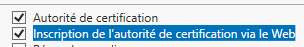
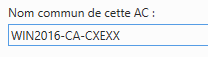
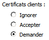

= Site Web et site FTP sécurisés avec SSL/TLS (Secure Sockets Layer / Transport Layer Security)
Bauer Baptiste <cours.bauer@gmail.com>
:description: Windows 2016 Server.
:icons: font
:keywords: windows 2012 Server, SSL, TLS
:sectanchors:
:url-repo: https://github.com/BTS-SIO2
:chapter-number: number
:sectnums:
:toc:
:experimental:

====
* *Objectif :*
Mise en œuvre d'un site web sécurisé avec le protocole SSL/TLS et les certificats d'authentification.

* *Condition :* Le Tp est réalisé soit par groupe de deux étudiants, soit seul.
Le groupe utilise deux postes sous Windows 2016 avec l’entrée multiboot du Tp sur WebFTP (*Vérifier:* noms des serveurs différents) et un poste sous Windows 10 labo pour les deux étudiants.)
====

[TIP]
====
Rappels sur les certificats et le protocole SSL : voir bloc2/03-TD-SSL.adoc
====

*Wikipedia: _Transport Layer Security_* (*TLS*) ou Sécurité de la couche de transport et son prédécesseur *_Secure Sockets Layer_* (*SSL*), sont des protocoles de sécurisation des échanges sur Internet. Le protocole SSL a été développé à l'origine par Netscape. L'IETF en a poursuivi le développement en le rebaptisant _Transport Layer Security_ (TLS). On parle parfois de SSL/TLS pour désigner indifféremment SSL ou TLS.

*Préparation*

- Vérifier les adresses IP des deux serveurs en statique (172.16.0.xx/16).

- Vérifier l’adresse IP du poste Windows 10 labo en statique ((172.16.0.xx/16).

- Pour les différents tests, *désactiver* les pare-feux des serveurs (Panneau de configuration, Système et sécurité, Pare-feu Windows, Activer ou désactiver le pare-feu Windows)

- Vérifier la connexion (PING) entre les trois postes.

== Installation des services de certificats

Pour ce Tp, l’autorité de certification est *privée* et mise en place avec les rôles de Windows 2016 Server.

=== Installation du rôle Services de certificats Active Directory

Utiliser le bouton Gestionnaire de serveur.

Menu _Gérer / Ajouter des rôles et fonctionnalités_ (attendre éventuellement la fin de la collecte des données).

Bouton Suivant pour passer la page ‘Avant de commencer’,

Conserver le type d’installation «_Installation basée sur un rôle ou une fonctionnalité_», bouton Suivant,

Conserver votre serveur sélectionné par défaut, bouton Suivant,

Vérifier que le Serveur Web (IIS) est déjà installé.

Cocher le rôle : ‘Services de certificats Active Directory’.

Bouton ‘Ajouter des fonctionnalités’.

Bouton Suivant trois fois.

Cocher ‘Inscription de l’autorité de certification via le Web’.

Bouton ‘Ajouter des fonctionnalités’.

Bouton Suivant, bouton Installer, Attendre !!!

=== Configuration de l’autorité de certification

Menu Notifications

Utiliser le lien : Configurer les services de certifications ….

Bouton Suivant.

Cocher les deux premières options, bouton Suivant.

Sélectionner ‘Autorité de certification autonome’, bouton Suivant.

Sélectionner ‘Autorité de certification racine’, bouton Suivant.

Sélectionner ‘Créer une clé privée’, bouton Suivant.

Conserver les paramètres de chiffrement par défaut, bouton Suivant.

Modifier le nom commun de l’autorité de certification en ajoutant votre code *CXEXX* à la fin, bouton Suivant.

Conserver la période de validité des certificats de 5 ans, bouton Suivant deux fois.

Bouton Configurer, Attendre !!! Et bouton Fermer.

== Partie 2 : Mise en œuvre d'un site web non sécurisé.

=== Préparation

Sur les deux serveurs:

- Explorateur de fichiers, Affichage, cocher ‘Extensions de noms de fichiers’

- Installer Wireshark si nécessaire,

- Créer le répertoire suivant : C:\sitesecurise

- Créer dans le répertoire C:\sitesecurise, un fichier texte Default.htm contenant les balises HTML et affichant le message suivant : Bienvenue sur le site sécurisé de CxExx, du serveur __NomVotreServeu__r.

- Créer le répertoire suivant : C:\certificat

Sur W10 Labo:

- Pour joindre les deux serveurs à partir de leur nom, ajouter les deux lignes nécessaires dans le fichier *c:\Windows\sytem32\drivers\etc\hosts* (_Ip serveur1 nomServeur1 et Ip serveur2 nomServeur2_)

=== Création d'un nouveau site Web

Démarrer, Outils d’administration, Gestionnaire des services Internet (IIS).

Modifier le port d’écoute du site Web par défaut pour éviter les alertes:

Clic droit sur Default Web Site, menu Modifier les liaisons,

Sélectionner la ligne et bouton Modifier:

Saisir *8080* pour le port, bouton OK et bouton Fermer.

Relancer le site Web par défaut: Clic droit sur Default Web Site, menu Gérer le site Web, Redémarrer.

Arrêter ou supprimer tous les autres sites Web des précédents Tp.

Création d’un nouveau site :

Clic droit sur le dossier Sites, menu Ajouter un site Web…,

Pour le nom du site, mettre ‘Tp site sécurisé’, pour le Chemin d'accès physique, rechercher C:\sitesecurise

Conserver Démarrage immédiat du site Web, Bouton OK.

Clic droit sur le site, menu Actualiser pour vérifier que le site est bien démarré :

=== Test à partir du poste *Windows10 Labo*

Lancer le navigateur IE, et taper l’adresse http://NomServeurWeb

Vérifier que la page du serveur s’affiche.

Si problème, vérifier la configuration de connexion via un proxy du navigateur.

=== Tester le site et capturer les trames avec Wireshark

[IMPORTANT]
====
 vider le cache du navigateur (Supprimer l’historique de navigation en fonction du navigateur)
====

*Test à faire pour chaque étudiant:*

À l'aide de Wireshark, lancer la capture de trames sur la carte réseau concernée,

À partir de W10 Labo, lancer le navigateur et taper l'adresse suivante : http://NomServeurWeb

Arrêter et afficher la capture.

[.question]
**
Question {counter:question} :
Combien de trames encapsulent le protocole HTTP :
**

ifdef::correction[]
[.reponse]
****
*Réponse {counter:reponse} :*
_2_
****
endif::[]

[.question]
**
Question {counter:question} :
Que contient la zone data de la deuxième trame HTTP (fin de la trame) :
**

ifdef::correction[]
[.reponse]
****
*Réponse {counter:reponse} :*

_le code html de la page_

_<html><body> Bienvenue sur le site sécurisé de CxExx :</html></body>._
****
endif::[]

== Mise enœuvre d'un site web sécurisé.

=== Demande d'un certificat pour le serveur Web

Dans le gestionnaire des services Internet (IIS), sélectionner le nom du serveur,

Dans la fenêtre du milieu, zone IIS, double clic sur ‘Certificats de serveur’,

Dans la fenêtre Actions, Utiliser le lien ‘Créer une demande de certificat…’

Taper un nom pour le certificat : _NomDuServeur_

Saisir les renseignements sur votre organisation (à votre choix), bouton Suivant,

Laisser les valeurs par défaut pour le service de chiffrement et la longueur de la clé de cryptage, bouton Suivant,

Bouton Parcourir (…) pour sélectionner le répertoire C:\certificat

Saisir le nom du fichier: certificat

Bouton Ouvrir et bouton Terminer.

=== Envoyer le fichier de demande de certificat à une autorité de certification de confiance

Dans notre cas, nous gérons notre propre autorité de certification, le poste serveur Web a donc à la fois le rôle de demandeur de certificat, et le rôle de l'autorité de certification qui délivre les certificats.

[TIP]
====
le site Web par défaut utilise maintenant le port 8080 (voir début page 2).
====

Accéder aux pages de l'autorité de certification (à partir du serveur Web Windows2016) :

Dans le navigateur, taper l'adresse suivante : *http://localhost:8080/certsrv*

Retrouver le nom de l’autorité en haut des pages Web,

Utiliser le lien: ‘Demander un certificat’,

Utiliser le lien: ‘Demande de certificat avancée’,

Utiliser le lien: ‘Soumettez une demande de..’

Ouvrir le fichier *C:\certificat\certificat.txt*, copier le contenu *entier* du fichier et coller le dans la zone Demande enregistrée, bouton Envoyer.

Lire les recommandations affichées sur la page Web.

La demande de certificat a été reçue par l'autorité, l'administrateur de celle-ci doit maintenant, après vérification de l'identité du demandeur, émettre un certificat correspondant à cette demande.

=== Délivrer le certificat demandé à l'autorité de certification

Démarrer, Outils d’administration, Autorité de certification,

Ouvrir le dossier demande en attente,

Clic droit sur la demande concernée, menus Toutes les tâches et Délivrer,

Vérifier la présence du certificat dans le dossier Certificats Délivrés.

=== Récupération du certificat pour le site Web sécurisé

- Dans le navigateur, taper l'adresse suivante : http://localhost:8080/certsrv

Ou utiliser le lien Accueil si le navigateur est resté ouvert:

Utiliser le lien: ‘_Afficher le statut d’une requête de certificat en attente_’,

Utiliser le lien correspondant à votre demande de certificat,

Utiliser le lien: ‘_Télécharger le certificat_’,

En fonction du navigateur utilisé, récupérer le fichier _certnew.cert_ et le copier dans le répertoire *C:\certificat*

=== Contenu du certificat

Double cliquer sur le fichier C:\certificat\certnew.cer, qui correspond au certificat de votre site, onglet Général:

[.question]
**
Question {counter:question} :
Quel est la fonction de ce certificat ?
**

ifdef::correction[]
[.reponse]
****
*Réponse {counter:reponse} :*
_Garantit l'identité d'un ordinateur distant._
****
endif::[]

[.question]
**
Question {counter:question} :
A qui est-il délivré et par qui ?
**

ifdef::correction[]
[.reponse]
****
*Réponse {counter:reponse} :*
Délivré à win2016 par win2016-ca-cxexx
****
endif::[]

[.question]
**
Question {counter:question} :
Date de validité du certificat ?
**

ifdef::correction[]
[.reponse]
****
*Réponse {counter:reponse} :*
5 ans à partir d'aujourd'hui
****
endif::[]

*Onglet Détails:*

[.question]
**
Question {counter:question} :
Version:
**
ifdef::correction[]
[.reponse]
****
*Réponse {counter:reponse} :*
_V3_
****
endif::[]

[.question]
**
Question {counter:question} :
Quel est l'algorithme de signature ?
**

ifdef::correction[]
[.reponse]
****
*Réponse {counter:reponse} :*
_sha1RSA._
****
endif::[]

[.question]
**
Question {counter:question} :
Objet :
**

ifdef::correction[]
[.reponse]
****
*Réponse {counter:reponse} :*
_win2016, SIO, bts, laon, aisne_
****
endif::[]

[.question]
**
Question {counter:question} :
Algorithme et nombre de bits de la clé publique :
**

ifdef::correction[]
[.reponse]
****
*Réponse {counter:reponse} :*
_RSA 1024bits_
****
endif::[]

[.question]
**
Question {counter:question} :
Utilisation avancée de la clé:
**

ifdef::correction[]
[.reponse]
****
*Réponse {counter:reponse} :*
_Authentification du serveur_
****
endif::[]

[.question]
**
Question {counter:question} :
Utilisations de la clé :
**

ifdef::correction[]
[.reponse]
****
*Réponse {counter:reponse} :*
_Signature numérique, Non-répudiation, cryptage de la clé, Chiffrement des données_
****
endif::[]

[.question]
**
Question {counter:question} :
Algorithme d'empreinte numérique :
**

ifdef::correction[]
[.reponse]
****
*Réponse {counter:reponse} :*
_sha1_
****
endif::[]

=== Affectation du certificat au site Web sécurisé

Dans le gestionnaire des services Internet (IIS), sélectionner le nom du serveur,

Dans la fenêtre du milieu, double clic sur ‘Certificats de serveur’,

Dans la fenêtre Actions, Utiliser le lien ‘Terminer la demande de certificat…’

A l'aide du bouton Parcourir (…), sélectionner le fichier C:\certificat\certnew.cer,

Saisir le Nom convivial : *_site sécurisé_* et bouton OK

Dans la fenêtre du milieu, vérifier la présence du nouveau certificat.

=== Définir une communication sécurisée avec SSL:

Clic droit sur le site sécurisé, menu Modifier les liaisons, bouton Ajouter:

- Dans Type, sélectionner https

- Dans Certificat SSL, sélectionner le certificat (*_site sécurisé_*),

- Vérifier avec le bouton Afficher.., les informations du certificat.

- Relever le port utilisé par https :

Bouton OK et bouton Fermer.

Clic sur le site sécurisé, dans la fenêtre du milieu, double clic sur ‘Paramètres SSL’

Cocher la case Exiger SSL,

Quelles sont les trois options pour les certificats clients ? _Ignorer, Accepter, Demander_

Fenêtre Actions: lien Appliquer

Clic droit sur le site sécurisé, Gérer le site Web, Redémarrer.

=== Tester le site et capturer les trames avec Wireshark

Test à faire pour chaque étudiant :

A l'aide de Wireshark, lancer la capture de trames sur la carte réseau concernée,

A partir de W10 Labo, lancer le navigateur et taper l'adresse suivante (attention au '*s'* de *https:*) :

*https://NomServeurWeb*

Lors du message d'alerte de sécurité (éventuel), utiliser les liens pour poursuivre la navigation.

Une fois la page affichée, arrêter et afficher la capture.

=== Mise en place d'un filtre pour afficher les trames envoyées par le serveur avec le port 443.

- Dans Wireshark, zone Filter, saisir *SSL* et bouton Apply,

Pour chaque trame affichée, regarder le contenu du champ TCP: Data (le dernier champ de chaque trame), ce contenu est-il lisible ? _Non_

=== Faire confiance à l'autorité de certification pour ne plus avoir le message d'alerte sur le client

Il s’agit sur le poste *W10 Labo* de récupérer le certificat de l’autorité de certification de votre serveur.

Lancer le navigateur et taper l'adresse suivante : *http://NomServeurWeb:8080/certsrv*

Utiliser le lien: ‘Télécharger un certificat d’autorité de certification, http://win2008:8080/certsrv/certcarc.asp[une chaîne de certificats ou une liste..]’,

Utiliser le lien: ‘Installer un certificat d'autorité de certification’, (ou le lien Télécharger si l’installation ne se réalise pas correctement),

Lors de l’installation, pour le magasin de certificats, choisir: Autorités de certification racines de confiance

Retrouver le certificat installé:

#Sur Windows 10#: Rechercher: Gérer les certificats utilisateur (ouvrir la console),

Dossier Autorités de certification racines de confiance/Certificats, retrouver le certificat de l’autorité : WIN2016-CA-CXEXX dans la liste

Dans les navigateurs :

Dans IE : menu Outils, menu Options Internet, Onglet contenu, bouton certificats,

Dans Google Chrome : menu Paramètres, Confidentialité et sécurité, Sécurité, Gérer les certificats,

Dans FireFox : menu Options, Vie privée et sécurité, Afficher les certificats…

Onglet Autorités de certification racines de confiance, retrouver le certificat de l’autorité : WIN2016-CA-CXEXX dans la liste

=== Test à partir de W10 Labo

Lancer le navigateur et taper l'adresse (avec *https*) suivante : *https://NomServeurWeb*

Normalement, le message d'alerte n'apparaît plus (attention aux dates systèmes des postes).

=== Demander un certificat pour accéder au site Web.

Dans cette configuration, le serveur Web ne va autoriser que la connexion de client possédant un certificat.

Dans les paramètres SSL du site sécurisé, pour les certificats clients, cocher ‘Demander’, Fenêtre Actions : Appliquer

Relancer le site : Clic droit sur site sécurisé, menu Gérer le site Web, Démarrer.

Test à partir du client W10 : Vérifier que le site n’est plus accessible avec l’adresse : *https://NomServeurWeb*

=== Installer un certificat client sur le poste W10

Sur W10 Labo, lancer le navigateur et taper l'adresse suivante : *http://NomServeurWeb:8080/certsrv*

Utiliser le lien : ‘Demander un certificat’, utiliser le lien : ‘Certificat de navigation Web,

Saisir les renseignements organisation (à votre choix), bouton Envoyer,

Sur le serveur Win2016, délivrer le certificat avec la console Autorité de certification,

Dans le navigateur W10 Labo, taper l'adresse suivante : *http://NomServeurWeb:8080/certsrv*

Utiliser le lien : ‘Afficher le statut d’une requête de certificat en attente’,

Utiliser le lien correspondant à votre demande de certificat,

Utiliser le lien : ‘Installer le certificat’,

Test : Vérifier maintenant que le site est accessible avec l’adresse : *https://NomServeurWeb*

Une fenêtre proposant le certificat à utiliser doit apparaître, bouton OK.

== Sécurisé un site FTP avec SSL

=== Création d'un nouveau site FTP

Arrêter ou supprimer tous les autres sites FTP des précédents Tp.

Clic droit sur le dossier Sites, menu Ajouter un site FTP…,

Pour le nom du site, mettre ‘FTP sécurisé’, pour le Chemin d'accès physique, rechercher le dossier C:\monFTP,

Bouton Suivant, Conserver coché Démarrer automatiquement le site FTP,

Pour SSL, sélectionner Pas de, bouton Suivant,

Dans Authentification, cocher Anonyme,

Dans la liste déroulante Autoriser l’accès à, sélectionner Utilisateurs anonymes,

Dans Autorisations, cocher Lecture

Bouton Terminer.

Test d’accès : Installer le client FTP graphique FileZilla et tester la connexion à votre site FTP (à partir de votre serveur ou à partir du client *W10 Labo*)

Retrouver les informations indiquant que le serveur n’est pas sécurisé.

=== Affectation du certificat au site FTP sécurisé

Clic sur le site FTP sécurisé, dans la fenêtre du milieu, double clic sur ‘Paramètres SSL FTP’.

Dans la liste déroulante, sélectionner le même certificat qui est utilisé pour identifier le site Web, nommé ‘site sécurisé’.

Cocher la case Exiger des connexions SSL.

Fenêtre Actions : Appliquer

Clic droit sur le site sécurisé, Gérer le site FTP, Redémarrer.

=== Tests de connexions à partir du client FileZilla

Tester une nouvelle connexion à votre site FTP (à partir de votre serveur ou à partir du client *W10 Labo*) :

image:img/tp07/image24.png[image,width=212,height=71]Quel est l’avertissement affiché ?

Bouton Ok.

Retrouver les informations indiquant que le serveur est sécurisé.

Fermer la connexion et ouvrir une nouvelle connexion vers votre serveur FTP, que faut-il faire pour ne plus avoir le message d’avertissement ?

Une fois que vous n’avez plus de message d’avertissement, changer l’adresse IP de votre serveur FTP dans la configuration de sa carte réseau (garder une adresse IP compatible du style *172.16.100.xx/16*).

Ouvrir une nouvelle connexion vers votre serveur FTP avec cette nouvelle adresse.

Pourquoi le message d’avertissement s’affiche de nouveau ?

=== Analyse des trames FTP ([.underline]#connexion à partir du client Windows10 Labo#)

Capturer les trames de la connexion au serveur FTP sécurisé.

Essayer de retrouver les informations suivantes :

- Message contenant le nom de l'utilisateur

- Message contenant le mot de passe

Explication?
