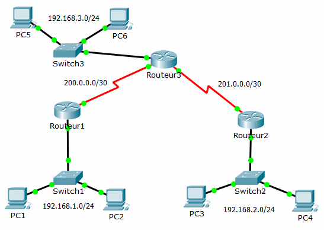

= TP : Le Routeur et la table de routage
Bauer Baptiste <cours.bauer@gmail.com>
:description: TP Packet Tracer.
:icons: font
:keywords: révisions, routeur, table de routage, TP, Packet Tracer
:sectanchors:
:url-repo: https://github.com/BTS-SIO2
:chapter-number: number

Soit le schéma réseau suivant :

La configuration IP étudiée :

[cols="1,1,1,1"]
|===
| Postes| Adresse IP | Routeur - Interface | Adresse IP

| PC1 | 192.168.1.2/24 |  Routeur 1 - G0/0   | 192.168.1.1/24
| PC2 | 192.168.1.3/24 |  Routeur 1 - S0/0/0 | 200.0.0.1/30
| PC3 | 192.168.1.2/24 |  Routeur 2 - G0/0   | 192.168.2.1/24
| PC4 | 192.168.1.3/24 |  Routeur 2 - S0/0/0 | 201.0.0.1/30
| PC5 | 192.168.1.2/24 |  Routeur 3 - G0/0   | 192.168.3.1/24
| PC6 | 192.168.1.3/24 |  Routeur 3 - S0/0/0 | 200.0.0.2/30
|     |                |  Routeur 3 - S0/0/1 | 201.0.0.2/30
|===

Pour chaque routeur, donner sa table de routage :
ifdef::correction[]
#En jaune les lignes à ajouter sur Cisco#
endif::[]

=== *Routeur 1*

ifdef::correction[]
[cols="1,1,1,1"]
|===
| Destination réseau | Masque réseau | Adr. passerelle | Adr. Interface

| 192.168.1.0 | 255.255.255.0 | 192.168.1.1 | 192.168.1.1
| #192.168.2.0# | #255.255.255.0# | #200.0.0.2# | #200.0.0.1#
| #192.168.3.0# | #255.255.255.0# | #200.0.0.2# | #200.0.0.1#
| 200.0.0.0 | 255.255.255.252 | 200.0.0.1  | 200.0.0.1
| #201.0.0.0# | #255.255.255.252# | #200.0.0.2#| #200.0.0.1#

|===
endif::[]

ifndef::correction[]
[cols="1,1,1,1"]
|===
| Destination réseau | Masque réseau | Adr. passerelle | Adr. Interface

|                    |               |                 |
|                    |               |                 |
|                    |               |                 |
|                    |               |                 |
|                    |               |                 |
|                    |               |                 |
|                    |               |                 |
|===
endif::[]

=== *Routeur 2*

ifdef::correction[]
[cols="1,1,1,1"]
|===
| Destination réseau | Masque réseau | Adr. passerelle | Adr. Interface

| #192.168.1.0# | #255.255.255.0# | #201.0.0.2# | #201.0.0.1#
| 192.168.2.0 | 255.255.255.0 | 192.168.2.1 | 192.168.2.1
| #192.168.3.0# | #255.255.255.0# | #201.0.0.2# | #201.0.0.1#
| #200.0.0.0# | #255.255.255.252# | #201.0.0.2#  | #201.0.0.1#
| 201.0.0.0 | 255.255.255.252 | 201.0.0.1 | 201.0.0.1

|===
endif::[]
ifndef::correction[]
[cols="1,1,1,1"]
|===
| Destination réseau | Masque réseau | Adr. passerelle | Adr. Interface

|                    |               |                 |
|                    |               |                 |
|                    |               |                 |
|                    |               |                 |
|                    |               |                 |
|                    |               |                 |
|                    |               |                 |
|===
endif::[]

=== *Routeur 3*

ifdef::correction[]
[cols="1,1,1,1"]
|===
| Destination réseau | Masque réseau | Adr. passerelle | Adr. Interface

|#192.168.1.0#|#255.255.255.0#|#200.0.0.1#|#200.0.0.2#
|#192.168.2.0#|#255.255.255.0#|#201.0.0.1#|#201.0.0.2#
|192.168.3.0|255.255.255.0|192.168.3.1|192.168.3.1
|200.0.0.0|255.255.255.252|200.0.0.2|200.0.0.2
|201.0.0.0|255.255.255.252|201.0.0.2|201.0.0.2

|===
endif::[]

ifndef::correction[]
[cols="1,1,1,1"]
|===
| Destination réseau | Masque réseau | Adr. passerelle | Adr. Interface

|                    |               |                 |
|                    |               |                 |
|                    |               |                 |
|                    |               |                 |
|                    |               |                 |
|                    |               |                 |
|                    |               |                 |
|===
endif::[]