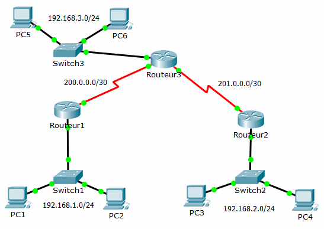

= Le routeur et la table de routage
Bauer Baptiste <cours.bauer@gmail.com>
:description: TP Packet Tracer.
:icons: font
:keywords: révisions, routeur, table de routage, TP, Packet Tracer
:sectanchors:
:url-repo: https://github.com/BTS-SIO2
:chapter-number: number
:sectnums:
:toc:

[NOTE]
====
*Documents à utiliser :*

* Réseau Packet Tracer `Tp01-labo-routage.pka`
* `04-CiscoModeOperatoireRouteur.pdf`

====

== Présentation

L’objectif de ce labo est de mettre en place une communication entre trois réseaux IP via trois routeurs.

== Mise en place avec Packet Tracer

Avec Packet Tracer, ouvrir le fichier `Tp01-labo-routage.pka`.

[NOTE]
====
Dans *Packet Tracer*, l'activation des ports (vert) peut prendre un certain temps (10 à 15s). Avant la configuration, les ports (interfaces) des routeurs sont rouges.

====

* La configuration étudiée :

[cols="1,1,1,1"]
|===
| Postes |Adresse IP	|	Routeur - Interface	| Adresse IP

| PC1	| 192.168.1.2/24	|	Routeur 1 - G0/0 |	192.168.1.1/24
| PC2 |	192.168.1.3/24	|	Routeur 1 - S0/0/0 |	200.0.0.1/30
| PC3	| 192.168.2.2/24	|	Routeur 2 - G0/0	|192.168.2.1/24
| PC4	| 192.168.2.3/24	|	Routeur 2 - S0/0/0|	201.0.0.1/30
| PC5 |	192.168.3.2/24	|	Routeur 3 - G0/0	|192.168.3.1/24
| PC6	|192.168.3.3/24	 |	Routeur 3 - S0/0/0	| 200.0.0.2/30
| | | Routeur 3 - S0/0/1 |	201.0.0.2/30
|===

== A FAIRE
=== Configuration des postes

* Configurer les adresses IPv4 et les masques de tous les postes (`Onglet Desktop/Configuration IP`).
* Tester la connexion entre PC1 et PC2, entre PC3 et PC4 et entre PC5 et PC6 (Onglet Desktop/Command Prompt, utiliser la commande `ping`)

=== Configuration de base des routeurs

* Sur chaque routeur, configurer le nom (routeur1, routeur2 et routeur3) et le mot de passe (toto), voir le mode opératoire : `04CiscoModeOperatoireRouteur.pdf`.

* Sur chaque routeur, visualiser la configuration active (sh run), utiliser la touche barre espace pour faire défiler la configuration.

=== Configuration IP des interfaces des routeurs

- Sur chaque routeur, configurer les adresses IP et les masques des interfaces, voir le mode opératoire.

- Sur chaque routeur, visualiser la configuration active (sh run), utiliser la touche barre espace pour faire défiler.

[NOTE]
====
Si les interfaces des routeurs sont correctement activées, Packet Tracer change la couleur de l’état après 10s.

====

=== Tests de connexion sur les routeurs

- Sur le routeur routeur3, tester la connexion vers les deux autres routeurs, voir le mode opératoire.

- Sur chaque routeur, tester la connexion vers un poste PCx de son réseau IP.

=== Configuration des passerelles par défaut sur les postes

- Sur chaque poste, configurer la passerelle par défaut correspondante (Onglet Desktop/Configuration IP).

- Sur chaque poste, tester la connexion vers l’interface S0 du routeur le plus proche (Onglet Desktop/Command Prompt, utiliser la commande ping).

- Sur le poste PC1, tester la NON connexion vers les postes PC3 et PC5.

=== Configuration des tables de routage sur les routeurs

- Sur chaque routeur, afficher la table de routage, voir le mode opératoire.
(Des routes sont automatiquement ajoutées à partir des adresses des interfaces, réseaux directement connectés)

- Sur chaque routeur, configurer les tables de routage pour joindre les autres réseaux, voir le mode opératoire.

- Sur chaque routeur, afficher seulement les routes statiques, voir le mode opératoire.

- Sur chaque routeur, afficher seulement les routes directement connectées, voir le mode opératoire.

Quelles sont les lettres utilisées pour distinguer les routes statiques et les routes connectées ?

=== Tests de connexion sur le réseau

- A partir du poste PC1, tester la connexion vers les postes PC3 et PC5, avec la commande ping et ensuite avec la commande tracert (Onglet Desktop/Command Prompt). Le premier test peut être un peu long !
Remarque sur le TTL ?

- A partir du poste PC3, tester la connexion vers le poste PC5, avec la commande ping.

- A partir du poste PC1, tester la NON connexion vers l’adresse IP 201.0.0.1
A l’aide du message affiché, justifier le problème.

=== Ajout de routes dans les tables de routage

- Sur le routeur routeur1, ajouter une route dans la table de routage pour joindre le réseau `201.0.0.0/30`

- Sur le routeur routeur2, ajouter une route dans la table de routage pour joindre le réseau `200.0.0.0/30`

- Sur ces deux routeurs, afficher seulement les routes statiques, voir le mode opératoire.

- À partir du poste PC1, tester la connexion vers l’adresse IP `201.0.0.1`

====
*Sauvegarder* et *créer* un nouveau schéma réseau Packet Tracer, identique, avec des *commutateurs 2960* et des *routeurs 2901*.

Sélectionner les mêmes ports de connexion entre les éléments.

*Attention* : Ne pas refaire la configuration IP.

====

