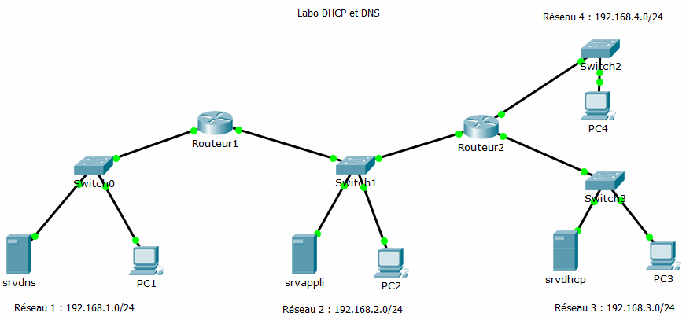

= Serveur DHCP, agent relais DHCP, serveur DNS
Bauer Baptiste <cours.bauer@gmail.com>
:description: TP Packet Tracer.
:icons: font
:keywords: TP, Packet Tracer
:sectanchors:
:url-repo: https://github.com/BTS-SIO2
:chapter-number: number
:sectnums:
:toc:

[NOTE]
====
*Documents à utiliser :*

* Réseau Packet Tracer `Labo-DHCP-DNS.pka`

====

== Présentation

L’objectif de ce labo est de mettre en place la configuration IP dynamique des postes via un serveur DHCP, sur un réseau comportant deux routeurs.

== Mise en place avec Packet Tracer 6.2

Ouvrir le fichier *labo-DHCP-DNS.pka*.

[NOTE]
====
Dans *Packet Tracer*, l'activation des ports (vert) peut prendre un certain temps (10 à 15s). Avant la configuration, les ports (interfaces) des routeurs sont rouges.
====

* La configuration étudiée :

|Header 1 |Header 2

|Column 1, row 1
|Column 2, row 1

|===
|Serveur	|Adresse IP	|Nom d’hôte complet		|Routeur - Interface	|Adresse IP

|srvdns	|192.168.1.10/24|srvdns.labo|Routeur 1 - G0/0	|192.168.1.1/24
|srvappli|192.168.2.10/24|srvappli.labo	|Routeur 1 - G0/1|192.168.2.1/24
|srvdhcp|192.168.3.10/24|srvdhcp.labo|Routeur 2 - G0/0|192.168.2.2/24
| | |  |Routeur 2 - G0/1	|192.168.3.1/24
| | | | Routeur 2 - G0/2	| 192.168.4.1/24
|===

[NOTE]
====
La *passerelle par défaut* de chaque réseau est la première adresse du réseau.
====

==  A faire
=== Configuration des serveurs

* Configurer les adresses IPv4, les masques et les passerelles par défaut des trois serveurs (_Onglet Desktop/Configuration IP_)

* Tester la connexion entre les trois serveurs (_Onglet Desktop/Command Prompt_, utiliser la commande `ping`)

=== Configuration des postes en client DHCP

* Configurer les postes (_PC1, PC2, PC3, PC4_) en client DHCP IPv4 (_Onglet Desktop/Configuration IP_)

* Afficher l’adresse IP de chaque poste, commande `ipconfig` (_Onglet Desktop/Command Prompt_)
Résultat :
* Tester la commande`` ipconfig /renew`` sur PC3 (_Onglet Desktop/Command Prompt_)

[.question]
**
Question {counter:question} :
Quel est le type de l’adresse obtenue (voir cours) ?
**

=== Configuration du service DHCP sur le serveur srvdhcp

Méthode sur packet tracer : _Onglet Services/Services DHCP_

A faire :
* Activer le service *DHCP* sur le serveur *srvdhcp*

* Configurer une étendue pour chaque réseau avec les paramètres suivants :
** Noms des étendues à créer : *serverPool* (nom par défaut à conserver), *reseau1, reseau2, reseau4*
(_Respecter ces noms, sans accent_)
** Les dix premières adresses sont réservées pour l’adressage statique,
** Chaque étendue a sa passerelle par défaut (première adresse du réseau),
** Le serveur DNS est le même pour toutes les étendues, c’est l’IP du serveur *srvdns*

* Tester la commande `ipconfig /renew` sur PC3 (_Onglet Desktop/Command Prompt_)

[.question]
**
Question {counter:question} :
Adresse IP obtenue :
**

* Tester la commande `ipconfig /all` sur PC3 (_Onglet Desktop/Command Prompt_)

[.question]
**
Question {counter:question} :
Quelle est l’adresse IP du serveur DHCP affichée ?
**

[.question]
**
Question {counter:question} :
Les adresses IP de la passerelle et du DNS sont-elles affichées ?
**

* Tester la commande `ipconfig /renew` sur PC1 (_Onglet Desktop/Command Prompt_)

[.question]
**
Question {counter:question} :
Quel est le type de l’adresse obtenue (voir cours) ?
**

* Tester la commande `ipconfig /all` sur PC1 (_Onglet Desktop/Command Prompt_)

[.question]
**
Question {counter:question} :
Quelle est l’adresse IP du serveur DHCP affichée ?
**

[.question]
**
Question {counter:question} :
Pourquoi PC1 n’obtient pas d’adresse du serveur DHCP (voir cours) ?
**

=== Configuration de l’agent relais DHCP sur le routeur routeur1

Commande sur l’IOS Cisco :

|===
| `conf  t` |Pour accéder au mode configuration : `(config)#`
|` int g0/0` |Pour accéder à la configuration de l’interface réseau `g0/0 : (config-if)#`
| `ip helper-address AdresseIPServeurDHCP` |Pour spécifier l'adresse IP du serveur DHCPv4
|===

**A faire **:

* Configurer l’agent relais sur l’interface `g0/0 de routeur1`
* Tester la commande `ipconfig /renew` sur PC1 (_Onglet Desktop/Command Prompt_)

[.question]
**
Question {counter:question} :
Adresse IP obtenue :
**

* Tester la commande`` ipconfig /all`` sur PC1 (_Onglet Desktop/Command Prompt_)

[.question]
**
Question {counter:question} :
Quelle est l’adresse IP du serveur DHCP affichée ?
**

[.question]
**
Question {counter:question} :
Les adresses IP de la passerelle et du DNS sont-elles correctes ?
**

* Tester la connexion entre *PC1* et *srvdhcp* (_Onglet Desktop/Command Prompt_, utiliser la commande `ping`)

[.question]
**
Question {counter:question} :
Résultat ?
**

* Tester la commande `ipconfig /renew` sur PC2 (_Onglet Desktop/Command Prompt_)

[.question]
**
Question {counter:question} :
Quel est le type de l’adresse obtenue et pourquoi ?
**

=== Configuration de l’agent relais DHCP sur le routeur routeur2

* Configurer correctement l’agent relais DHCP sur routeur2 pour que les postes PC2 et PC4 reçoivent leur configuration IP via le serveur DHCP.

* Tester la commande `ipconfig /renew` sur PC2 (_Onglet Desktop/Command Prompt_)

[.question]
**
Question {counter:question} :
Adresse IP obtenue :
**

* Tester la connexion entre *PC2* et *srvdhcp* (_Onglet Desktop/Command Prompt_, utiliser la commande `ping`)

[.question]
**
Question {counter:question} :
Résultat :
**

* Tester la commande `ipconfig /renew` sur PC4 (_Onglet Desktop/Command Prompt_)

[.question]
**
Question {counter:question} :
Adresse IP obtenue :
**

* Tester la connexion entre *PC4* et *srvdhcp* (_Onglet Desktop/Command Prompt_, utiliser la commande `ping`)

[.question]
**
Question {counter:question} :
Résultat :
**

=== Configuration du service DNS sur srvdns
Méthode sur packet tracer :** Onglet Services/Services DNS**

*A faire :*

* Activer le service DNS sur le serveur *srvdns*.
* Ajouter un enregistrement pour l’hôte *srvappli.labo* avec son adresse IP (voir tableau page 1).

* A partir de PC1, tester la commande ping *srvappli.labo* (_Onglet Desktop/Command Prompt_)

[.question]
**
Question {counter:question} :
Résultat :
**

* A partir de *PC1*, tester les commandes `ping srvdhcp.labo` et `ping srvdns.labo`

[.question]
**
Question {counter:question} :
Résultat :
**

* Ajouter les enregistrements nécessaires pour corriger les problèmes du dernier test, et recommencer le test.

[.question]
**
Question {counter:question} :
Quel est l’intérêt du service DNS ?
**

