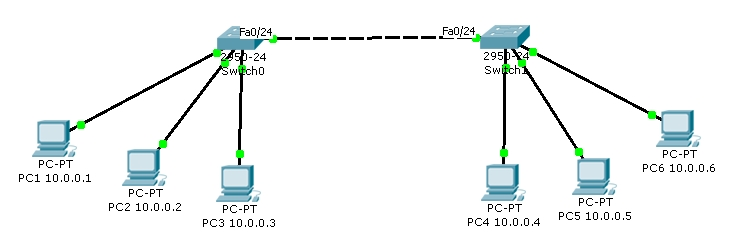

= Mise en place de VLAN avec commutateurs 2950
Bauer Baptiste <cours.bauer@gmail.com>
:description: TP Packet Tracer.
:icons: font
:keywords: TP, Packet Tracer
:sectanchors:
:url-repo: https://github.com/BTS-SIO2
:chapter-number: number
:sectnums:
:toc:

[NOTE]
====
*Documents à utiliser :*

* Réseau Packet Tracer `03CiscoModeOperatoireCommutateurVlan.adoc`

====

== Mise en place avec Packet Tracer

Avec Packet Tracer, ouvrir le fichier `laboVlan1.pka`.

[NOTE]
====
Dans Packet Tracer, l'activation des ports (vert) peut prendre un certain temps (10 à 15s).
====

== Tests de connexion

Attendre éventuellement l'activation de tous les ports (vert).

- A partir de PC1, tester la connexion (ping) vers tous les autres postes

== Création des vlan

Complétez le schéma (sur une feuille )avec les informations VLAN et les ports pour bien comprendre ce qu’il se passe.

Créer les deux vlan suivants sur les deux commutateurs :

* vlan *2*, nom : *bureau*
* vlan *3*, nom : *production*

== Affecter les ports aux vlan

Sur le commutateur  `Switch0`:

- Affecter le port du poste PC3 (f0/3) au vlan 3,
- Affecter en une seule commande les ports des postes PC1 et PC2 (f0/1 et f0/2) au vlan 2.

Sur le commutateur `Switch1` :

- Affecter le port du poste PC4 (f0/1) au vlan 2,
- Affecter en une seule commande les ports des postes PC5 et PC6 (f0/2 et f0/3) au vlan 3.

== Vérifier l'affectation des ports

Sur chaque commutateur, vérifier la configuration des vlan avec la commande `show`.

== Tests de connexion

Attendre éventuellement l'activation de tous les ports (vert).

- Vérifier la connexion entre PC1 et PC2 (même vlan).
- Vérifier la non-connexion entre PC1 et PC3 (vlan différents).
- Vérifier la connexion entre PC5 et PC6 (même vlan).
- Vérifier la non-connexion entre PC4 et PC5 (vlan différents).
- Vérifier la non-connexion entre PC1 et PC4 (pourtant dans le même vlan).

== Affecter les ports à tous les vlan

Affecter les ports à tous les vlan (port _taggé/802.1q_ ou port _trunk_ avec Cisco)

Sur les deux commutateurs :

* Affecter les ports d'interconnexion (f0/24) à tous les vlans (port 802.1q)

== Tests de connexion

- Vérifier la connexion entre PC1 et PC4 (même vlan).
- Vérifier la connexion entre PC3 et PC5 (même vlan).
