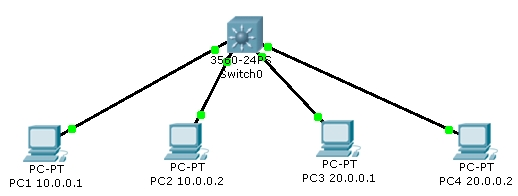

= Mise en place d’une communication inter-vlan avec commutateur-routeur 3560
Bauer Baptiste <cours.bauer@gmail.com>
:description: TP Packet Tracer.
:icons: font
:keywords: TP, Packet Tracer
:sectanchors:
:url-repo: https://github.com/BTS-SIO2
:chapter-number: number
:sectnums:
:toc:

[NOTE]
====
*Documents à utiliser :*

* Réseau Packet Tracer `03CiscoModeOperatoireCommutateurVlan.adoc`

====

== Mise en place avec Packet Tracer

Avec Packet Tracer, ouvrir le fichier `laboVlan2.pka`.

[NOTE]
====
Dans Packet Tracer, l'activation des ports (vert) peut prendre un certain temps (10 à 15s).
====

== Tests de connexion

Attendre éventuellement l'activation de tous les ports (vert).

- Vérifier la connexion entre PC1 et PC2 (même réseau IP, même vlan).
- Vérifier la connexion entre PC3 et PC4 (même réseau IP, même vlan).
- Vérifier la non-connexion entre PC1 et PC4 (réseaux IP différents, même vlan).

== Création des vlan

Créer les deux vlan suivants sur le commutateur-routeur :

- vlan *2*, nom : *bureau*
- vlan *3*, nom : *production*

== Affecter les ports aux vlan

- Affecter les ports des postes PC1 et PC2 (`f0/1` et `f0/2`) au vlan 2.
- Affecter les ports des postes PC3 et PC4 (`f0/3` et `f0/4`) au vlan 3.

== Vérifier l'affectation des ports

Vérifier la configuration des vlan avec la commande `show`.

== Configuration IP des interfaces virtuelles des vlan

- Affecter l'adresse IP `10.0.0.254` à l'interface virtuelle du `vlan 2`.
- Affecter l'adresse IP `20.0.0.254` à l'interface virtuelle du `vlan 3`.

== Activer le routage sur le commutateur-routeur

Activer le routage sur le commutateur-routeur

== Vérifier la configuration IP

- Vérifier la configuration des interfaces avec la commande `show`.
- Vérifier le contenu de la table de routage du commutateur-routeur.

== Tests de connexion à partir du commutateur-routeur

Vérifier la connexion vers PC1 et la connexion vers PC4, commande `ping` dans `l’invite >`.

== Configuration des passerelles des postes

Pour chaque poste, définir la passerelle par défaut du vlan (_ongle Desktop/IP Configuration_).

== Tests de connexion

Vérifier la connexion entre PC1 et PC4 (vlan différents, réseaux IP différents).