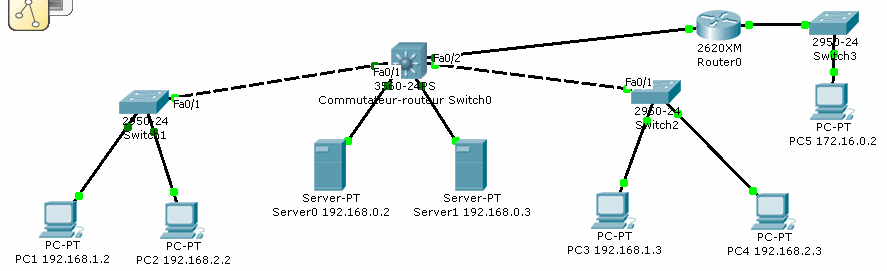

= Vlan, Commutateur-routeur, Routeur
Bauer Baptiste <cours.bauer@gmail.com>
:description: TP Packet Tracer.
:icons: font
:keywords: TP, Packet Tracer
:sectanchors:
:url-repo: https://github.com/BTS-SIO2
:chapter-number: number
:sectnums:
:toc:

[NOTE]
====
*Documents à utiliser :*

* Réseau Packet Tracer `03-CiscoModeOperatoireCommutateurVlan.adoc`

====

== Mise en place avec Packet Tracer

Avec Packet Tracer, ouvrir le fichier `laboVlan3.pka`.

[NOTE]
====
Dans Packet Tracer, l'activation des ports (vert) peut prendre un certain temps (10 à 15s).
====

== La configuration recherchée

(_voir 3 et 4 pour ce qui reste à faire_)

* Mise en place de trois vlan :
** vlan 2, nom	: bureau
** vlan 3, nom	: production
** vlan 4, nom 	: serveur

* Affectation des éléments aux vlan :
** vlan 2 : _PC1(Switch1-F0/2)_, _PC3(Switch2-F0/2)_
** vlan 3 : _PC2(Switch1-F0/3)_, _PC4(Switch2-F0/3)_
** vlan 4 : _server0(Switch0-F0/3)_, _server1(Switch0-F0/4)_
et   _router0(Switch0-F0/5)_
** Tous les éléments doivent pouvoir dialoguer.

== Ce qui est déjà configuré
* Les adresses IP des postes sont définies.
* Les vlan sont créés sur les deux commutateurs (*Switch1* et *Switch2*)
et sur le commutateur-routeur (*Switch0*).
* Les interfaces du routeur (*Router0*) sont configurées.
* Rien à faire sur le commutateur *Switch3*.

== Ce qui reste à faire :
* *Switch1* : affecter chaque port (F0/1 à F0/3) dans le bon Vlan.
* *Switch2* : affecter chaque port (F0/1 à F0/3) dans le bon Vlan.
* *Switch0* : affecter chaque port (F0/1 à F0/5) dans le bon Vlan.
* Tester les connexions entre PC1 et PC3, entre PC2 et PC4, entre server0 et server1,
entre server0 et router0 (`192.168.0.4`).
* *Switch0* : Configurer les adresses des interfaces virtuelles des Vlan avec une IP compatible de
la forme `192.168.xxxx.1/24`
* Configurer les passerelles par défaut des PCs (PC1 à PC4) et des serveurs.
- Tester les connexions entre PC1 et server0, entre PC1 et PC2.
* *Switch0* : ajouter une ligne dans la table de routage pour joindre le réseau `172.16.0.0/16` via le
routeur Router0 (`192.168.0.4`).
* *Switch0* : Afficher la table de routage.
* Tester la connexion entre server0 et PC5 et la non connexion entre PC1 et PC5.
* *Router0* : Ajouter deux lignes dans la table de routage pour joindre les réseaux `192.168.1.0/24`
et `192.168.2.0/24` via le `Vlan 4` du commutateur-routeur (Switch0).
* Router0 : Afficher la table de routage.
* Tester les connexions entre PC1 et PC5, entre PC2 et PC5.
