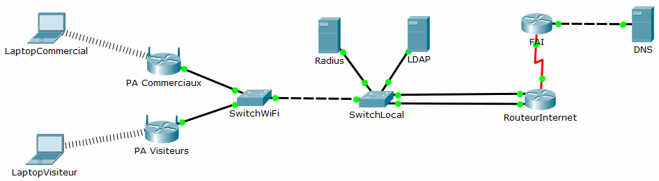

= Tp Cisco Packet Tracer, WiFi, Vlan, DHCP
Bauer Baptiste <cours.bauer@gmail.com>
:description: WIFI.
:icons: font
:keywords: Bloc2
:sectanchors:
:url-repo: https://github.com/BTS-SIO2
:chapter-number: number
:sectnums:
:toc:
:experimental:
:correction:
====

====
*Documents à utiliser :*

* link:../modesOpératoires/02-CiscoModeOperatoireWifi.adoc[02CiscoModeOperatoireWifi.pdf]
* link:../modesOpératoires/03-CiscoModeOperatoireCommutateurVlan.adoc[03-CiscoModeOperatoireCommutateurVlan.adoc]
* link:../modesOpératoires/04-CiscoModeOperatoireRouteur.adoc[04-CiscoModeOperatoireRouteur.adoc]
* link:laboWiFi-Vlan01.pka[laboWiFi-Vlan01.pka]

====

== Présentation

L’objectif de ce labo est de segmenter deux réseaux WiFi sur le réseau filaire via deux *Vlan*.

Les deux réseaux WiFi doivent pouvoir accéder au routeur FAI, mais seul le réseau des commerciaux peut accéder aux serveurs locaux (Radius et LDAP).

* Les commerciaux sont dans le *Vlan 100*, nommé *jeanneauCom* et dans le réseau IP : `192.168.100.0/24`

* Les visiteurs sont dans le *Vlan 200*, nommé *jeanneauVis* et dans le réseau IP : `192.168.200.0/24`

Le service *DHCP* pour la configuration des réseaux WiFi est assuré par le routeur *RouteurInternet*.

== Mise en place avec Packet Tracer 6.2

- Avec Packet Tracer, ouvrir le fichier *laboWiFi-Vlan.pka*

*La configuration déjà mise en place :*

- Vlan déjà créés sur les deux commutateurs:

** `Vlan 100`, nommé *jeanneauCom*

** `Vlan 200`, nommé *jeanneauVis*

- Affectation des ports du commutateur *SwitchWiFi*

** `F0/01`: PA Commerciaux

** `F0/02`: PA Visiteurs

** `F0/10`: Commutateur SwitchLocal

- Affectation des ports du commutateur SwitchLocal

** `F0/10`: Commutateur SwitchWiFi

** `F0/12`: Serveur Radius

** `F0/14`: Serveur LDAP

** `F0/18`: G0/0 RouteurInternet

** `F0/20`: G0/1 RouteurInternet

- Serveur RADIUS, IP: `192.168.100.2/24`

- Serveur LDAP, IP: `192.168.100.1/24`

- Serveur DNS (_et serveur Web_), IP: `90.90.90.2`

- Configuration du routeur FAI, *S0/0/0*: `80.80.80.1/24`

- Configuration du routeur _RouteurInternet_

** `G0/0`: 192.168.100.254/24

** `G0/1`: 192.168.200.254/24

** `S0/0/0`: 80.80.80.2/24

== A FAIRE

* *1. Configurer tous les ports connectés* des commutateurs `SwitchWiFi` et `SwitchLocal` dans le bon Vlan.

* *2. Configurer le service Radius sur le serveur Radius* :

** Client Radius : PA Commerciaux : `192.168.100.5`

** Secret : cisco

** Utilisateur : _jeanneau1_

** Mot de passe : _cisco_

* *3. Mise en place du WiFi pour les visiteurs*

** PA Visiteurs :

*** SSID : _jeanneauVis_, non masqué

*** Sécurité : WEP, clé : aaaaaaaaaa

* *4. Mise en place du WiFi pour les commerciaux*

** PA Commerciaux :

** Adresse IP réseau LAN : `192.168.100.5/24`

** SSID : _jeanneauCom_, masqué (voir onglet GUI)

** Sécurité : WPA2

** Paramètres Radius : voir configuration du serveur Radius

* *5. Configuration du service DHCP sur le routeur _RouteurInternet_*

** Voir le mode opératoire : _04CiscoModeOperatoireRouteur.pdf_

** Pour l’ensemble du réseau, le serveur DNS du FAI est `90.90.90.2`

Exclure les adresses suivantes :

** `192.168.100.1` à `192.168.100.10` et `192.168.100.254`
** `192.168.200.253` à `192.168.200.254`

Définir le pool d’adresse pour le réseau WiFi des commerciaux avec la passerelle par défaut et le serveur DNS, pool nommé : *commerciaux* (_Attention, le point d’accès n’est pas le routeur du réseau_)

Définir le pool d’adresse pour le réseau WiFi des visiteurs avec la passerelle par défaut et le serveur DNS, pool nommé: *visiteurs* (_Attention, le point d’accès n’est pas le routeur du réseau_)

* *6. Configurer la route par défaut sur le routeur : _RouteurInternet_*

* *7. Configurer les portables* avec les paramètres WLAN respectifs, penser notamment à activer la carte réseau sans fil (_onglet Config/Wireless0 Port Status_).

* *8. Tests de connexion vers Internet*

- À partir de chaque portable : ping `90.90.90.2` et `ping www.jeanneau.lab`

- Afficher le site`` www.jeanneau.lab`` (_onglet Desktop/Web Browser_)

* *9. Tests de connexion entre Vlan*

- À partir du portable des commerciaux, tester la connexion vers le serveur LDAP (ping 192.168.100.1)

- À partir du portable des visiteurs, tester la *NON* connexion vers le serveur LDAP (ping 192.168.100.1)

- A partir du portable des visiteurs, tester la *NON* connexion vers le portable des commerciaux.

En observant la configuration du routeur, trouver l’instruction qui bloque le trafic des visiteurs vers le Vlan des commerciaux :
