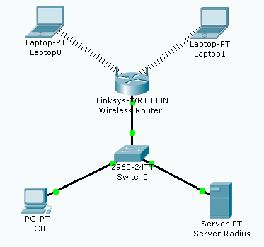

= Mise en place du Wifi avec le routeur Linksys WRT300N
Bauer Baptiste <cours.bauer@gmail.com>
:description: TP Packet Tracer.
:icons: font
:keywords: TP, Packet Tracer
:sectanchors:
:url-repo: https://github.com/BTS-SIO2
:chapter-number: number
:sectnums:
:toc:

[NOTE]
====
*Documents à utiliser :*

* `02CiscoModeOperatoireWifi.adoc`

====

== Mise en place

* Avec Packet Traver 6.2, ouvrir le fichier *laboWifi.pkt*

|===
|*Laptop0* :| `192.168.10.200`
|*Laptop1* :| `192.168.10.201`
|*PC0*	  :| `192.168.10.10`
|*Server Radius* :| `192.168.10.100`
|===

[NOTE]
====
Dans Packet Tracer, l'activation des ports (vert) peut prendre un certain temps (10 à 15s).
====

== Tests de connexion

Attendre éventuellement l'activation de tous les ports (vert).

* À partir de PC0, tester la connexion (`ping`) vers tous les autres postes.
* À partir de PC0, vérifier la non-connexion avec le routeur *Wireless* (`192.168.0.1`).

== Configuration IP du routeur Wifi

* Configurer l’adresse IP `192.168.10.1` sur le routeur Wifi
* À partir de PC0, tester la connexion (`ping`) avec le routeur *Wireless*.

== Configuration du SSID

Sur le routeur Wifi :

* Définir le nom du *SSID* du réseau sans fil à : _labo_

Sur les deux postes Laptop :

* Définir le nom du *SSID* du réseau sans fil.
* Vérifier la connexion entre *les deux postes Laptop*.

== Configuration du service DHCP sur le routeur Wifi

Sur le routeur Wifi :

* Activer le *DHCP*,
* Définir une plage d’adresses IP qui va de `192.168.10.50` à `192.168.10.60`
* Définir l’adresse IP pour le serveur DNS à `192.168.10.254`.

Sur les deux postes Laptop :

* Activer la configuration dynamique (*cocher DHCP*).
* Tester les commandes `ipconfig /release` et `ipconfig /renew` dans l’invite de commandes.
* Vérifier les adresses IP affectées à chaque poste Laptop (`ipconfig /all`).
* Vérifier la connexion entre les deux postes Laptop.

== Configuration de réservations DHCP sur le routeur Wifi

Sur le routeur *Wifi* :

* Définir une réservation *DHCP* avec l’*IP* `192.168.10.55` pour le poste laptop0

Sur le poste *Laptop0* :

* Tester les commandes `ipconfig /release` et `ipconfig /renew` dans l’invite de commandes
* Vérifier l’adresse IP affectée au poste *Laptop0* (`ipconfig /all`)

== Configuration de la sécurité par adresses MAC

Sur le routeur *Wifi* :

* Activer la sécurité par filtrage d’adresses MAC
* Saisir l’adresse MAC du poste *Laptop0*
* Vérifier la non-connexion du poste *Laptop1*
* Faire le nécessaire pour connecter le poste *Laptop1*

== Supprimer la sécurité par adresses Mac

Sur le routeur *Wifi* :

* Désactiver la sécurité par filtrage d’adresses *MAC*
* Vérifier la connexion entre les deux postes *Laptop*

== Configuration de la sécurité WEP

Sur le routeur Wifi :

* Activer le mode de sécurité WEP avec la clé de votre choix.

Sur les deux postes *Laptop* :

* Configurer le mode de *sécurité* nécessaire
* Vérifier la connexion entre *les deux postes Laptop*

== Configuration de la sécurité WPA Personal

Sur le routeur *Wifi* :

* Activer le mode de sécurité WPA Personal avec la phrase de votre choix.

Sur les deux postes *Laptop* :

* Configurer le mode de sécurité nécessaire
* Vérifier la connexion entre les deux postes *Laptop*

== Configuration de la sécurité WPA Enterprise

Sur le routeur *Wifi* :

* Activer le mode de sécurité *WPA Enterprise*, avec le serveur radius d’IP : `192.168.10.100`
* Définir le mot de passe ‘_secret partagé_’ à : *cisco*

Sur le serveur *Radius* :

* Activer le service *Radius*
* Définir les informations du client radius correspondant au routeur Wifi
* Créer un utilisateur d’*identification* dont le nom est : _tpWifi_ et le mot de passe : _toto_

Sur les deux postes *Laptop* :

* Configurer le mode de sécurité nécessaire
* Vérifier la connexion entre les deux postes *Laptop*

== Supprimer la sécurité

Sur le routeur *Wifi* et sur les postes *Laptop* : _Désactiver la sécurité_

== Recherche du SSID sur les Laptop

- _Onglet Desktop > Zone PC Wireless > Onglet Connect > bouton Refresh_
- Vérifier que le *SSID* s’affiche dans le tableau ‘_Wireless Network Name_’

== Cacher le SSID

Sur le routeur *Wifi* :

* Arrêter la diffusion du SSID

Sur le poste *Laptop0* :

* Vérifier que le *SSID* n’est plus visible dans le tableau ‘_Wireless Network Name_’
