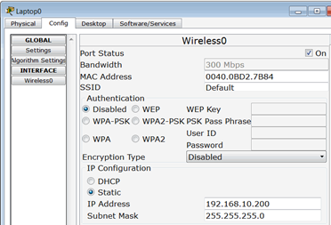

= Cisco routeur Wifi Linksys WRT300N (Packet Tracer 6.2)
Bauer Baptiste <cours.bauer@gmail.com>
:description: Mode opératoire
:icons: font
:keywords: Packet Tracer, cisco, mode opératoire
:sectanchors:
:url-repo: https://github.com/BTS-SIO2
:chapter-number: number
:toc:
:experimental :

== Configuration WiFi d’un PC (LapTop)

* Onglet kbd:[Config]  et *INTERFACE* _Wireless0_
* Tous les paramètres peuvent être définis dans cette page :

== Configuration IP du routeur WiFi

* Paramètres du routeur Wifi
** clic sur le routeur Wifi
** Onglet *GUI*

* Définir l’adresse IP du routeur Wifi
** Menu *Setup*
** Définir l’adresse IP dans la zone IP Address
** Définir le masque dans la zone *Subnet Mask*
** Bouton *Save Settings* en bas de la page.

== Configuration du service DHCP sur le routeur WiFi

* Configurer le service DHCP du routeur WiFI
** Menu _Setup_
** Cocher l’option _Enabled_ pour DHCP Server
** Définir l’adresse IP de départ dans _Start IP Address_
** Définir le nombre d’adresses dans la zone _Maximun Nomber of Users_
** Définir l’adresse d’un serveur DNS dans les zones _Static DNS 1_
** Bouton _Save Settings_ en bas de la page

* Configurer une réservation dans le service *DHCP* du routeur *WiFI*
** Menu *Setup*
** Bouton *DHCP Reservation*
** Deux solutions :
*** *Zone Select Clients* : Cocher _Select_ et bouton _ADD Client_
*** *Zone Manualy* : Saisir un nom, une adresse IP et l’adresse *MAC* et bouton *ADD*,
** Bouton _Save Settings_ en bas de la page
** Bouton _Close_

== Configuration du SSID

* Définir le *SSID*
** Menu _Wireless/Basic Wireless Settings_
** Saisir le nom du SSID dans la zone _Network Name(SSID)_
** Bouton _Save Settings_ en bas de la page

* Cacher le SSID
** Menu _Wireless/Basic Wireless Settings_
** Cocher l’option _Disabled_ dans la zone *SSID Broadcast*
** Bouton__ Save Settings__ en bas de la page

== Filtrage des adresses MAC

* Configuration du filtrage
** Menu W__ireless/Wireless MAC Filter__
** Cocher l’option _Enabled_
** Cocher l’option : _Permit PCs listed_  … pour accepter les adresses MAC listées
** Saisir les adresses MAC dans les zones *MAC 01* à *MAC 50*
** Bouton _Save Settings_ en bas de la page

== Configuration de la sécurité Wifi

* Configuration du WEP
** Menu _Wireless/Wireless Security_
** Sélectionner _WEP_ dans la liste déroulante _Security Mode_
** Sélectionner le type d’encryptage dans la liste déroulante _Encryption (40/128 bit)_
** Saisir une clé dans la zone *Key1* (10 ou 26 caractères en fonction du cryptage)
** Bouton _Save Settings_ en bas de la page

* Configuration *WPA Personal*
** Menu _Wireless/Wireless Security_
** Sélectionner *WPA Personal* dans la liste déroulante _Security Mode_
** Sélectionner le type d’encryptage dans la liste déroulante _Encryption (AES – TKIP)_
** Saisir une phrase dans la zone *Passphrase*
** Bouton _Save Settings_ en bas de la page

* Configuration *WPA Enterprise*
** Menu _Wireless/Wireless Security_
** Sélectionner *WPA Enterprise* dans la liste déroulante _Security Mode_
** Sélectionner le type d’encryptage dans la liste déroulante _Encryption (AES – TKIP)_
** Saisir l’adresse IP du server *Radius*
** Saisir le secret partagé dans la zone__ Share Secret__.
** Bouton _Save Settings_ en bas de la page

== Configuration d’un serveur Radius

* Configuration du service *Radius*
** Clic sur le serveur, onglet *Services*
** Sélectionner le *service AAA*
** Cocher l’option *On* pour activer le service *radius*
** Saisir les informations du client Radius (ici le routeur Wifi) dans la zone  _Network Configuration_ et bouton _Add_
** Saisir les informations d’identification dans la zone _User Setup_ et _bouton Add_
