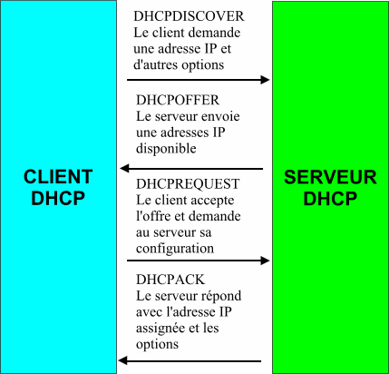

= Le protocole DHCP (Dynamic Host Configuration Protocol)
Bauer Baptiste <cours.bauer@gmail.com>
:description: DHCP.
:icons: font
:keywords: révisions, DHCP, Bloc2
:sectanchors:
:url-repo: https://github.com/BTS-SIO2
:chapter-number: number
:sectnums:
:toc:
:experimental:
:correction:

== Problèmes liés à l'adressage statique

La mise en œuvre de *TCP/IP* sur un réseau de taille respectable peut être très difficile à suivre et à administrer correctement. La configuration de chaque poste doit être *parfaite*, chaque adresse IP *doit être unique*, le *risque de conflits* d'adresse est toujours présent. Lorsque le réseau grandit, gérer ces adresses peut prendre beaucoup de temps. De même, les machines portables doivent être configurées (adr. Ip) à chaque changement de réseau.

== L'attribution automatique (dynamique) des adresses Ip

Le protocole DHCP (Protocole de configuration dynamique de l'hôte) offre un moyen de centraliser la configuration des postes du réseau, en mettant à disposition du réseau local un serveur capable de fournir aux stations clientes tous les paramètres TCP/IP, notamment :

* L'adresse IP, le masque de sous-réseau, la passerelle par défaut, l'adresse des serveurs de noms (DNS).

La configuration d'une station sous IP se résume alors à cocher une unique case, tous les paramètres IP étant fournis par le serveur.

Chaque serveur DHCP possède *une ou plusieurs plages d'adresses IP*. C’est parmi les adresses de ces plages qu'il peut attribuer une adresse IP aux clients.

== Les notions liées au serveur DHCP

[.question]
**
Question {counter:question} :
La plage d'adresses attribuée par le serveur se nomme une :
**

ifdef::correction[]
[.reponse]
****
*Réponse {counter:reponse} :*
Etendue
****
endif::[]

[.question]
**
Question {counter:question} :
Le bail est :
**
ifdef::correction[]
[.reponse]
****
*Réponse {counter:reponse} :*
la durée de validité de l’adresse attribuée par le serveur DHCP, une tentative de renouvellement est réalisée (unicast) par le client à 50% de la durée, et une autre (broadcast) à 87,5% si le serveur n’a pas répondu.
****
endif::[]

[.question]
**
Question {counter:question} :
Une exclusion est :
**

ifdef::correction[]
[.reponse]
****
*Réponse {counter:reponse} :*
Une adresse de l’étendue qui ne sera pas attribuée par le serveur, correspond souvent à un hôte configuré avec cette adresse en statique (serveur, routeur).
****
endif::[]

[.question]
**
Question {counter:question} :
Une réservation est :
**

ifdef::correction[]
[.reponse]
****
*Réponse {counter:reponse} :*
Une adresse IP qui est toujours attribuée au même hôte, en fonction de l’adresse mac de celui-ci. (Souvent : imprimante réseau)
****
endif::[]

[.question]
**
Question {counter:question} :
Une option DHCP est :
**

ifdef::correction[]
[.reponse]
****
*Réponse {counter:reponse} :*
Un paramètre IP supplémentaire que le serveur attribue au client, par exemple : passerelle par défaut (option 003 router), IP du serveur DNS, nom de domaine.
****
endif::[]

[.question]
**
Question {counter:question} :
Un agent relais DHCP :
**
ifdef::correction[]
[.reponse]
****
*Réponse {counter:reponse} :*
Etant donné que les diffusions sont stoppées par les routeurs, l'agent relais DHCP intercepte les demandes (broadcast) DHCP envoyées par les clients, afin de les router vers le serveur DHCP et récupérer la configuration IP attribuée par ce serveur.
L'agent relais DHCP est configuré avec une adresse IP statique et a connaissance de l'adresse IP du serveur DHCP.

****
endif::[]

[.question]
**
Question {counter:question} :
A démarrage, le client recherche le serveur DHCP avec une requête dont la destination est :
**

ifdef::correction[]
[.reponse]
****
*Réponse {counter:reponse} :*
Un broadcast (diffusion)
****
endif::[]

Le dialogue est réalisé avec 4 trames qui sont

[.question]
**
Question {counter:question} :
Du client au serveur :
**
ifdef::correction[]
[.reponse]
****
*Réponse {counter:reponse} :*
DHCPDISCOVER, le client recherche un serveur DHCP sur le réseau
****
endif::[]

[.question]
**
Question {counter:question} :
Du serveur au client :
**
ifdef::correction[]
[.reponse]
****
*Réponse {counter:reponse} :*
DHCPOFFER, le serveur propose une adresse IP disponible et options
****
endif::[]
[.question]
**
Question {counter:question} :
Du client au serveur :
**
ifdef::correction[]
[.reponse]
****
*Réponse {counter:reponse} :*
DHCPREQUEST, le client accepte l’offre et demande au serveur sa configuration
****
endif::[]

[.question]
**
Question {counter:question} :
Du serveur au client :
**
ifdef::correction[]
[.reponse]
****
*Réponse {counter:reponse} :*
DHCPACK, le serveur valide l’adresse IP assignée et les options
****
endif::[]

[.question]
**
Question {counter:question} :
Le renouvèlement de l'adresse attribuée est réalisé avec une requête dont la destination est :
**
ifdef::correction[]
[.reponse]
****
*Réponse {counter:reponse} :*
IP du serveur (unicast).
****
endif::[]

[.question]
**
Question {counter:question} :
Dans ce cas, le dialogue est réalisé avec les 2 trames :
**
ifdef::correction[]
[.reponse]
****
*Réponse {counter:reponse} :*
DHCPREQUEST et DHCPACK
****
endif::[]

== Les commandes liées au DHCP sur le client

[.question]
**
Question {counter:question} :
Libérer l’adresse obtenue :
**
ifdef::correction[]
[.reponse]
****
*Réponse {counter:reponse} :*
`IPCONFIG /RELEASE`
****
endif::[]

[.question]
**
Question {counter:question} :
Demander/Renouveler la configuration IP :
**

ifdef::correction[]
[.reponse]
****
*Réponse {counter:reponse} :*
IPCONFIG /RENEW
****
endif::[]

== Adresses APIPA (Automatic Private Internet Protocol Addressing)

APIPA (Automatic Private Internet Protocol Addressing) ou IPv4LL est un processus qui permet à un système d'exploitation de s'attribuer automatiquement une adresse IP, lorsque le serveur DHCP est injoignable.

APIPA utilise la plage d'adresses IP `169.254.0.0/16`, c'est-à-dire la plage dont les adresses vont de `169.254.0.0` à `169.254.255.255`. Cette plage est réservée à cet usage auprès de l'IANA.

Ce processus peut être désactivé sur le système d’exploitation.