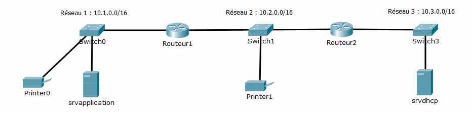

= Travaux Dirigés sur le DHCP
Bauer Baptiste <cours.bauer@gmail.com>
:description: TD DHCP.
:icons: font
:keywords: révisions, DHCP, Bloc2
:sectanchors:
:url-repo: https://github.com/BTS-SIO2
:chapter-number: number

:toc:
:experimental:
:correction:

== Situation 1
La configuration du réseau local de l'entreprise *_Pascher_* est la suivante :

[CAUTION]
Les postes de l’entreprise ne sont pas représentés sur le schéma.

Un *serveur DHCP* est installé sur un des segments IP de l'entreprise, avec l'adresse IP `10.3.0.5/16`.

*Deux imprimantes*, d’adresse IP `10.1.0.50/16` et `10.2.0.55/16` doivent toujours recevoir la même adresse IP.

Un *serveur d’application* est configuré avec l’adresse `IP 10.1.0.100/16`.

Les adresses des *routeurs* sont :

* *Routeur 1* : `10.1.0.254`, `10.2.0.253`
* *Routeur 2* : `10.2.0.254`, `10.3.0.254`

Le *serveur DNS* de l’entreprise a l’adresse IP `172.16.0.100`, le nom de domaine est _pascher.com_.

[.question]
**
Question {counter:question} :
Proposer tous les paramètres de configuration du serveur _DHCP_ afin d’assurer le bon fonctionnement de l’ensemble des postes de l'entreprise.
Le plus grand nombre possible d'adresses sera attribué par le serveur _DHCP_.
**

ifdef::correction[]
[.reponse]
****
Réponse {counter:reponse} :

* *Durée bail* : 8 jours
* Les options communes aux 3 étendues:
** *Option DNS* : `172.16.0.100`
** *Option nom de domaine* : _pascher.com_
* Les plages des étendues et masque :
** *Étendue 1* : `10.1.0.1`     à     `10.1.255.254`,    masque `255.255.0.0`
*** *Exclusions* : `10.1.0.100`, `10.1.0.254`
*** *Réservation* : `10.1.0.50` (imprimante)
*** *Option* : passerelle (routeur) : `10.1.0.254`

** *Étendue 2* : `10.2.0.1`	à  `10.2.255.254`	, 	masque 255.255.0.0
*** *Exclusions* : `10.2.0.254`, `10.2.0.253`
*** *Réservation* : `10.2.0.55` (imprimante)
*** *Option* : passerelle (routeur) : `10.2.0.254`

** *Etendue 3* : `10.3.0.1`     à    `` 10.3.255.254``,     masque `255.255.0.0`
*** *Exclusions* : `10.3.0.254`, `10.3.0.5`
*** *Option* : passerelle (routeur) : `10.3.0.254`

****
endif::[]

[.question]
**
Question {counter:question} :
Dans quel cas, la durée du bail doit-elle être assez courte ?
**

ifdef::correction[]
[.reponse]
****
Réponse {counter:reponse} :
Lorsque le nombre d’adresses est limité dans l’étendue, une durée de bail courte permet de libérer rapidement des adresses pour d’autres demandes. Utilisation courante avec des postes mobiles qui ne restent pas longtemps dans l’entreprise.
****
endif::[]

== Situation 2

Un administrateur réseau a mis en place deux serveurs *DHCP* dans une entreprise qui ne possède qu’un seul réseau IP d’adresse `192.168.200.0/24`.

Les plages des étendues sont les suivantes :

* *Serveur 1* :	`192.168.200.1` à `192.168.200.100`, _masque_`` 255.255.255.0``, _durée de bail_ : 1 journée
* *Serveur 2* : `192.168.200.50` à `192.168.200.150`, _masque_ `255.255.255.0`, _durée de bail_ : 1 journée

**Très souvent**, il se retrouve avec des ordinateurs qui ne peuvent pas se connecter au réseau et qui affichent un problème lié à des *conflits d’adresses*. Pourtant, tous les postes (serveurs, routeurs, etc..) *configurés en statique* appartiennent à la plage d’adresse `192.168.200.201` à `192.168.200.250`.

[.question]
**
Question {counter:question} :
Quel est l’intérêt d’avoir deux serveurs DHCP pour un seul réseau IP ?
**
ifdef::correction[]
[.reponse]
****
*Réponse {counter:reponse} :*
C’est la mise en place d’une tolérance aux pannes, si un serveur s’arrête, il reste un serveur DHCP pour attribuer des adresses.
****
endif::[]

[.question]
**
Question {counter:question} :
Expliquer les raisons de ces dysfonctionnements et justifier le côté aléatoire de ces pannes.
**
ifdef::correction[]
[.reponse]
****
*Réponse {counter:reponse} :*
Les deux plages des étendues ne sont pas *disjointes* (elles ont des adresses IP communes : 50 à 100). Le serveur 1 peut donc attribuer l’adresse `192.168.200.51` à un poste et le serveur 2 peut donc attribuer la même adresse à un autre poste (*conflit d’IP*).

C’est aléatoire, car les demandes des clients sont réalisées par des broadcast, c’est ainsi le premier serveur disponible qui répond.

Dans cette architecture, les étendues devraient être :

* *Serveur 1* :	`192.168.200.1` à `192.168.200.100`, masque `255.255.255.0`, *durée de bail* : 1 journée
* *Serveur 2* :	`192.168.200.101` à `19.168.200.200`, masque `255.255.255.0`, *durée de bail* : 1 journée

****
endif::[]

== Situation 3

Une entreprise est constituée de différentes agences réparties dans plusieurs villes. Chaque agence a un réseau IP différent.

Dans chaque agence, *un serveur DHCP* attribue les configurations IP des ordinateurs mobiles.

Un employé qui se déplace tous les jours, d’agence en agence, se retrouve toujours avec la bonne configuration IP, *même si la durée du bail est de 3 jours*.

[.question]
**
Question {counter:question} :
Justifier le bon fonctionnement de cette architecture.
**

ifdef::correction[]
[.reponse]
****
*Réponse {counter:reponse} :*
A chaque déplacement dans une agence, l’employé démarre le portable qui fait systématiquement un broadcast pour obtenir une adresse IP auprès du serveur local de l’agence. Donc même si l’adresse est réservée 3 jours sur le serveur DHCP de la précédente agence, le portable obtient une nouvelle configuration.
****
endif::[]

== Situation 4

Un administrateur réseau capture des trames du protocole *DHCP* alors qu’il lance les commandes suivantes :

a) `ipconfig /release`

b) `ipconfig /renew`

c) `ipconfig /renew`

Pour le b), il capture des trames de type *_broadcast_*, alors que pour le c), il capture des trames de type _*unicast*_ à destination du serveur DHCP.

[.question]
**
Question {counter:question} :
Justifier cette différence.
**

ifdef::correction[]
[.reponse]
****
*Réponse {counter:reponse} :*

Le a) libère l’adresse IP, donc le poste n’a plus d’adresse IP

Le b) fait donc une demande en broadcast pour obtenir une nouvelle configuration IP

Le c) fait une demande en unicast au serveur DHCP, car le poste a déjà une configuration IP, donc il essaie de renouveler sa configuration auprès du même serveur.

****
endif::[]