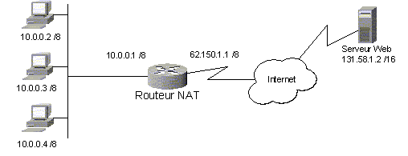
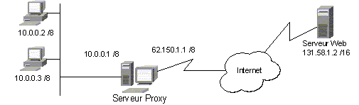
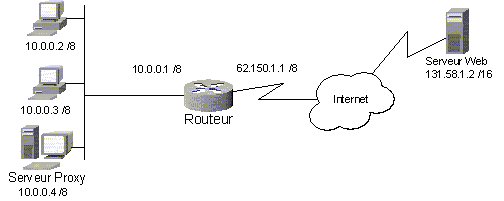

= Le partage d'une connexion vers Internet
Bauer Baptiste <cours.bauer@gmail.com>
:description: Révision BLOC 2.
:icons: font
:keywords: révisions, NAT, PROXY
:sectanchors:
:url-repo: https://github.com/BTS-SIO2
:chapter-number: number
:sectnums:
:toc:

:sectnums!:

== Introduction

[NOTE]
====
Des plages d'adresses Ip (privées) sont réservées pour les réseaux locaux et ne sont pas *routable* sur Internet.
====

Adresses Ip privées (RFC 1918) :

ifdef::correction[]
[cols="1,1,1"]
|===
| Classe | Plage IP | Nbr de réseaux

| Classe A | 10.0.0.0 | (1 réseau)
| Classe A | 172.16.0.0 à 172.31.0.0 | (16 réseaux)
| Classe A | 192.168.0.0 à 192.168.0.0 | (256 réseaux)

|===
endif::[]

ifndef::correction[]
[cols="1,1,1"]
|===
| Classe | Plage IP | Nbr de réseaux

| Classe A |  |
| Classe A |  |
| Classe A |  |

|===
endif::[]

Quelle que soit la méthode utilisée, l'accès Internet nécessite de posséder une adresse IP publique pour communiquer sur ce réseau.

[.question]
**
Question {counter:question} :
Comment obtenir une adresse IP publique ?
**

ifdef::correction[]
[.reponse]
**
Réponse {counter:reponse} :
Cette adresse est attribuée par le FAI (Fournisseur d'accès à Internet).
**
endif::[]

Dans une entreprise, toutes les stations du réseau local devraient donc disposer d'une adresse publique afin de pouvoir naviguer sur Internet.

[.question]
**
Question {counter:question} :
Inconvénients de cette méthode pour l'entreprise ?
**

ifdef::correction[]
[.reponse]
**
Réponse {counter:reponse} :
Manque d'adresses IP, coût d'achat des adresses publiques, sécurité du réseau local.
**
endif::[]

[.question]
**
Question {counter:question} :
La solution ?
**

ifdef::correction[]
[.reponse]
**
Réponse {counter:reponse} :
Toutes les stations de l'entreprise partagent la même adresse IP publique.
**
endif::[]

Dans la plupart des réseaux d'entreprise, l'accès Internet s'effectue soit par le biais d'un routeur avec la fonction de *NAT (Network Address Translation)*, soit par le biais d'un *serveur Proxy* (*serveur mandataire*).

:sectnums:

== Le protocole NAT (Network Address Translation)
=== Principe

Le traducteur d'adresses réseau appelé *NAT* est un équipement de type routeur qui permet de remplacer les adresses Ip privées en une ou plusieurs adresses Ip publiques à des fins de navigation sur Internet.

Lorsqu'un équipement *NAT* reçoit un paquet Ip en provenance d'une machine du réseau privé, il va modifier l'adresse Ip source ainsi que le port application source.

=== Exemple

La station dont l'adresse Ip est `10.0.0.4` désire accéder au serveur Web présent sur Internet dont l'adresse Ip est `131.58.1.2`

[cols="1,1"]
|===
| *Adresse privée du routeur NAT*  | `10.0.0.1`
| *Adresse publique du routeur NAT*  | `62.150.1.1`
|===

*Description du fonctionnement* :

[loweralpha, start=1]
. *Les paquets sont envoyés de la station `10.0.0.4` vers le routeur.*

Passerelle par défaut des stations ? `10.0.0.1`

[loweralpha, start=2]
. *Le routeur reçoit donc un paquet avec l'en-tête IP/TCP suivante :*

[cols="1,1"]
|===
| *Adresse IP source* : `10.0.0.4`  | *Port source* : `1512` (exemple)
| *Adresse IP destination* : `131.58.1.2` | *Port destination* : `80` (port http)
|===

[loweralpha, start=3]
. *Le routeur NAT modifie l'en-tête, ce qui donne l'en-tête suivant  :*

[cols="1,1"]
|===
| *Adresse IP source* : `62.150.1.1`  | *Port source* : `1724` (exemple), il conserve cette correspondance.
| *Adresse IP destination* : `131.58.1.2` | *Port destination* : `80` (port http), dans une table de mappage.
|===

[loweralpha, start=4]
. *Le routeur NAT envoie alors les paquets sur Internet avec cet en-tête.*

[loweralpha, start=5]
. *Le serveur Web reçoit les paquets et envoie la réponse au routeur NAT avec l'en-tête Ip suivant :*

[cols="1,1"]
|===
| *Adresse IP source* : `131.58.1.2`  | *Port source* : `80`
| *Adresse IP destination* : `62.150.1.1` | *Port destination* : `1724`, défini par le routeur NAT
|===

[loweralpha, start=6]
. *Lorsque le routeur NAT reçoit les paquets, il consulte sa table de "mappage" et modifie les paquets afin de les acheminer au client du réseau privé.*

L'en-tête TCP/IP modifié est donc le suivant :

[cols="1,1"]
|===
| *Adresse IP source* : `131.58.1.2`  | *Port source* : `80`
| *Adresse IP destination* : `10.0.0.4` | *Port destination* : `1512`, retrouvé à l'aide de la table de mappage
|===

Le routeur *NAT* a donc mis en place une correspondance entre les en-têtes *10.0.0.4:1512* et *62.150.1.1:1724*.

[loweralpha, start=7]
. *Le routeur NAT envoie alors les paquets sur le réseau local avec cet en-tête*.

Remarque NAT/PAT : Ici, comme le port a aussi été modifié, on parle de PAT (Port Address Translation).

=== Conclusion

Simple à mettre en place, il ne supporte pas tous les protocoles (SNMP, RPC, IPSec) et ne permet pas de paramètrer les accès à l'Internet en fonction des utilisateurs, des horaires, etc.

Les routeurs NAT, qui sécurisent déjà le réseau privé en cachant les adresses Ip locales, ont très souvent en plus des fonctionnalités de pare-feu (Firewall) et de filtrage des trames sur les adresses IP.

Le protocole NAT est proposé sur la majorité des routeurs, il peut être mis en place sur des serveurs à l'aide de logiciels spécifiques ou de fonctions du système d'exploitation (ex : services de routage de Windows 2008, NetFilter sur Linux).

== Le serveur Proxy (serveur mandataire)

=== Principe

Avec un Proxy, lorsqu'un client du réseau privé veut accéder à une page Web sur Internet, il en fait la demande au serveur Proxy. Ce dernier utilise une liaison vers Internet pour obtenir la page demandée, la récupère et la retransmet aussitôt au client privé. Une des fonctions principales de ce serveur est de mémoriser cette page dans un cache pour d'autres demandes éventuelles.

[WARNING]
====
Ici, il n'y a pas de routage (pas activé).
====

Les applications, qui doivent accéder à l'Internet, doivent être configurées pour utiliser le Proxy, exemples : Internet Explorer, Netscape, client FTP, Anti-virus, mise à jour (apt-get sous linux), etc..

=== Exemples de configuration

==== Exemple 1
Dans cette solution, la connexion à l'Internet est réalisée à l'aide d'un des composants suivants : Adaptateur ADSL ou routeur ADSL.

[IMPORTANT]
====
La fonction de routage n'est pas activée sur le serveur Proxy, l'accès à l'Internet est réalisé par le service Proxy.
====

==== Exemple 2

Dans cette solution, seul le serveur Proxy utilise le routeur pour accéder à l'Internet.

=== Conclusion

Plus délicat à mettre en place, il faut configurer toutes les applications qui doivent accéder à l'Internet.
Le serveur mandataire offre de nombreuses fonctionnalités :

* Mise en cache des pages consultées sur Internet afin d'accélérer les navigations,
* Sécurité par filtrage des paquets (Entrant/sortant), mise en place de pare-feu,
* Administration et surveillance des accès à l'Internet en fonction des utilisateurs :
** Accès interdit à certains utilisateurs,
** sites interdits,
** horaires,
** type de téléchargement
** audit des connexions (fichiers log)

Exemples de produits : Wingate, Microsoft Threat Management Gateway 2010, SQUID
