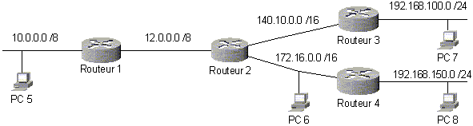

= Le routeur et la table de routage
Bauer Baptiste <cours.bauer@gmail.com> 
:description: Révision BLOC 2. 
:icons: font
:keywords: révisions, routeur, table de routage
:sectanchors: 
:url-repo: https://github.com/BTS-SIO2
:chapter-number: number
:sectnums:
:toc:

== Communication entre réseau `IP`

Seuls les postes appartenant à un même réseau IP peuvent communiquer directement entre eux.
Pour communiquer avec un poste appartenant à un autre réseau IP, il faut passer par une machine intermédiaire appelée *Routeur*.

Un *routeur* est une machine connectée à plusieurs réseaux IP. Il dispose donc de plusieurs cartes réseaux (interfaces), de plusieurs adresses MAC et de plusieurs adresses IP.
Chaque interface réseau constitue une *route directe ou indirecte* vers un ou plusieurs réseaux.

Une *route indirecte* passe par un autre routeur.
*La table de routage* contient toutes les adresses de réseaux que le routeur doit pouvoir atteindre.

Le protocole IP compare l'adresse de destination IP du paquet avec les adresses dans la table de routage. Si l'adresse correspond, le paquet est transmis avec l’interface indiquée par la table de routage.

== Le routeur : porte d'entrée et de sortie du réseau local

Dans un réseau, le protocole IP est systématiquement utilisé pour la communication entre postes. Un poste détermine pour chaque paquet qu'il émet si celui-ci est émis dans son réseau IP ou vers un autre réseau IP.
Il applique pour cela son masque de sous-réseau à l'adresse de destination du paquet et compare le résultat avec son adresse réseau. Si le paquet est destiné à un autre réseau, il transmet le paquet à son routeur (*passerelle par défaut*).

Pour communiquer avec d'autres réseaux, un poste doit donc connaître au moins une adresse de routeur. 
Cette adresse (*passerelle par defaut*) fait partie de la configuration du poste.

== La table de routage

La table de routage comporte plusieurs colonnes. Pour la 'décoder', il faut lire:

[NOTE]
====
Pour atteindre la *Destination réseau `N°xx`*, de *Masque réseau `N°xx`*, 
le paquet IP doit passer par la *Passerelle d'adresse `N° xxx`*, en sortant par *l’interface d’adresse `N°xxx`*.
====

[cols="1,1,1,1"]
|===
| Destination réseau | Masque réseau | Adr. passerelle | Adr. interface

| 155.10.0.0		
| 255.255.0.0
|	192.168.200.9
| 192.168.200.1
|=== 

[WARNING]
====
* Quand le réseau cible est un réseau où le *lien est direct*, l’adresse de la *passerelle* et l’adresse IP de *l’interface* sont identiques.
* Quand le réseau cible est un *réseau éloigné* (lien indirect), donc nécessitant la *traversée* d’un ou de plusieurs *routeurs*, l'adresse *IP de la passerelle* est l'*adresse Ip du premier routeur* à traverser.
* Les adresses IP de la passerelle et de l’interface dans une ligne de routage appartiennent *OBLIGATOIREMENT* au même réseau.
* Si l'adresse destination du paquet IP n'est pas trouvée dans la table de routage et que l'*adresse réseau 0.0.0.0 de masque 0.0.0.0*  est spécifiée (*route par défaut*), cette ligne est utilisée pour le routage du paquet.
====

== Exercice

Le dernier octet de l'adresse IP de chaque nœud correspond au numéro du matériel.

. Compléter le schéma avec les adresses IP de chaque carte réseau.
. Pour chaque poste, donner sa configuration IP.
[cols="1,1,1,1,1"]
|===
| Poste | PC 5 | PC 6 | PC 7 | PC 8

| *Adr. IP* | | | |
|*Masque* | | | |
|*Passerelle par défaut* | | | |
|=== 

[start=3]
. Pour chaque routeur, donner sa table de routage : 

* Routeur 1

[cols="1,1,1,1"]
|===
| Destination réseau | Masque réseau | Adr. passerelle | Adr. interface

| 192.168.100.0 | 255.255.255.0 | | 
| 192.168.150.0 | 255.255.255.0 | | 
| 172.16.0.0 | 255.255.255.0 | | 
| 140.10.0.0 | 255.255.0.0 | | 
| 12.0.0.0 | 255.0.0.0 | | 
| 10.0.0.0 | 255.0.0.0 | | 
|=== 

* Routeur 2

[cols="1,1,1,1"]
|===
| Destination réseau | Masque réseau | Adr. passerelle | Adr. interface

| 192.168.100.0 | 255.255.255.0 | | 
| 192.168.150.0 | 255.255.255.0 | | 
| 172.16.0.0 | 255.255.255.0 | | 
| 140.10.0.0 | 255.255.0.0 | | 
| 12.0.0.0 | 255.0.0.0 | | 
| 10.0.0.0 | 255.0.0.0 | | 
|=== 

* Routeur 3

[cols="1,1,1,1"]
|===
| Destination réseau | Masque réseau | Adr. passerelle | Adr. interface

| 192.168.100.0 | 255.255.255.0 | | 
| 192.168.150.0 | 255.255.255.0 | | 
| 172.16.0.0 | 255.255.255.0 | | 
| 140.10.0.0 | 255.255.0.0 | | 
| 12.0.0.0 | 255.0.0.0 | | 
| 10.0.0.0 | 255.0.0.0 | | 
|=== 

* Routeur 4 (avec route par défaut)

[cols="1,1,1,1"]
|===
| Destination réseau | Masque réseau | Adr. passerelle | Adr. interface

| 192.168.150.0 | 255.255.255.0 | | 
| 172.16.0.0 | 255.255.255.0 | | 
| 0.0.0.0 | 0.0.0.0 | | 

|=== 