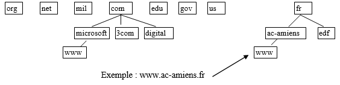
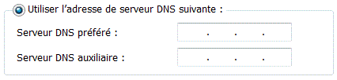

= Le protocole DNS  (Domain Name System)
Bauer Baptiste <cours.bauer@gmail.com>
:description: DNS.
:icons: font
:keywords: révisions, DNS, Bloc2
:sectanchors:
:url-repo: https://github.com/BTS-SIO2
:chapter-number: number
:sectnums:
:toc:
:experimental:
:correction:

== Problème lié aux adresses IP

L'utilisateur mémorise plus facilement un nom de poste qu'une adresse IP, il faut donc trouver l'adresse Ip d'un poste (hôte) en fonction de son NOM.

==  La résolution de noms

Le *DNS* est un service qui permet de trouver l'adresse IP d'une poste à partir d’un nom (*nom d'hôte*). On parle de *résolutions de noms d'hôtes en adresses IP* ou d'adresses IP en noms d'hôtes (résolution inverse).

*Système de nom de domaine* : Le réseau Internet, de par sa taille, ne pouvait se satisfaire d'un espace de noms "à plat" où toutes les machines auraient simplement été référencées par un simple nom.

La solution retenue est une décomposition du nom suivant une arborescence hiérarchique (__voir arborescence Interne__t).

Compléter les affirmations suivante :

* *www* représente :
ifdef::correction[]
[.reponse]
*Le nom de l’hôte*
endif::[]

* *ac-amiens*	représente :
ifdef::correction[]
[.reponse]
*Le nom d’un sous-domaine*
endif::[]

* *fr* représente :
ifdef::correction[]
[.reponse]
*Le nom du domaine parent*
endif::[]

* *ac-amiens.fr* 	représente :
ifdef::correction[]
[.reponse]
*Le nom de domaine complet*
endif::[]

[NOTE]
====
* Il est possible de faire référence à une machine de manière relative, si l'on se trouve dans le même domaine.

*Exemple :* `ping andromede`, `ftp andromede`

* Ou bien d'employer le *FQDN* (**F**ull **Q**ualified **D**omain **N**ame), qui correspond au nom complet de la machine.

*Exemple :* `ping andromede.eni.fr`, `ftp andromede.eni.fr`
====

Un serveur *DNS* gère un fichier de zone dans lequel se trouvent des références adresse *ip/Nom d'hôte*.

On dit alors que le serveur *DNS* a *autorité* sur le nom de domaine.

== Les notions liées au serveur DNS

=== Serveur secondaire

C'est une copie en *lecture seule* du fichier de zone du serveur  principal.

Donnez les intérêts à avoir un serveur secondaire

Le serveur secondaire a deux intérêts :

*	Aide à équilibrer la charge des serveurs principaux (répartition des charges),
*	Offre une gestion de la tolérance aux pannes du service DNS.

=== Serveur préféré et serveur auxiliaire sur le client

Le client interroge en premier le serveur préféré et si celui-ci ne répond pas, il interroge le serveur auxiliaire **(tolérance aux pannes**).

=== Délégation de zone

La création de sous-domaines permet de gérer plusieurs zones dans une hiérarchie de noms.

.Hiérarchie du domaine entreprise.fr
====
*#Domaine principal* :

* entreprise.fr

*#Sous-domaines* :

* agence1.entreprise.fr
* agence2.entreprise.fr
* agence3.entreprise.fr
====

*Intérêts de la délégation de zone :*

Le premier intérêt des *sous-domaines* est de faciliter la gestion et l'administration de l'espace de noms.

Il est possible d'héberger plusieurs zones sur le même serveur *DNS*, ou d'*héberger les zones DNS* sur différents serveurs, dans ce cas : *répartition de charge ou optimise le trafic réseau.*

== Les commandes liées au DNS sur le client

|===
|Afficher le cache DNS : | `IPCONFIG /DISPLAYDNS`
|Vider le cache DNS : | `IPCONFIG /FLUSHDNS`
|===

* Intérêt du cache DNS sur le client :

_Limite le nombre de requêtes lancées vers le serveur DNS pour résoudre souvent les mêmes noms_

* Commande pour diagnostiquer l’infrastructure DNS :	`NSLOOKUP`.

image::img/02-DNS-03.png[]