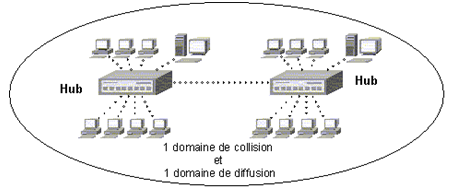
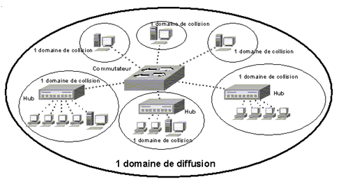
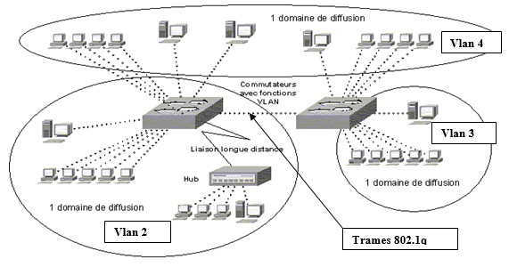

= : LES RÉSEAUX LOCAUX VIRTUELS (VLAN)
Bauer Baptiste <cours.bauer@gmail.com>
:description: VLAN.
:icons: font
:keywords: révisions, VLAN, Bloc2
:sectanchors:
:url-repo: https://github.com/BTS-SIO2
:chapter-number: number
:sectnums:
:toc:
:experimental:
:correction:

== Introduction

Les réseaux virtuels (*VLAN : Virtual Local Area Network*) permettent de réaliser des réseaux axés sur l’organisation de l’entreprise en s’affranchissant de certaines contraintes techniques comme la localisation géographique. On peut ainsi définir des domaines de diffusion (domaines de broadcast) indépendamment de l’endroit où se situent les systèmes.

== Rappels sur les domaines de collision et de diffusion

L'utilisation de concentrateurs et/ou de répéteurs génère un seul domaine de *collision* et un seul *domaine de diffusion*.

[TIP]
====
Un *domaine de collision* est une zone logique d'un réseau informatique où les paquets de données peuvent entrer en collision entre eux, en particulier avec le protocole de communication Ethernet.

Un domaine de collision peut être un seul segment de câble Ethernet, un seul concentrateur ou même un réseau complet de concentrateurs et de répéteurs.
====

La mise en place d'un commutateur permet de créer un domaine de *collision par port*, mais conserve un seul domaine de diffusion.
Ce qui réduit les risques de collision.

== L'architecture VLAN

Les VLAN introduisent la notion de *segmentation virtuelle*, qui permet de constituer des sous-réseaux logiques en fonction de critères prédéfinis comme les numéros de ports ou les adresses MAC.

*Les diffusions (broadcast) sont limitées à un Vlan*. Les échanges à l’intérieur d’un domaine sont automatiquement sécurisés et les communications *inter-vlan* peuvent être contrôlées via le filtrage IP.

Les domaines de diffusions du schéma sont le résultat de la configuration des commutateurs par l'administrateur, qui, à l'aide de certains critères (voir ci-dessous), a regroupé les postes par domaine.

Il existe *plusieurs niveaux de VLAN* :

* Les VLAN *statiques* :
On parle aussi de *VLAN de niveau 1* ou VLAN par port (*Port-Based VLAN*) qui regroupent les stations connectées aux ports associés au même VLAN.

[IMPORTANT]
====
Le déplacement d’un poste nécessite la reconfiguration d’un port du commutateur
====

* Les VLAN *dynamiques* :
Les *VLAN de niveau 2* ou VLAN MAC (*MAC Address-Based VLAN*) qui associent des stations par leur adresse MAC selon des tables d’adresses introduites par l’administrateur.

== La communication entre Vlan

Les *communications intra-VLAN* se déroulent comme si les machines se situaient sur le même réseau physique, les commutateurs récupérant les trames de broadcast ARP pour les rediriger vers les machines du même VLAN.

Avec plusieurs commutateurs, nécessite d’activer *le protocole 802.1q* sur les ports de liaison entre commutateurs.

**Les communications inter-VLAN **ne peuvent se faire qu'au niveau 3 du modèle OSI, elles nécessitent donc de mettre en place des réseaux IP différents (1 par vlan) et des fonctions de routage.  Ces fonctions de routage peuvent être implémentées sur des commutateurs de niveau 3 *(commutateur-routeur)*.

== Les normes 802.1q et 802.1p

Elles décrivent respectivement les Vlan et la qualité de service associée (*QoS*). Quatre octets sont insérés dans la trame MAC des réseaux 802.3 juste après l’adresse source :

* Le champ *User Priority* sur 3 bits (8 niveaux de priorité)
* Un champ *VID* (VLAN ID) sur 12 bits qui identifient le VLAN destination.

Les trames *802.1q* sont utilisées dans *les liaisons entre les commutateurs* pour transmettre l’identifiant du Vlan dans la trame. On parle de trame "*Taguée*" ou *étiquetée*. On parle aussi de port *tagué*, port *802.1q* et port *trunk* (Cisco). Certaines cartes réseaux de serveurs sont en mesure de lire ces trames.

== Avantages des Vlan

[IMPORTANT]
====
La segmentation du réseau avec les Vlan donne trois avantages :

 * *Optimisation du trafic/Performance* : Les trames de broadcast sont limitées à un Vlan, ne vont pas sur les autres.
* *Sécurité* : Le trafic entre les vlan est bloqué (étanchéité) ou contrôlé via le filtrage IP avec un routeur.
* *Souplesse d’organisation* : Il n’est pas nécessaire d’avoir un commutateur par service (Vlan).

====