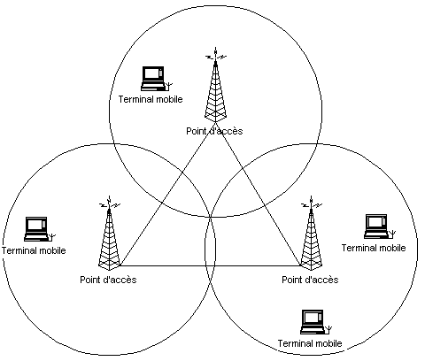
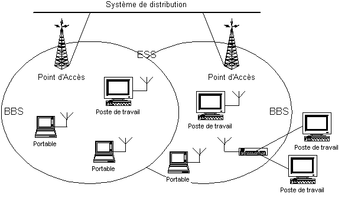

= : LES RÉSEAUX LOCAUX SANS FIL
Bauer Baptiste <cours.bauer@gmail.com>
:description: WLAN.
:icons: font
:keywords: WLAN, Bloc2
:sectanchors:
:url-repo: https://github.com/BTS-SIO2
:chapter-number: number
:sectnums:
:toc:
:experimental:
:correction:

==  Introduction

Le principe de cette technologie est de remplacer le *câble* par des *signaux hertziens* (radio).

Pour les réseaux locaux sans fil, on utilise souvent les abréviations suivantes :

* *WLAN* pour Wireless Local Area Network
* *Wi-Fi* pour Wireless Fidelity par analogie à Hi-Fi (High Fidelity)

== Les topologies des WLAN

* En mode *ad-hoc*

Les postes sont directement interconnectés à l'aide d'un adaptateur (carte réseau) sans fil.

* En mode *Infrastructure : mono-cellule*

Cette topologie nécessite une infrastructure composée d'une borne de concentration appelée *Point d'Accès* (*AP* en anglais), qui gère l'ensemble des communications dans une même zone géographique. Les postes communiquent avec ce Point d'Accès à l'aide d'un adaptateur sans fil. Ils peuvent être mobiles dans la cellule.

* En mode Infrastructure : *multi-cellule*

La zone géographique est découpée en plusieurs cellules pour étendre la couverture du *WLAN*. Les Points d'Accès de chaque cellule peuvent être reliés par une liaison filaire ou hertzienne.

Les terminaux peuvent se déplacer et changer de cellule sans fermer la connexion au réseau, ce qui s'appelle le ‘*roaming*’.

Le WLAN peut être utilisé comme une extension d'un réseau Ethernet câblé :

== La norme IEEE 802.11

C'est la norme qui prédomine, elle constitue une version sans fil de la norme *802.3* sur les réseaux Ethernet câblés. On parle aussi de la norme *Wi-Fi*.

[NOTE]
====
*Remarque sur les débits :* Ils dépendent de nombreux paramètres, dont notamment, la distance au *Point d'Accès*, les types de **matériaux traversés**, le *nombre des postes* sans fil reliés au Point d'Accès.

Nécessite très souvent de faire des tests de couverture WiFi dans les locaux.

====

* *802.11b (WiFi 1)*

C'est le standard. De nombreux constructeurs le mettent en œuvre.

_Fréquence radio utilisée_ : 2,4 Ghz.

Les débits vont jusqu'à 11 Mbit/s, mais peuvent être ramenés à 5,5, 2 et 1 Mbits/s.

* *802.11a (WiFi 2)*

Plus complexe que la précédente, les débits peuvent atteindre 54 Mbit/s.

__Fréquence radio utilisée __: 5 Ghz.

* *802.11b+*

Ce standard vise à améliorer le 802.11b tout en restant compatible avec celui-ci. Le débit maximal est porté à 22 Mbit/s.

* *802.11g (WiFi 3)*

Ce standard (2003) vise une compatibilité avec le 802.11b avec un débit de 54 Mbit/s.

*Fréquence radio utilisée* : 2,4 Ghz.

* *802.11n (WiFi 4)*

Cette norme (2009) permet d’atteindre en théorie un débit de 150 Mbit/s, mais les débits réels sont plus proches de 100 Mbit/s.

*Fréquences radio utilisées* : 2,4 et 5 Ghz.

* *802.11ac (WiFi 5)*

Cette norme (2014) permet d’atteindre en théorie un débit de 1 300 Mbit/s, mais les débits réels sont plus proche de 300 Mbit/s.

*Fréquence radio utilisée* : 5 Ghz.

* *802.11ax (WiFi 6)*

La publication de la version finale de cette norme a eu lieu le 19 mai 2021. Le standard 802.11ax est conçu pour pouvoir fonctionner sur tout le spectre fréquentiel entre 1 et 7,1 GHz, en complément des bandes 2,4 et 5 GHz déjà utilisées par les versions précédentes. Amélioration des débits et de la portée.

* *802.11i*

Cette norme a pour but d'améliorer la sécurité des transmissions (gestion et distribution des clés, chiffrement et authentification). Cette norme s'appuie sur l'AES (Advanced Encryption Standard).

== La sécurité

=== Les risques

Les réseaux sans fil offrent de nouvelles failles aux pirates. De part la nature immatérielle du support physique, l’écoute clandestine sur un réseau sans fil est facile. Il faut donc protéger l’accès aux ressources sans fil et aux informations qui circulent dans les trames.

Les systèmes sans fil sont sensibles à une attaque supplémentaire par rapport aux réseaux classiques. Ces attaques portent atteinte à la disponibilité du réseau et des nœuds :

* *Le blocage radio* : pour rendre le réseau inutilisable, le pirate peut bloquer les fréquences radio utilisées par le système.

=== Les solutions

* *Cacher le SSID du réseau*

Le SSID est l’identifiant du réseau, il est nécessaire pour se connecter sur un point d’accès. Il est possible de ne pas diffuser cet SSID sur la zone du réseau sans fil. Le client doit donc connaître cet identifiant et le définir dans les paramètres de l’adaptateur sans fil  pour ce connecter au réseau.

* *Prévenir l’accès aux ressources du réseau*

Ceci est obtenu en utilisant un mécanisme d’authentification où une station est obligée de prouver sa connaissance d’une clef (mot de passe partagé par tous les points d'accès et terminaux du même réseau).

Une autre solution est de définir les adresses MAC autorisées à utiliser le réseau sans fil.

[CAUTION]
====
*Attention*, certains logiciels permettent de mettre en place une usurpation de l’adresse MAC en remplaçant l’adresse MAC de la carte WiFi par une autre (autorisée).
====

* *Écoute clandestine*

L’écoute clandestine est bloquée par l’utilisation d’algorithme de cryptage.

Le *cryptage WEP* (_Wired Equivalent Privacy_)/ (_Wireless Encryption  Privacy_) est une première version de protection par cryptage des données, il n’est pas jugé assez fiable par les spécialistes.

Le *cryptage WPA* (_Wi-Fi Protected Access_) à remplacé le protocole WEP défaillant. *WPA* comble les trous de sécurité qui ont été découverts avec WEP, notamment en assurant le changement automatique des clés de cryptage entre les points d'accès et les postes sans fil.

Deux modes d’implantation du *WPA*, le *WPA-PSK (Personal)* avec identification par mot de passe et le *WPA-EAP (Enterprise)* avec identification à l’aide d’un *serveur Radius*, architecture plus lourde réservée aux entreprises.

== Avantages/Inconvénients des réseaux sans fil

=== Avantages

* L’intérêt premier est : la *mobilité* de l’utilisateur (portable dans les ateliers, les supermarchés, etc..).

* De plus, le câblage n’est plus nécessaire, ce qui représente un avantage certain dans de nombreux cas :
** Mise en place d’un réseau dans un bâtiment classé « *monument historique* »
** Mise en place d’un réseau de courte durée (chantiers, expositions, locaux loués, formations)
** *Confort d’utilisation* : tous les participants d’une réunion sont automatiquement interconnectés
** *Gain en coût* pour la mise en place d’un réseau dans tout bâtiment non préalablement câblé.
** Ajout de postes dans un réseau sans fil existant.
** Étendre un réseau filaire existant.

*Installation rapide, simple et flexible*

* Relier les bâtiments d'une même entreprise (solution parfois moins onéreuse que de tirer un câble).

[WARNING]
====
Attention à la réglementation lorsque cette liaison doit être déployée sur la voie publique (formalités administratives, bandes passantes réservées pour l'armée).
====

=== Inconvénients

* Les débits encore assez limités et non garantis.
* Attention particulière à la sécurité.
* Les interférences
* Le respect des normes des constructeurs.
